# Retail Sales Analysis for Inventory Management

**Discovering purchase patterns and improving replenishment decisions**

**Authors**

- Saif Mashalieh, 202210039
- Mohammad Marei, 202210644

**Supervised by:** Dr. Wasef Matar

**Course:** 307498 – Graduation Project  
**Semester:** First Semester, 2025/2026  
**Date:** [Submission Date]

**Department of Business Intelligence and Data Analytics, University of Petra**

---

## Table of Content

- [**Glossary of Terms and Abbreviations**](#glossary-of-terms-and-abbreviations)
- [**Abstract**](#abstract)
- [**Acknowledgment**](#acknowledgment)
- [**Business Intelligence Project Description and Objectives**](#business-intelligence-project-description-and-objectives)
- [**Data Research and Acquiring Effort**](#data-research-and-acquiring-effort)
- [**Data Description and Understanding**](#data-description-and-understanding)
- [**Data Primary Cleaning and Transformation**](#data-primary-cleaning-and-transformation)
- [**Data Visualization and Insights**](#data-visualization-and-insights)
- [**Dashboard Design & Business Insights**](#dashboard-design-business-insights)
- [**Advanced Analytics and AI Modeling**](#advanced-analytics-and-ai-modeling)
- [**Tools Research and Selection Effort**](#tools-research-and-selection-effort)
- [**Project Deployment Effort — Use Case**](#project-deployment-effort-use-case)
- [**Results**](#results)
- [**References**](#references)
- [**Appendix A — Objective Traceability**](#appendix-a-objective-traceability)
- [**Appendix B — Source Code**](#appendix-b-source-code)

---

## Glossary of Terms and Abbreviations

This project sits across three vocabularies that do not usually appear together: retail inventory management, data mining, and applied statistics. A term that is obvious inside one of them is frequently opaque from the other two. Everything used in this report is defined here, in the sense in which this report uses it, so that no section depends on a reader having the same background as the author.

Terms are grouped by the vocabulary they belong to rather than alphabetically, because the grouping is itself informative — it shows which parts of the argument are retail reasoning, which are analytical method, and which are questions of tooling. The first occurrence of most of these terms in the body of the report is also explained in place.


### Retail and inventory terms

| Term | What it means in this report |
|---|---|
| **SKU** — Stock-Keeping Unit | One distinct product, identified by its stock code. The unit of every inventory decision here. This catalogue has 4,724 of them. |
| **Basket** | The set of distinct SKUs on a single invoice. A multi-item basket is what makes association mining possible. |
| **Invoice line** | One row of the raw file: one product, one quantity, one price, on one invoice. 1,067,371 before cleaning, 1,014,751 after. |
| **Stockout** | A product being unavailable when a customer wants it. Not directly observable in this data — see *absence episode*. |
| **Absence episode** | A SKU that sold regularly, recorded no sales for three or more consecutive weeks, and then resumed. The observable proxy for a stockout. 6,896 were found. |
| **Pull-through** | The effect this project measures: when one product is unavailable, the sales of the products customers usually buy alongside it also fall. |
| **Co-stocking** | Treating two or more products as a group for replenishment, because letting one run out puts the others' sales at risk. |
| **Lead time** | The delay between placing a replenishment order and receiving it. Absent from this dataset, so it is treated as a user-supplied parameter throughout. |
| **Stock cover** | How many weeks of expected demand are held in stock. “Four weeks' cover” is the uniform policy this project's derived policy is tested against. |
| **Cycle stock** | The part of the reorder point that covers expected demand during the lead time. |
| **Safety stock** | The extra buffer held to absorb demand that was higher than forecast. Sized by forecast error, not by demand size. |
| **Reorder point (ROP)** | The stock level at which a new order is placed. Cycle stock plus safety stock. |
| **Service level** | The probability of not running out during a replenishment cycle. 95% is used throughout; the buyer can change it. |
| **Replenishment buyer** | The stakeholder this project is built for: the person deciding on a Monday morning what to order. |
| **Delisting** | Removing a product from the range. 2,379 low-value, erratic SKUs are flagged as candidates. |
| **Long tail** | The large number of products that each sell very little. Half this catalogue earns 4.8% of revenue. |
| **Wholesale / B2B** | Selling to other businesses rather than to consumers. Explains the median basket of seventeen distinct products and the empty weekends. |

*Table G1 — Retail and inventory vocabulary*


### Classification terms

These describe the nine-cell grid that is the project's central classification. The two axes measure different things and are close to statistically independent, which is why both are needed — a point established empirically in Figure 5.

| Term | What it means in this report |
|---|---|
| **ABC** | Classification by revenue. **A** = the SKUs making up the first 80% of revenue, **B** = the next 15%, **C** = the last 5%. |
| **XYZ** | Classification by demand volatility, measured as the coefficient of variation of weekly demand. **X** = stable (CV below 0.5), **Y** = variable (0.5–1.0), **Z** = erratic (above 1.0). |
| **ABC × XYZ grid** | The two axes combined into nine cells, each taking a different stocking policy. The central deliverable of the classification. |
| **AX** | High revenue, stable demand — predictable and cheap to protect. 55 SKUs carrying 12.0% of revenue. |
| **AZ** | High revenue, erratic demand — valuable but hard to forecast, so it needs a large buffer. |
| **CZ** | Low revenue, erratic demand — should not be forecast at all. 2,379 SKUs, 50.4% of the catalogue, 4.8% of revenue. |
| **Coefficient of variation (CV)** | Standard deviation divided by the mean. A unit-free measure of volatility, so a high-volume and a low-volume product can be compared on the same scale. |
| **Pareto principle** | The observation that a small share of items produces most of the value. Here, 21.8% of SKUs generate 80% of revenue. |

*Table G2 — Classification vocabulary*


### Analytics, modelling and statistical terms

| Term | What it means in this report |
|---|---|
| **EDA** — Exploratory Data Analysis | The first pass over the raw data. Here it had one narrow purpose: confirm the objectives could be attempted before writing analysis that depends on them. |
| **Association rule mining** | Finding products that appear together in baskets more often than chance would predict. Objectives 3, 4 and 8. |
| **Support** | How often a pair appears, as a share of all baskets. A support of 0.019 means the pair appears in 1.9% of invoices. |
| **Confidence** | Given that A was bought, how often B was also bought. Inflated by popularity, which is why it is never used for ranking here. |
| **Lift** | How much more often a pair occurs than if the two were independent. Lift 26.4 means twenty-six times more often than chance. The ranking metric used throughout. |
| **Itemset** | A group of products appearing together. This project mines pairs only (`max_len=2`). |
| **FP-Growth** | The association-mining algorithm used. Builds a compressed prefix tree instead of enumerating candidates, so a low support threshold stays affordable. |
| **Apriori** | The classic alternative to FP-Growth. Rejected here because its candidate-generation step forces a high support threshold on a catalogue this wide. |
| **Basket matrix** | The invoices × products table of true/false values that association mining consumes. Here 33,505 × 250. |
| **Holt-Winters / exponential smoothing** | The forecasting method used. Weights recent observations more heavily than older ones. |
| **Croston's method** | A forecasting method designed for intermittent demand. Not used here, but named in section 12 as the obvious next step for the CZ cell. |
| **Naive baseline** | The trivial forecast that repeats the last observed value. Every accuracy figure in this report is quoted against it. |
| **Moving-average baseline** | The second trivial forecast: repeat the training-period mean. |
| **MAE** — Mean Absolute Error | Average size of the forecast error, in units per week. Used because it is in the same units as demand and is therefore interpretable by a buyer. |
| **Train / test split, held-out data** | Fitting on the first 93 weeks and evaluating on the final 13, which the model never saw. Split by time, never randomly — a random split of a time series leaks the future. |
| **Intermittent demand** | Demand that arrives in irregular bursts with many zero weeks. The median SKU here sells in only about a third of weeks. |
| **Wilcoxon signed-rank test** | A significance test for paired measurements that does not assume a normal distribution. Used for the pull-through result because the ratios are strongly skewed. |
| **p-value** | The probability of seeing an effect this large if there were really no effect. The pull-through result returns p = 3.25 × 10⁻⁸. |
| **Median** | The middle value. Preferred to the mean throughout, because a handful of very large orders would distort an average. |
| **z (service factor)** | The standard-normal multiplier that converts a service level into a safety-stock size: 1.28 for 90%, 1.65 for 95%, 2.33 for 99%. |
| **Simulation / replay** | Running the policy week by week against real demand it was never fitted to, rather than evaluating the formula on its own training data. |
| **Sensitivity analysis** | Re-running a result with different parameter choices to check the conclusion does not depend on one arbitrary setting. |

*Table G3 — Analytical and statistical vocabulary*


### Tools, formats and platforms

| Term | What it means in this report |
|---|---|
| **BI** — Business Intelligence | Turning transaction data into decisions a business can act on. The framing of the whole project. |
| **Python** | The language all analysis is written in. Chosen for reproducibility: every transformation is a readable, re-runnable line of code. |
| **pandas / NumPy / SciPy** | The core data-handling, numerical and statistical libraries. |
| **statsmodels / scikit-learn / mlxtend** | Forecasting (Holt-Winters), evaluation metrics, and association mining (FP-Growth) respectively. |
| **Matplotlib / seaborn / Plotly** | Static charts for the report; interactive charts for the application. |
| **Jupyter notebook (.ipynb)** | The document format the four analysis notebooks are written in — code, output and commentary in one file. |
| **Power BI / .pbix** | Microsoft's dashboard tool and its file format. Used as a presentation layer only. |
| **DAX** | Power BI's formula language. Deliberately *not* used for business logic, because a DAX measure inside a .pbix cannot be audited from the repository. |
| **Star schema** | A data model with one central dimension table (here `dim_product`) that every fact table relates to. Keeps dashboard filtering consistent. |
| **dim / fact table** | *Dimension* tables describe things (products); *fact* tables record measurements about them (weekly demand, rules, policy). |
| **Streamlit** | The Python framework the deployed prototype is built in. |
| **CSV / XLSX** | Plain-text tabular format / Excel workbook format. The source is one .xlsx; every processed table is a .csv. |
| **Git / GitHub** | Version control and the public host for the repository, from which the application deploys. |
| **UCI Machine Learning Repository** | The institutional archive hosting the source dataset. |
| **CC BY 4.0** | The dataset licence. Permits reuse, including commercially, on condition of attribution. |
| **DOI** | A permanent identifier for a published dataset, so the citation still resolves years later. |

*Table G4 — Tooling vocabulary*


### Notation used in the reorder-point formula

Section 9 derives the reorder point from the following expression. Each symbol is defined below, together with where its value comes from — which matters, because two of the five are measured from the data, one is estimated by a model, and one is not in the data at all.

```
ROP  =  d̄ × L  +  z × σₑ × √L
```

| Symbol | Meaning | Where it comes from |
|---|---|---|
| ROP | Reorder point, in units | The output of section 9, Block 4 |
| d̄ | Mean weekly demand for the SKU | The 93 training weeks only |
| L | Lead time, in working weeks | Not in the data — supplied by the user, tested across 1–4 |
| z | Service factor | 1.28 / 1.65 / 2.33 for 90% / 95% / 99% service |
| σₑ | Forecast error | The fitted model's MAE for that SKU, not raw demand variance |
| CV | Coefficient of variation of weekly demand | The XYZ axis |

*Table G5 — Notation*

The two terms of that expression do different jobs. **d̄ × L** is cycle stock: the demand expected to arrive while the order is in transit. **z × σₑ × √L** is safety stock: the buffer against demand being higher than forecast. The first scales linearly with lead time; the second scales with its square root, which is why doubling a lead time does not double the reorder point.


## Abstract

Retailers holding thousands of stock-keeping units still order them one at a time. Each product is replenished as though its demand were independent of every other, and a single stock-cover rule is applied across a catalogue whose items differ by orders of magnitude in both value and volatility. Two blind spots follow. The first is basket pull-through: when customers buy in assortments, an item that runs out takes some of its partners' sales with it, and a product-by-product view cannot see that loss. The second is that uniform cover commits the same working capital to an item earning a few pounds a year as to one earning tens of thousands.

This project addresses both using the Online Retail II transaction record of a UK gift-ware wholesaler: 1,067,371 invoice lines from December 2009 to December 2011, reduced through an eight-step reconciling pipeline to 1,014,751 lines covering 4,724 SKUs and 104 weeks. Association rules were mined with FP-Growth; the resulting pairs were used to build an empirical pull-through test over 6,896 absence episodes; the catalogue was classified on an ABC × XYZ grid; weekly demand was forecast for the 300 highest-revenue SKUs against naive and moving-average baselines; and a reorder-point policy derived from the classification was replayed against thirteen weeks of held-out demand. The results are delivered through a four-page Power BI dashboard and a deployed Streamlit application.

Pull-through is real and it is large. When a product disappears from sale, its strongest co-purchase partners lose a median 52.6% of their weekly sales, in 78.8% of the 85 pairs tested (Wilcoxon signed-rank, p = 3.25 × 10⁻⁸). The cost of a stockout is therefore substantially understated by the missing item's own lost revenue, and products that pull each other through should be reordered together rather than independently. The policy built on that principle held service essentially unchanged against uniform four-week cover while carrying 33% less stock — the same availability on the shelf for two-thirds of the capital.


## Acknowledgment

We would like to thank our supervisor, Dr. Wasef Matar, for the guidance that shaped this project — in particular for insisting that a claim be tested rather than asserted, which is the reason the pull-through effect in section 9 is an experiment and not an assumption.

We thank the Department of Business Intelligence and Data Analytics at the University of Petra for the resources and the structure of course 307498, within which this work was carried out.

The dataset used throughout is Online Retail II, contributed by Dr Daqing Chen to the UCI Machine Learning Repository and released under a Creative Commons Attribution 4.0 licence. The attribution is a condition of that licence, and the project would not have been possible without an openly published transaction record of this depth. We are also indebted to the maintainers of the open-source Python scientific stack — pandas, NumPy, SciPy, statsmodels, scikit-learn, mlxtend, Matplotlib, seaborn, Plotly and Streamlit — every one of which is used in this project and none of which cost anything to use.

> **TODO** — Add here any individuals who helped, and the disclosure your course requires regarding the use of software tools and AI assistance. Check the 307498 policy before submitting — disclose exactly what it asks for, no more and no less.


## Business Intelligence Project Description and Objectives


### The problem

Retailers carry thousands of SKUs, but replenishment decisions are still made product by product, using intuition or simple historical averages. Two blind spots follow from that habit, and they compound one another.

**First, products are ordered as though demand for each were independent.** Customers do not shop that way. They buy in baskets, and the sale of one item is frequently conditional on the availability of another — a customer assembling a set will often buy nothing at all if one piece is missing, or will buy the set elsewhere. A replenishment process built on single-SKU demand histories has no representation of that dependency. It cannot see it, cannot cost it, and therefore cannot protect against it. The loss does not even appear in the missing item's numbers; it appears in the sales record of a product that never went out of stock, where nobody is looking for it.

**Second, without a forward-looking demand signal at SKU level, stock cover is applied uniformly.** A rule such as “hold four weeks of cover on everything” is easy to administer and easy to defend, and it is wrong for almost every item it touches. It over-protects the long tail of low-value products, whose demand is too erratic for a buffer to help, and it under-protects the small group of high-value products whose availability actually determines revenue. The result is working capital distributed in near-inverse proportion to where it is earned.

This project mines transaction-level sales records to discover which products are genuinely bought together, measures what a stockout of one costs the others, forecasts demand for the SKUs whose history supports it, and turns both into a replenishment recommendation a buyer can act on. Each of those four steps is validated rather than asserted: the association rules are ranked by lift rather than confidence, the pull-through effect is tested for significance against a controlled baseline, the forecasts are measured against naive benchmarks on held-out data, and the inventory policy is simulated against demand it was never fitted to.


### The business being analysed

The records belong to a UK-registered online wholesaler of gift-ware, trading between December 2009 and December 2011. Its customers are overwhelmingly other businesses — small retailers, market traders and gift shops buying to resell — and roughly 92% of invoice lines ship within the United Kingdom. That single fact governs how every figure in this report should be read. A median invoice of seventeen distinct products would be an extraordinary consumer basket; for a shop owner restocking a display it is unremarkable. Bulk quantities, the same lines reordered at intervals, and the near-total absence of weekend trading are the expected shape of this business rather than anomalies to be cleaned away.

Reading the data as though it came from a consumer storefront would produce exactly the wrong conclusions at every stage: the large baskets would look like outliers to be trimmed, the repeated product lines like data-entry errors to be de-duplicated, and the flat weekends like missing data to be imputed. Each of those three mistakes is available in this dataset, and section 6 documents the decisions taken to avoid them. The business description is not background — it is the interpretive frame that makes the cleaning decisions defensible.

It also sets the boundary on how far the findings travel. They describe wholesale distribution, where assortment and replenishment are decided in volume and where a buyer reorders a known catalogue on a cycle. They should not be read as claims about impulse-driven consumer retail, where basket composition and demand volatility behave differently.


### How this helps the industry

Three things in this project transfer to any multi-SKU retailer or distributor holding physical inventory, and none of them requires data that such a business does not already have.

- **A method for costing a stockout properly.** Most stockout costing counts the margin on units that could not be sold. The pull-through test measures the collateral loss on co-purchased items, using nothing but the retailer's own transaction history. Any business with invoice-level records can run the same test on its own data.
- **A defensible way to allocate stock cover.** The ABC × XYZ grid replaces one policy with nine, and the allocation is derived from two measured properties of each SKU rather than from a category label or a buyer's intuition.
- **A worked argument for where analytical effort pays and where it does not.** The finding that forecasting beats a naive baseline on only about half the catalogue is as useful as a finding that it beats it everywhere, because it tells a business which half to stop spending time on.


### The stakeholder

The primary user is the replenishment buyer deciding, on a Monday morning, what to order. That single decision is the design constraint on every deliverable in this project. A chart that cannot change what goes on the purchase order is decoration; a model whose output the buyer cannot interpret will not be used; a dashboard that requires an analyst to operate has the wrong user. Section 11 describes how the two delivered artefacts — the Power BI dashboard and the Streamlit application — divide that job between them, and why both are needed.


### Objectives

Eleven objectives were fixed before any data was examined, so that the dataset was chosen to answer a question rather than the question being chosen to suit a dataset. Nine are primary; two are secondary and were completed once the primary work was stable. Each is listed below with the purpose it serves, because an objective with no stated purpose reads as a checklist item rather than a decision.

| Term | What it means in this report |
|---|---|
| SKU — Stock-Keeping Unit | One distinct product, identified by its stock code. The unit of every inventory decision here. This catalogue has 4,724 of them. |
| Basket | The set of distinct SKUs on a single invoice. A multi-item basket is what makes association mining possible. |
| Invoice line | One row of the raw file: one product, one quantity, one price, on one invoice. 1,067,371 before cleaning, 1,014,751 after. |
| Stockout | A product being unavailable when a customer wants it. Not directly observable in this data — see absence episode. |
| Absence episode | A SKU that sold regularly, recorded no sales for three or more consecutive weeks, and then resumed. The observable proxy for a stockout. 6,896 were found. |
| Pull-through | The effect this project measures: when one product is unavailable, the sales of the products customers usually buy alongside it also fall. |
| Co-stocking | Treating two or more products as a group for replenishment, because letting one run out puts the others' sales at risk. |
| Lead time | The delay between placing a replenishment order and receiving it. Absent from this dataset, so it is treated as a user-supplied parameter throughout. |
| Stock cover | How many weeks of expected demand are held in stock. “Four weeks' cover” is the uniform policy this project's derived policy is tested against. |
| Cycle stock | The part of the reorder point that covers expected demand during the lead time. |
| Safety stock | The extra buffer held to absorb demand that was higher than forecast. Sized by forecast error, not by demand size. |
| Reorder point (ROP) | The stock level at which a new order is placed. Cycle stock plus safety stock. |
| Service level | The probability of not running out during a replenishment cycle. 95% is used throughout; the buyer can change it. |
| Replenishment buyer | The stakeholder this project is built for: the person deciding on a Monday morning what to order. |
| Delisting | Removing a product from the range. 2,379 low-value, erratic SKUs are flagged as candidates. |
| Long tail | The large number of products that each sell very little. Half this catalogue earns 4.8% of revenue. |
| Wholesale / B2B | Selling to other businesses rather than to consumers. Explains the median basket of seventeen distinct products and the empty weekends. |

*Table 1 — Primary objectives and what each is for*

| Term | What it means in this report |
|---|---|
| ABC | Classification by revenue. A = the SKUs making up the first 80% of revenue, B = the next 15%, C = the last 5%. |
| XYZ | Classification by demand volatility, measured as the coefficient of variation of weekly demand. X = stable (CV below 0.5), Y = variable (0.5–1.0), Z = erratic (above 1.0). |
| ABC × XYZ grid | The two axes combined into nine cells, each taking a different stocking policy. The central deliverable of the classification. |
| AX | High revenue, stable demand — predictable and cheap to protect. 55 SKUs carrying 12.0% of revenue. |
| AZ | High revenue, erratic demand — valuable but hard to forecast, so it needs a large buffer. |
| CZ | Low revenue, erratic demand — should not be forecast at all. 2,379 SKUs, 50.4% of the catalogue, 4.8% of revenue. |
| Coefficient of variation (CV) | Standard deviation divided by the mean. A unit-free measure of volatility, so a high-volume and a low-volume product can be compared on the same scale. |
| Pareto principle | The observation that a small share of items produces most of the value. Here, 21.8% of SKUs generate 80% of revenue. |

*Table 2 — Secondary objectives*


### Scope and boundaries

Three things are deliberately outside the scope of this project, and stating them here prevents them from reading as omissions later.

- **Customer segmentation.** 22.8% of rows carry no customer identifier. A segmentation built on the remaining 77% would be a partial view presented as a complete one, and every analysis in this project operates at invoice and SKU level where the data is complete.
- **Price and promotion effects.** The dataset records the price charged on each line but carries no promotional calendar, so a price change cannot be distinguished from a discount, a clearance or a data correction. Modelling elasticity on that basis would attribute demand movements to causes that cannot be verified.
- **Supplier and cost data.** There is no purchase cost, no supplier identity and no lead time in the source. Lead time is therefore treated as a user-supplied parameter throughout, and margin is never claimed — the project reports revenue and units, not profit.


## Data Research and Acquiring Effort

This section describes the search rather than only its result. The objectives in section 3 were fixed first, and they impose requirements that eliminate most publicly available retail data. Recording which candidates were rejected, and on what specific grounds, is what distinguishes a dataset that was chosen from one that was merely found.


### What the project needed before any dataset could qualify

Four properties were treated as non-negotiable. They were written down before searching began, and they were tested in a deliberate order — basket structure first, because it is by far the rarest of the four and rejects candidates fastest.

| Term | What it means in this report |
|---|---|
| EDA — Exploratory Data Analysis | The first pass over the raw data. Here it had one narrow purpose: confirm the objectives could be attempted before writing analysis that depends on them. |
| Association rule mining | Finding products that appear together in baskets more often than chance would predict. Objectives 3, 4 and 8. |
| Support | How often a pair appears, as a share of all baskets. A support of 0.019 means the pair appears in 1.9% of invoices. |
| Confidence | Given that A was bought, how often B was also bought. Inflated by popularity, which is why it is never used for ranking here. |
| Lift | How much more often a pair occurs than if the two were independent. Lift 26.4 means twenty-six times more often than chance. The ranking metric used throughout. |
| Itemset | A group of products appearing together. This project mines pairs only (max_len=2). |
| FP-Growth | The association-mining algorithm used. Builds a compressed prefix tree instead of enumerating candidates, so a low support threshold stays affordable. |
| Apriori | The classic alternative to FP-Growth. Rejected here because its candidate-generation step forces a high support threshold on a catalogue this wide. |
| Basket matrix | The invoices × products table of true/false values that association mining consumes. Here 33,505 × 250. |
| Holt-Winters / exponential smoothing | The forecasting method used. Weights recent observations more heavily than older ones. |
| Croston's method | A forecasting method designed for intermittent demand. Not used here, but named in section 12 as the obvious next step for the CZ cell. |
| Naive baseline | The trivial forecast that repeats the last observed value. Every accuracy figure in this report is quoted against it. |
| Moving-average baseline | The second trivial forecast: repeat the training-period mean. |
| MAE — Mean Absolute Error | Average size of the forecast error, in units per week. Used because it is in the same units as demand and is therefore interpretable by a buyer. |
| Train / test split, held-out data | Fitting on the first 93 weeks and evaluating on the final 13, which the model never saw. Split by time, never randomly — a random split of a time series leaks the future. |
| Intermittent demand | Demand that arrives in irregular bursts with many zero weeks. The median SKU here sells in only about a third of weeks. |
| Wilcoxon signed-rank test | A significance test for paired measurements that does not assume a normal distribution. Used for the pull-through result because the ratios are strongly skewed. |
| p-value | The probability of seeing an effect this large if there were really no effect. The pull-through result returns p = 3.25 × 10⁻⁸. |
| Median | The middle value. Preferred to the mean throughout, because a handful of very large orders would distort an average. |
| z (service factor) | The standard-normal multiplier that converts a service level into a safety-stock size: 1.28 for 90%, 1.65 for 95%, 2.33 for 99%. |
| Simulation / replay | Running the policy week by week against real demand it was never fitted to, rather than evaluating the formula on its own training data. |
| Sensitivity analysis | Re-running a result with different parameter choices to check the conclusion does not depend on one arbitrary setting. |

*Table 3 — The four non-negotiable requirements*

The order matters in practice. Testing for basket structure first meant that the large sales-history datasets, which are numerous and well documented and superficially attractive, could be eliminated in a single check rather than after a day of exploration each. A requirement list applied in the wrong order costs time without changing the outcome.


### The search, step by step

1. **Catalogue searches on the two obvious repositories.** The UCI Machine Learning Repository and Kaggle Datasets were searched on the terms *retail transactions*, *market basket*, *point of sale*, *invoice*, *inventory demand* and *store sales*. Roughly a dozen candidates survived a first reading of their descriptions.
2. **Requirement 1 — basket structure.** Each candidate was checked for a transaction or order identifier that groups multiple products. This eliminated the entire sales-history family immediately: Corporación Favorita, the M5 competition data and the Walmart store-sales releases all aggregate to product × store × day, so the information about which items shared a basket has already been destroyed before the file is published.
3. **Requirement 2 — dated demand.** The surviving basket datasets were checked for calendar dates. This is where Instacart failed, and it is the most instructive rejection in the search.
4. **Requirements 3 and 4 — SKU identity and value.** The remaining candidates were checked for a stable product code and a price or revenue field. Several transaction datasets carry a product name but no code, which makes SKU-level classification unreliable because names are inconsistently spelled across a two-year file.
5. **Licence and provenance check.** The one surviving candidate was verified as openly licensed, citable with a DOI, and hosted by an institution rather than an individual — so the link in section 5 can be expected to still resolve when this report is read.
6. **Acquisition and integrity check.** The file was downloaded, its two sheets were opened, row counts were compared against the published figure of 1,067,371, and the column set was compared against the documented schema before any analysis was written.


### The rejections, and why each one matters

| Term | What it means in this report |
|---|---|
| BI — Business Intelligence | Turning transaction data into decisions a business can act on. The framing of the whole project. |
| Python | The language all analysis is written in. Chosen for reproducibility: every transformation is a readable, re-runnable line of code. |
| pandas / NumPy / SciPy | The core data-handling, numerical and statistical libraries. |
| statsmodels / scikit-learn / mlxtend | Forecasting (Holt-Winters), evaluation metrics, and association mining (FP-Growth) respectively. |
| Matplotlib / seaborn / Plotly | Static charts for the report; interactive charts for the application. |
| Jupyter notebook (.ipynb) | The document format the four analysis notebooks are written in — code, output and commentary in one file. |
| Power BI / .pbix | Microsoft's dashboard tool and its file format. Used as a presentation layer only. |
| DAX | Power BI's formula language. Deliberately not used for business logic, because a DAX measure inside a .pbix cannot be audited from the repository. |
| Star schema | A data model with one central dimension table (here dim_product) that every fact table relates to. Keeps dashboard filtering consistent. |
| dim / fact table | Dimension tables describe things (products); fact tables record measurements about them (weekly demand, rules, policy). |
| Streamlit | The Python framework the deployed prototype is built in. |
| CSV / XLSX | Plain-text tabular format / Excel workbook format. The source is one .xlsx; every processed table is a .csv. |
| Git / GitHub | Version control and the public host for the repository, from which the application deploys. |
| UCI Machine Learning Repository | The institutional archive hosting the source dataset. |
| CC BY 4.0 | The dataset licence. Permits reuse, including commercially, on condition of attribution. |
| DOI | A permanent identifier for a published dataset, so the citation still resolves years later. |

*Table 4 — Sources considered and rejected*

The Instacart Market Basket Analysis release is the instructive rejection, because it fails for a reason that is specific and measurable rather than vague. It is purpose-built for basket analysis, carries 3.3 million orders with impeccable basket structure, and would have served objectives 3, 4 and 8 better than anything else available. But its orders carry no calendar dates — only a day of the week and an hour since the customer's previous order. Without a date there is no time series, and objectives 6 and 7, forecasting demand and deriving reorder points from it, become impossible to attempt. A dataset that satisfies three requirements out of four eliminates a third of the project.

The mirror-image failure is the sales-history family. Corporación Favorita, the M5 competition data and the Walmart store-sales releases all provide excellent dated demand at item level, and none of them records which items shared a basket. They would have supported the forecasting and inventory objectives and eliminated the association mining that this project's central claim depends on. The two families fail in exactly opposite directions, and between them they account for most of what is publicly available.

Scraping a live retailer was rejected on terms-of-service risk and, more decisively, on historical depth: two years of transactions cannot be scraped inside a project timeline, and a scraper collects catalogue pages rather than baskets in any case. Synthetic data was rejected on validity — a pull-through effect measured in generated baskets would only reproduce the assumption used to generate them, which is precisely the assumption this project set out to test.


### What was chosen, and how it was acquired

- **Online Retail II**, UCI Machine Learning Repository.
- 1,067,371 transactions, December 2009 to December 2011, licensed **CC BY 4.0**.
- Citation: Chen, D. (2012). *Online Retail II*. UCI Machine Learning Repository. https://doi.org/10.24432/C5CG6D
- Acquired as a single 43.5 MB .xlsx download from the UCI archive — no scraping, no API key, no registration, no account.

Acquisition was deliberately simple, and that simplicity is itself a property worth recording. Because the source is a single openly licensed file behind a permanent DOI, anyone reading this report can obtain the identical input in one step and reproduce every figure in it. A dataset behind a login, a competition agreement or a rate-limited API would have made the pipeline in section 6 unreproducible by a third party, whatever its analytical merits.


### A constraint of the domain, not of the search

No public dataset carries both basket structure and stock-on-hand. Stock positions are commercially sensitive — they reveal supplier relationships, working-capital position and buying patterns to competitors — and they are therefore not published by any retailer. This was confirmed across every candidate examined, and it is a property of the domain rather than a failure of searching.

It has two consequences that shape the whole project and are carried honestly through to the conclusions. First, an absence in the transaction record cannot be confirmed as a stockout; the test in section 9 is designed around that limitation rather than ignoring it. Second, objective 7 must derive reorder points from demand and its variability rather than validating them against real inventory positions, which is why a simulation against held-out demand is used in place of a comparison with actual stock outcomes.


### Links to Raw Data


#### Source

- Dataset page: https://archive.ics.uci.edu/dataset/502/online+retail+ii
- Direct download: https://archive.ics.uci.edu/static/public/502/online+retail+ii.zip
- DOI: https://doi.org/10.24432/C5CG6D
- Licence: **CC BY 4.0** — attribution required, commercial use permitted, no share-alike obligation.
- File: `online_retail_II.xlsx`, 43.5 MB, **two sheets** — *Year 2009-2010* and *Year 2010-2011*, one per trading year.

The source is a real transactional record from a UK-based online gift-ware retailer whose customer base is predominantly wholesale. It was contributed to the UCI Machine Learning Repository by Dr Daqing Chen of London South Bank University and is the extended two-year version of the widely used single-year *Online Retail* dataset. The extension matters here: a single year cannot show whether a seasonal peak repeats, and a peak that has not been observed twice cannot responsibly be planned against.

One structural feature of the file is worth flagging before the dictionary, because it causes the single largest data-quality problem in the project. The two sheets are named for trading years rather than calendar years, and both of them contain December 2010. Loading the two sheets and concatenating them — the obvious first step, and the one every published tutorial on this dataset performs — duplicates a month of trading. Section 6 quantifies the effect and section 7 removes it.


#### Licence compliance and data ethics

The dataset is released under CC BY 4.0, which permits reuse — including commercial reuse — on the single condition that the source is attributed. That condition is met in the Acknowledgment, in section 4, in this section, in the reference list, in the repository README and in the footer of every page of the deployed application. Attribution under a CC BY licence is a legal obligation rather than a courtesy, and it is the one term of use this project has to honour actively.

Three properties make this data ethically straightforward to work with, and it is worth stating them rather than assuming them.

- **No personal data is used.** The file contains a `Customer ID` field, but it is an opaque integer with no name, address, email or payment information attached, and it is missing on 22.8% of rows in any case. Section 3 places customer-level analysis outside scope, so the field is never used for anything beyond counting how often it is absent. No individual, consumer or business, is identifiable anywhere in this project's outputs.
- **The retailer is already anonymous at source.** The contributor published the records without naming the business, and no attempt is made here to identify it. The commercially sensitive quantities a competitor would want — supplier identities, unit costs, margins, stock positions — are simply not in the file.
- **The data was obtained as published.** It was downloaded once, in full, from the institutional archive that hosts it. Nothing was scraped, no terms of service were circumvented, and no access control was worked around. Section 4 records that scraping a live retailer was considered and rejected partly on exactly these grounds.

One ethical question is live rather than settled, and belongs in the report rather than being left implicit. The Action List screen recommends 2,379 SKUs as delist candidates on the evidence of low revenue and erratic demand. Acting on that recommendation would remove products from a range, and a purely quantitative rule cannot see the reasons a business might keep a line: it may complete a set, serve one important customer, be new and therefore short of history, or exist for reasons of range credibility. The application is deliberately worded as *stock to order, or drop the line* and exports the full list for review rather than executing anything. A recommendation engine that removes products automatically on a revenue threshold would be a straightforwardly worse design, and the restraint is a design decision rather than an unfinished feature.


#### Data dictionary

Eight fields are used. Three of them carry traps that cost real time later, and those are noted here rather than discovered downstream.

| Symbol | Meaning | Where it comes from |
|---|---|---|
| ROP | Reorder point, in units | The output of section 9, Block 4 |
| d̄ | Mean weekly demand for the SKU | The 93 training weeks only |
| L | Lead time, in working weeks | Not in the data — supplied by the user, tested across 1–4 |
| z | Service factor | 1.28 / 1.65 / 2.33 for 90% / 95% / 99% service |
| σₑ | Forecast error | The fitted model's MAE for that SKU, not raw demand variance |
| CV | Coefficient of variation of weekly demand | The XYZ axis |

*Table 5 — Data dictionary*


## Data Description and Understanding

Source notebook: `notebooks/01_eda.ipynb`. The purpose of that notebook was narrow and worth stating explicitly, because it is not the same as the purpose of exploratory analysis in general. It was not written to find insights — that is section 8 — but to answer a single question: **can the eleven objectives actually be attempted on this data?** Four feasibility checks were defined in advance, each attached to the objectives that depend on it, and a negative answer to any one of them would have sent the search in section 4 back to the beginning.

Doing this first, rather than beginning to clean and model and discovering a blocking problem three notebooks later, is the reason the project's structure never had to change. It also surfaced the December 2010 duplication and the non-standard stock codes early enough that both could be handled deliberately in the cleaning pipeline rather than patched afterwards.

Every figure in this section is measured on the **raw** file, before cleaning. They differ slightly from section 7 onward, which reports figures measured on the cleaned data. Where the two are close but not identical — 90.8% multi-item invoices here against 91.9% after cleaning, 7,054 absence episodes here against 6,896 after — the difference is the effect of the cleaning decisions and is expected.


### Loading the file

The workbook is read one sheet at a time with `openpyxl`, and a `source_sheet` column is attached to each before the two are concatenated. That column looks redundant at load time and turns out to be the single most important field added anywhere in the pipeline: without it, the cross-sheet duplication described below cannot be distinguished from ordinary repeated order lines, and there is no other signal in the data that separates them.

- Sheet *Year 2009-2010*: 525,461 rows.
- Sheet *Year 2010-2011*: 541,910 rows.
- Concatenated: **1,067,371 rows**, matching the count published by UCI.


### Scale

- 1,067,371 rows across two sheets — 525,461 and 541,910.
- December 2009 to December 2011: **604 distinct trading days**, **104 weeks**.
- Roughly 4,700 distinct stock codes and just over 40,000 invoices.
- Country field is ~92% United Kingdom, with the remainder spread across 40 mostly European destinations — too thin to support geographic analysis, which is why none is attempted.


### Missingness

| # | Objective | Purpose |
|---|---|---|
| 1 | Build a reproducible cleaning pipeline over 1,067,371 lines, every decision counted in a ledger | Nothing downstream is defensible if the row counts do not reconcile |
| 2 | Establish the shape of demand — which SKUs drive revenue, how concentrated the catalogue is | Decides whether a value-based classification is worth building at all |
| 3 | Mine association rules — support, confidence and lift | Separates real product affinity from two items simply both being popular |
| 4 | Test pull-through empirically using SKUs that stop selling and later resume | Turns the central claim of the problem statement from an assumption into a result with a pass/fail answer |
| 5 | Classify the catalogue by ABC (revenue) and XYZ (volatility) | Produces nine segments, each needing a different stocking policy rather than one blanket rule |
| 6 | Forecast demand at SKU level where forecasting is justified, against a naive baseline | Establishes where forecasting earns its place — and where it does not |
| 7 | Derive reorder points and safety stock, then validate them by simulation | A formula applied to a spreadsheet proves nothing; replaying held-out demand does |
| 8 | Produce co-stocking rules — pairs that must not go out of stock independently | The operational output of objectives 3 and 4 |
| 9 | Publish an interactive dashboard for replenishment decisions | Puts the analysis where the buyer can act on it |

*Table 6 — Missingness*

Neither gap blocks anything this project does. The missing customer identifiers would be fatal to a segmentation or a lifetime-value analysis, and this is the reason section 3 places both outside scope: 22.8% is far too large a hole to impute across and far too large to ignore. Every analysis here operates at invoice and SKU level, where the data is complete. The missing descriptions cluster in adjustment rows, which are removed during cleaning in any case.


### The four feasibility questions

Each question was asked before the analysis that depends on it was written, and each is answered below with the code that answered it. A negative answer to any one would have changed the project rather than the method.

| # | Objective | Purpose |
|---|---|---|
| 10 | Measure seasonality and its effect on stock cover across the two-year window | Static cover is wrong for roughly a third of the year; this quantifies it |
| 11 | Analyse returns and cancellations as a demand-quality signal | Gross sales overstate true demand for SKUs with high return rates |

*Table 7 — Feasibility checks on the raw data*


#### Question 1 — are there enough multi-item baskets?

Association rule mining needs invoices containing several products; an invoice with one line contributes nothing to a co-occurrence count. The check filters to genuine sales — excluding cancellations, non-positive quantities and non-positive prices, the same conditions the cleaning pipeline will later apply — and counts distinct SKUs per invoice.

**Listing 4 — basket-size feasibility check**

```python
sales = raw[~is_cancel & (raw["Quantity"] > 0) & (raw["Price"] > 0)]
bsize = sales.groupby("Invoice")["StockCode"].nunique()

print(f"invoices              : {len(bsize):,}")
print(f"multi-item invoices   : {(bsize>1).sum():,}  ({100*(bsize>1).mean():.1f}%)")
print(f"median basket         : {bsize[bsize>1].median():.0f} SKUs")
print(f"95th percentile       : {bsize[bsize>1].quantile(.95):.0f} SKUs")
print(f"largest basket        : {bsize.max():,} SKUs")
Output
invoices              : 40,077
multi-item invoices   : 36,389  (90.8%)
median basket         : 17 SKUs
95th percentile       : 76 SKUs
largest basket        : 1,110 SKUs
```

Only about nine invoices in a hundred contain a single product. The median multi-item invoice carries seventeen distinct SKUs, the 95th percentile carries 76, and the largest carries 1,110. This is the business description of section 3 appearing in the data: a seventeen-product basket is not how a consumer shops, it is how a shop owner restocks. The assortment relationships this project sets out to find are therefore genuinely present in the transaction record, rather than being a pattern that has to be hunted for at the margins.

> **Verdict: viable.** More than nine invoices in ten carry co-occurrence information. Objectives 3, 4 and 8 can proceed.


#### Question 2 — is revenue concentrated enough for ABC to mean anything?

An ABC classification is only useful if revenue is unevenly distributed; if every SKU contributed equally, the classification would separate nothing. Computing the cumulative revenue share by descending SKU rank gives 21.8% of SKUs accounting for 80% of revenue, which is a pronounced concentration even by the standards of long-tail retail.

> **Verdict: viable.** 21.8% of SKUs generate 80% of revenue. An ABC axis will separate the catalogue meaningfully.


#### Question 3 — is there enough history per SKU to forecast?

A time-series method needs a series. Counting active weeks per SKU across the 104-week window gives 2,810 SKUs with 26 or more weeks of activity and 664 with fewer than eight. That distribution sets the scope of objective 6 before any model is fitted: forecasting is attempted on the well-observed minority and is not attempted on the rest, and the modelling in section 9 goes on to confirm that this was the right boundary.

> **Verdict: viable for the top of the catalogue only.** 2,810 SKUs have 26+ active weeks. Objective 6 is scoped to them rather than to the whole catalogue.


#### Question 4 — are there enough absence episodes to test pull-through?

This is the check that decides whether the project's headline claim can be tested at all. The pull-through test needs SKUs that sold regularly, stopped, and later resumed. Requiring resumption is what separates a de facto stockout from a discontinued line, and it is the single most important design decision in the whole experiment — without it, every product ever delisted would be counted as a stockout and the result would measure catalogue churn rather than availability.

The episode detector requires at least eight active weeks before the gap, a gap of at least three consecutive weeks with no sales, and at least four active weeks after it. The thresholds trade sample size against episode quality: relaxing them produces more episodes of lower confidence, tightening them produces fewer and cleaner ones.

**Listing 5 — identifying absence episodes with resumption required**

```python
MIN_BEFORE, MIN_GAP, MIN_AFTER = 8, 3, 4

episodes = []
for sku, g in weekly.groupby("StockCode"):
    wk = set(g["week"])
    if len(wk) < MIN_BEFORE + MIN_AFTER:
        continue
    present = pd.Series(all_weeks.isin(list(wk)), index=all_weeks)
    grp = (present != present.shift()).cumsum()
    for _, run in present.groupby(grp):
        if run.iloc[0] or len(run) < MIN_GAP:
            continue
        before = present.loc[:run.index[0]].iloc[:-1]
        after  = present.loc[run.index[-1]:].iloc[1:]
        if before.sum() >= MIN_BEFORE and after.sum() >= MIN_AFTER:
            episodes.append({"StockCode": sku, "gap_weeks": len(run)})
Output
qualifying absence episodes : 7,054
distinct SKUs               : 2,086
median gap length           : 4 weeks

VERDICT: VIABLE
```

> **Verdict: viable.** 7,054 qualifying episodes across 2,086 SKUs on the raw data (6,896 across 2,034 SKUs after cleaning). Objective 4 can be tested rather than assumed.


### Two duplicates that are not the same kind of duplicate

6.3% of rows are flagged as duplicates on the natural key of invoice, stock code, quantity, timestamp and price. That figure alone would justify a de-duplication step in most pipelines. Where those rows sit in time turns out to be the whole story, and it changes the correct action completely.

**Listing 1 — locating the duplicates in time (01_eda.ipynb)**

```python
KEY = ["Invoice", "StockCode", "Quantity", "InvoiceDate", "Price"]

flagged = raw.duplicated(subset=KEY, keep=False)
print(f"rows flagged as duplicated: {flagged.sum():,}  ({100*flagged.mean():.1f}%)")

by_month = (raw[flagged]
            .groupby(pd.to_datetime(raw.loc[flagged, "InvoiceDate"]).dt.to_period("M"))
            .size())
print(by_month.sort_values(ascending=False).head(4).to_string())
Output
rows flagged as duplicated: 67,246  (6.3%)

InvoiceDate
2010-12    45381
2010-11     2747
2011-11     2643
2010-10     1636
```

December 2010 carries roughly 45,000 duplicate-flagged rows against 400 to 2,700 in every other month of the two-year window. That is not a gradual pattern with a peak; it is a spike of a different order of magnitude, concentrated in exactly one month. The sheets are named *Year 2009-2010* and *Year 2010-2011*, and both of them contain December 2010 — so the spike has an explanation that has nothing to do with customer behaviour. Those rows are the same transactions published twice by the data provider.

The `source_sheet` column added at load time is what makes the two populations separable. Rows whose natural key appears in both sheets are publication artefacts; rows whose key repeats within a single sheet are something else entirely.

**Listing 2 — separating cross-sheet from within-sheet duplicates**

```python
sheets_per_key = raw.groupby(KEY, dropna=False)["source_sheet"].transform("nunique")
cross  = (sheets_per_key > 1) & raw.duplicated(subset=KEY, keep="first")
within = raw.duplicated(subset=KEY, keep=False).sum() - (sheets_per_key > 1).sum()

print(f"cross-sheet duplicates (to remove) : {cross.sum():,}")
print(f"within-sheet duplicates (to keep)  : approx {within:,}")
Output
cross-sheet duplicates (to remove) : 22,844
within-sheet duplicates (to keep)  : approx 22,200
```

The two populations are almost the same size — 22,844 cross-sheet against approximately 22,200 within-sheet — and that near-equality is precisely why a single call to `duplicated()` would have been wrong. It would have removed both indiscriminately and, in doing so, deleted roughly as much genuine demand as spurious demand.

The difference between the two is not statistical but editorial. One set exists because the publisher printed December 2010 in both annual sheets, so the same transaction appears twice in the file while having happened once. The other exists because a customer ordered the same product on two lines of one order, so the transaction appears twice in the file because it happened twice. No test applied to the rows themselves can tell those apart; only the provenance of the sheet can. Section 7 acts on each differently.


### The trap worth a paragraph

61 stock codes fail the standard five-digit product pattern. The obvious move is a regex filter that keeps only the codes matching it. It would have been wrong, and the reason is worth setting out in full because it is the most consequential decision in the pipeline.

**Listing 3 — inspecting every non-standard stock code by hand**

```python
codes = raw["StockCode"].astype(str).str.strip().str.upper()
odd = sorted(set(codes[~codes.str.match(r"^\d{5}[A-Z]*$")]))
print(f"codes failing the standard 5-digit pattern: {len(odd)}\n")

for cde in odd[:26]:
    d = raw.loc[codes == cde, "Description"].dropna()
    n = (codes == cde).sum()
    print(f"  {cde:<16} n={n:<6} {str(d.iloc[0])[:46] if len(d) else '(no description)'}")
Output
codes failing the standard 5-digit pattern: 61

  ADJUST           n=67     Adjustment by john on 26/01/2010 16
  AMAZONFEE        n=43     AMAZON FEE
  BANK CHARGES     n=102    Bank Charges
  C2               n=282    CARRIAGE
  D                n=177    Discount
  DCGS0003         n=14     BOXED GLASS ASHTRAY
  DCGS0004         n=5      HAYNES CAMPER SHOULDER BAG
  DCGS0041         n=1      HAYNES MINI-COOPER PLAYING CARDS
  DCGS0044         n=1      HANDZ-OFF CAR FRESHENER
  DCGS0058         n=31     MISO PRETTY  GUM
  ...
```

Some of these are genuinely services and belong nowhere near a demand analysis: `POST` and `DOT` are postage, `BANK CHARGES` and `AMAZONFEE` are fees, `ADJUST` rows are manual corrections with descriptions like *“Adjustment by john on 26/01/2010”*, `M` and `D` are manual entries and discounts, `TEST001` and `TEST002` are system tests, and the `GIFT_0001` family are voucher redemptions rather than product sales.

But 37 of the 61 are real products. `DCGS0058` is *MISO PRETTY GUM*. `DCGS0066N` is *NAVY CUDDLES DOG HOODIE*. `DCGS0004` is *HAYNES CAMPER SHOULDER BAG*. They are ordinary saleable items that happen to carry a supplier's own code format rather than the house one.

What makes this consequential is not the size of the loss but its invisibility. A regex exclusion would have raised no error. No row count would have looked wrong — 4,687 SKUs instead of 4,724 is not a number that announces itself. The 37 products would simply have been absent from everything downstream: missing from the ABC classification, unavailable as association-rule partners, and structurally incapable of producing an absence episode for the pull-through test. The output would have looked entirely healthy and would have been quietly wrong.

> The exclusion was therefore written as an **explicit list** of service codes, arrived at by reading all 61 non-standard codes and their descriptions by hand. Inspecting 61 rows cost a few minutes. The regex would have cost 37 products, and nothing in the results would ever have revealed it.


### One structural note that matters later

`InvoiceDate` is recorded **per invoice, not per line**. Every line on an order shares a timestamp by construction, down to the minute. This is easy to miss and it has a direct consequence for the duplicate decision in section 7: identical timestamps on two lines of the same order are not evidence of duplication, they are an artefact of the schema. The one field that might have discriminated between a genuine second line and a copied one is unavailable by design.


### What the exploratory pass changed

Three concrete decisions came out of this notebook and were carried into the rest of the project.

1. **The cleaning pipeline gained a two-stage duplicate step** rather than a single de-duplication, because the December 2010 finding showed that one action would have been wrong for half the affected rows.
2. **Service-code exclusion was specified as a list rather than a pattern**, on the evidence of the 37 genuine products with non-standard codes.
3. **Objective 6 was scoped to the well-observed minority of SKUs** before any model was fitted, on the evidence that the median SKU sells in roughly a third of weeks. This is why the forecasting result in section 9 is reported as a boundary rather than as a failure.


## Data Primary Cleaning and Transformation

Source notebook: `notebooks/02_cleaning.ipynb`, with a script twin at `src/build_dataset.py` so the whole pipeline re-runs in one command. Every preparation step is described here in the sequence it executes, structured as **what was found → what was decided → why**. The *why* is the substance of this section. Anyone can call `dropna()`; the defensible part of data cleaning is the reasoning that decides what should and should not be dropped.


### Two design rules the pipeline follows

1. **Every removal is logged.** Each step records a label, a reason, a before count and an after count into a ledger that is written out as `cleaning_ledger.csv`. A cleaning step that removes rows without recording how many is unauditable, and an unauditable pipeline cannot be defended when a downstream number looks surprising.
2. **The notebook has a script twin.** `src/build_dataset.py` performs the identical sequence non-interactively. This turned out to matter: when the December 2010 duplication was fully understood, every downstream artefact had to be regenerated, and a single command did it. Without the script, the correction would have meant repeating several days of manual work, and the temptation to patch the affected figures instead would have been considerable.


### The cleaning ledger

The ledger reconciles exactly: raw minus removed equals clean, checked programmatically at the end of the pipeline rather than by eye.

| Requirement | Field | Why it was non-negotiable |
|---|---|---|
| Basket structure | Invoice | Without multiple SKUs per invoice, association mining is impossible — objectives 3, 4 and 8 all collapse |
| SKU identity | StockCode | The unit of every inventory decision in the project |
| Demand over time | InvoiceDate | Two full years makes seasonality measurable and forecasting real rather than illustrative |
| Value | Quantity × Price | ABC classifies on revenue; stockout cost is measured in money |

*Table 8 — Cleaning ledger — every row removed, and why*


### Step 0 — type conversion and normalisation

Before any filtering, three conversions are applied. `InvoiceDate` is parsed to a datetime so that week and month can be derived from it; `Quantity` and `Price` are coerced to numeric with errors raised rather than silently coerced to null, so that a malformed value stops the pipeline instead of quietly becoming a missing one; and `StockCode` is cast to string, stripped of surrounding whitespace and upper-cased. That last normalisation is not cosmetic — the same product appears in the file as `85123a` and `85123A`, and leaving them distinct would split one SKU's demand history in two, understating it in both halves.


### Decision 1 — two kinds of duplicate, two different answers

Section 6 established that duplicate-flagged rows cluster overwhelmingly in December 2010, the one month both sheets contain. Those rows are the same transactions published twice and are removed. Identical lines *within* a single sheet are a different phenomenon entirely and are kept. The step is therefore split into 1a and 1b.


#### D1a — removing publication duplicates

**Listing 6 — D1a — removing publication duplicates only**

```python
sheets_per_key = df.groupby(KEY, dropna=False)["source_sheet"].transform("nunique")
cross = (sheets_per_key > 1) & df.duplicated(subset=KEY, keep="first")

n = len(df)
df = df[~cross]
log("D1a", "remove cross-sheet duplicates (Dec 2010 published in both sheets)", n, len(df))
Output
[D1a] remove cross-sheet duplicates (Dec 2010 published in both sheets)
        1,067,371 -> 1,044,527   (22,844 removed, 2.14%)
```

The condition is deliberately narrow: a row is removed only if its natural key appears in **more than one sheet**, and only the second occurrence is dropped. A row whose key repeats within one sheet is untouched by this filter regardless of how many times it repeats. 22,844 rows are removed, 2.14% of the file, and essentially all of them fall in December 2010.


#### D1b — the duplicates that were kept, and why

**Listing 7 — D1b — inspecting the duplicates that were kept**

```python
within = df.duplicated(subset=KEY, keep=False).sum()
print(f"within-sheet duplicate lines KEPT: {within:,}")

ex = df[df.duplicated(subset=KEY, keep=False)].sort_values(KEY).head(4)
print(ex[["Invoice","StockCode","Description","Quantity","Price"]].to_string(index=False))
Output
within-sheet duplicate lines KEPT: 22,200

example — same invoice, same product, two lines:
Invoice StockCode                     Description  Quantity  Price
 489517     21491 SET OF THREE VINTAGE GIFT WRAPS         1   1.95
 489517     21491 SET OF THREE VINTAGE GIFT WRAPS         1   1.95
 489517     21821 GLITTER STAR GARLAND WITH BELLS         1   3.75
 489517     21821 GLITTER STAR GARLAND WITH BELLS         1   3.75
```

Three arguments justify keeping these lines.

**First, entering the same product twice on a single order is ordinary retail behaviour** — an amendment, a second pallet, two lines keyed by two people at a trade counter. The example above, two identical lines of *SET OF THREE VINTAGE GIFT WRAPS* on invoice 489517, is indistinguishable from a customer who genuinely ordered two of them. Note also that the same invoice repeats the pattern for a second product, *GLITTER STAR GARLAND WITH BELLS*, which is more consistent with a way of keying orders than with an accidental copy.

**Second, the identical timestamps carry no information.** As established in section 6, `InvoiceDate` is recorded per invoice rather than per line, so every line on an order shares a timestamp by construction. Reading a shared timestamp as evidence of duplication would be reading an artefact of the schema.

**Third, and decisively, the two possible errors are not symmetric.** Deleting real order lines understates demand, and understated demand propagates into a reorder point that is too low and a recommendation that starves the shelf — which is the exact failure this project exists to prevent. Keeping a small number of true duplicates overstates demand slightly and buys a little too much stock. Between a policy that occasionally over-orders and one that systematically under-orders, the defensible choice is the one that does not cause a stockout.

> 22,200 within-sheet duplicate lines were **kept**. 22,844 cross-sheet duplicates were **removed**. The two counts are almost identical, which is exactly why a single `duplicated()` call would have been the wrong instrument.


### Decision 2 — cancellations moved, not deleted

Invoices whose number begins with `C` are cancellations, and they carry negative quantities. They are not demand and must not be counted as such — including them would net off genuine sales and understate weekly demand for exactly the products that are returned most often.

They are nonetheless real evidence about return behaviour, and secondary objective 11 uses them. So rather than being deleted, 19,165 cancellation lines are written out to `data/processed/returns.csv` and removed from the sales stream. This is the difference between a filter and a routing decision: nothing is destroyed, and the returns analysis in section 8 exists because of it.


### Decision 3 — service codes excluded by explicit list, never by pattern

This is the most consequential decision in the pipeline, and it follows directly from the inspection of all 61 non-standard stock codes in section 6.

**Listing 8 — D3 — the exclusion list, with the products it deliberately spares**

```python
# CRITICAL: the exclusion is an EXPLICIT LIST, not a pattern. Codes such as
# DCGS0058 ("MISO PRETTY GUM") and DCGS0066N ("NAVY CUDDLES DOG HOODIE") do not
# match the usual 5-digit product pattern but ARE real products.
SERVICE_CODES = {"POST","DOT","C2","M","D","S","BANK CHARGES","ADJUST","ADJUST2",
                 "AMAZONFEE","CRUK","B","TEST001","TEST002","PADS"}

is_voucher = df["StockCode"].str.startswith("GIFT_0001")
is_service = df["StockCode"].isin(SERVICE_CODES) | is_voucher

n = len(df)
df = df[~is_service]
log("D3", "remove service codes, postage, vouchers and test rows", n, len(df))

kept = df.loc[~df["StockCode"].str.match(r"^\d{5}[A-Z]*$")]
print(f"KEPT as genuine products despite non-standard codes: {kept['StockCode'].nunique()}")
Output
REMOVED as services:
POST            1858
DOT             1422
M                868
C2               270
ADJUST            36
BANK CHARGES      34
GIFT_0001_20      29

[D3] remove service codes, postage, vouchers and test rows
        1,025,362 -> 1,020,724   (4,638 removed, 0.45%)

KEPT as genuine products despite non-standard codes: 37
StockCode                  Description
 DCGS0058             MISO PRETTY  GUM
 DCGS0068            DOGS NIGHT COLLAR
 DCGS0004   HAYNES CAMPER SHOULDER BAG
DCGS0066N      NAVY CUDDLES DOG HOODIE
```

The comment at the top of the listing is not decoration. It records why the list exists in the form it does, so that a future reader tidying the code does not replace fifteen hard-coded strings with a two-line regex and silently delete 37 products. The final check in the same cell is the safeguard: it counts the non-standard codes that survived the filter and prints them, so that if the list is ever edited carelessly, the count changes visibly.

4,638 rows are removed as services, postage, vouchers and test entries — 0.45% of the file. 37 SKUs with non-standard codes are retained as genuine products.


### Decision 4 — non-positive quantity and price

After cancellations have been routed out, 3,393 rows still carry a quantity of zero or less and a further 2,580 carry a price of zero or less. These are write-offs, damaged stock, free samples and residual adjustments. None represents a customer purchasing a product at a price, which is the definition of demand this project uses, so all are removed. The two conditions are logged separately rather than as one step, because they have different causes and a future reader may want to treat them differently.


### Decision 5 — orphan products

29 SKUs appear only in the returns file, with no matching sale anywhere in the two-year window. They are excluded at source rather than left to be filtered downstream. The reason is practical and specific to the deliverable: left in the product dimension, Power BI creates a blank product row for each, and that blank row then pollutes every slicer, every top-N visual and every count of catalogue size across all four dashboard pages. A data quality problem that is invisible in a notebook can be highly visible in a dashboard.


### Derived fields

Four fields are computed once, here, so that no downstream notebook has to recompute them and risk defining them differently.

- `revenue` = `Quantity` × `Price`, per line.
- `week` = the Monday of the invoice week, so that all weekly aggregation aligns to a common boundary. Anchoring to Monday rather than to the first day of the file avoids a partial week at each end distorting the series.
- `basket` = the set of distinct stock codes per invoice, which is the unit the association mining consumes.
- `month` = the calendar month, used only for the seasonality chart in section 8.


### Aggregation — the weekly demand panel

Transactions are rolled up to a SKU × week demand panel and then **reindexed across all 104 weeks**. That reindex is the important part and it is easy to omit. Without it, a week in which a SKU recorded no sales is simply absent from the panel rather than present with a value of zero — and the two are not the same thing at all.

Three later analyses depend on the distinction. The XYZ classification measures the coefficient of variation of weekly demand: computed over only the weeks a SKU sold, an intermittent product looks deceptively stable, because all its zero weeks have vanished from the calculation. The absence detector needs explicit zeros to find a gap at all. And the forecasting split needs a contiguous, evenly spaced series to train on. Reindexing once, here, makes all three correct by construction.

> This is the answer to the question *“why is XYZ measured across all 104 weeks rather than only weeks with sales?”* — measuring only active weeks would systematically understate the volatility of exactly the intermittent products whose volatility matters most.


### Reconciliation

The pipeline closes with an arithmetic check rather than an inspection. Raw minus removed must equal clean, and the assertion is printed so that a failure is visible in the notebook output rather than discovered later.

**Listing 9 — the reconciliation check that closes the pipeline**

```python
print("RECONCILIATION")
print(f"  raw lines    {N_RAW:,}")
print(f"  removed      {N_RAW-len(df):,}  ({100*(N_RAW-len(df))/N_RAW:.1f}%)")
print(f"  clean sales  {len(df):,}")
print(f"  reconciles   {N_RAW - (N_RAW-len(df)) == len(df)}")
Output
RECONCILIATION
  raw lines    1,067,371
  removed      52,620  (4.9%)
  clean sales  1,014,751
  reconciles   True
  (19,165 of those removals were moved to returns.csv, not discarded)
```

4.9% of the raw file was removed, every row of it accounted for in the ledger with a reason and a reconciling count, and 19,165 of those removals were relocated to `returns.csv` rather than discarded. The surviving 1,014,751 lines — 4,724 SKUs across 104 weeks — are the sole input to every chart, table and model in the remainder of this report.


### What the pipeline writes out

The cleaning notebook produces the analytical base tables consumed by everything downstream. Keeping them as files rather than recomputing in each notebook means the visualisation, modelling, dashboard and application layers all read exactly the same numbers.

- `transactions_clean.csv` — the 1,014,751 surviving sales lines.
- `sku_weekly.csv` — the SKU × week demand panel, reindexed across all 104 weeks.
- `baskets.csv` — invoice-to-SKU pairs, the input to association mining.
- `returns.csv` — the 19,165 routed cancellation lines.
- `absence_candidates.csv` — the detected absence episodes.
- `cleaning_ledger.csv` — the audit trail reproduced as Table 8.


## Data Visualization and Insights

Source notebook: `notebooks/03_visualization.ipynb`. Thirteen charts are presented, each with the insight it exists to deliver — a caption alone states what is plotted and says nothing about what the business should do differently. The second half of this section showcases the Power BI dashboard and breaks it down by the business question each page answers.


### Exploratory data analysis


#### Seasonality

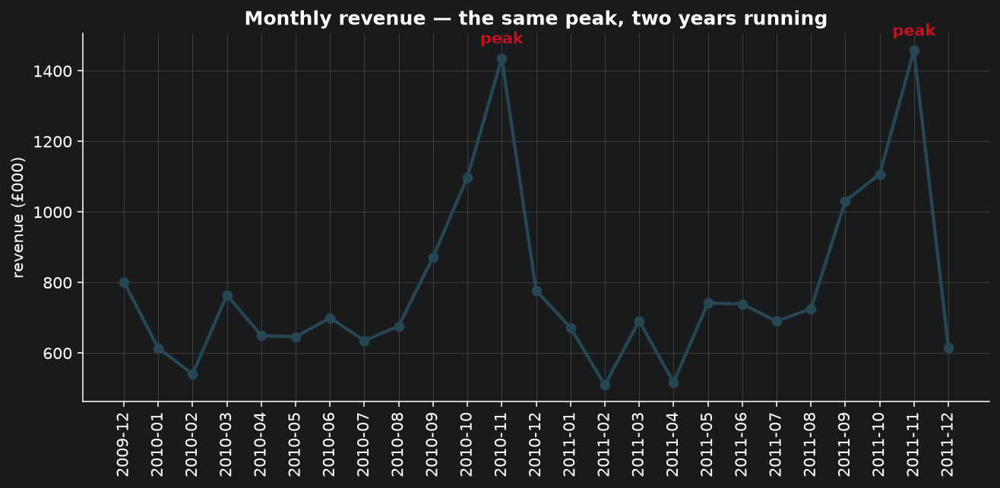

*Figure 1 — Monthly revenue, December 2009 – December 2011*

Revenue peaks in November in both trading years, ahead of the December retail season this wholesaler supplies, and the two peaks have the same shape. A peak that repeats is a seasonal signal that can be planned against; a peak that appears once is an event. The distinction matters because only the first justifies changing a policy.

The practical consequence is that a fixed stock cover is wrong for roughly a third of the year. It ties up capital through the quiet spring months when the catalogue is not earning, and it under-stocks the autumn weeks in which most of the year's revenue is booked. A cover rule that does not move with the season is calibrated correctly for no part of it.


#### Revenue concentration

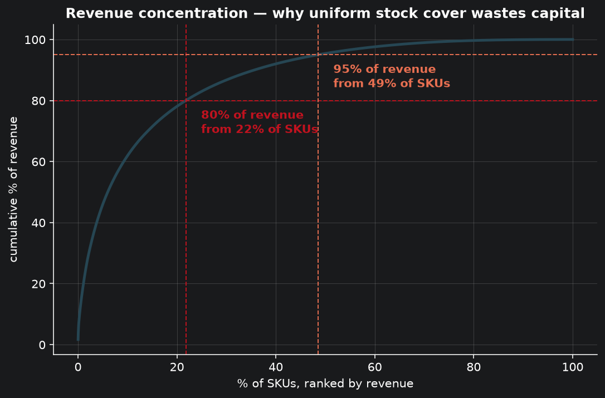

*Figure 2 — Pareto curve — cumulative revenue by SKU rank*

21.8% of SKUs generate 80% of revenue. The number itself is unremarkable — concentration of this kind is expected in a long-tail catalogue — and the consequence is what matters. Under a uniform stock-cover rule, an item earning a few pounds a year receives the same buffer, the same reorder discipline and the same share of the buyer's Monday morning as an item earning tens of thousands. That is not an inefficiency at the margin; it is the working capital of the business allocated in near-inverse proportion to where it is earned.

The curve is the argument for classifying the catalogue before setting any policy at all, and it is the second of the two blind spots in the problem statement rendered as a single line.


#### Basket structure

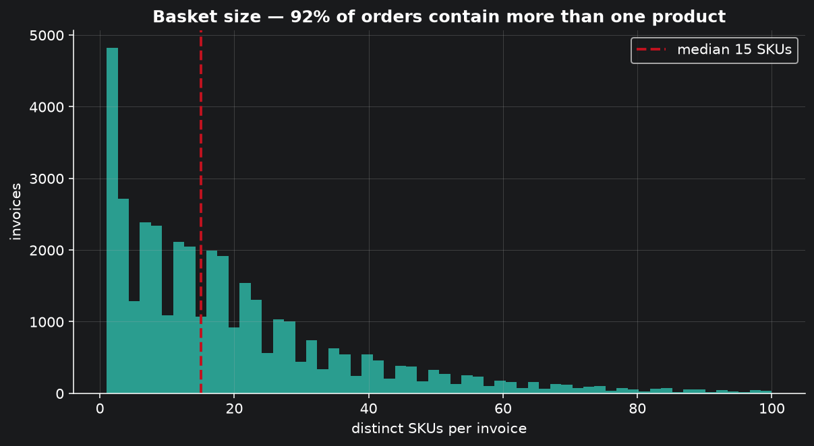

*Figure 3 — Distribution of distinct SKUs per invoice*

91.9% of invoices contain more than one SKU. The median invoice carries fifteen distinct products, seventeen if only multi-item invoices are counted. Nine orders in ten are assortments rather than single purchases.

This is the first blind spot made visible. A replenishment process that treats every product as an independent demand stream is modelling the one order in eleven that actually behaves that way, and is silently mis-modelling the other ten. Whatever relationship exists between the items in those baskets, a product-by-product process cannot represent it — which is what makes the pull-through question in section 9 worth asking rather than assuming.


#### Where a stockout is most expensive

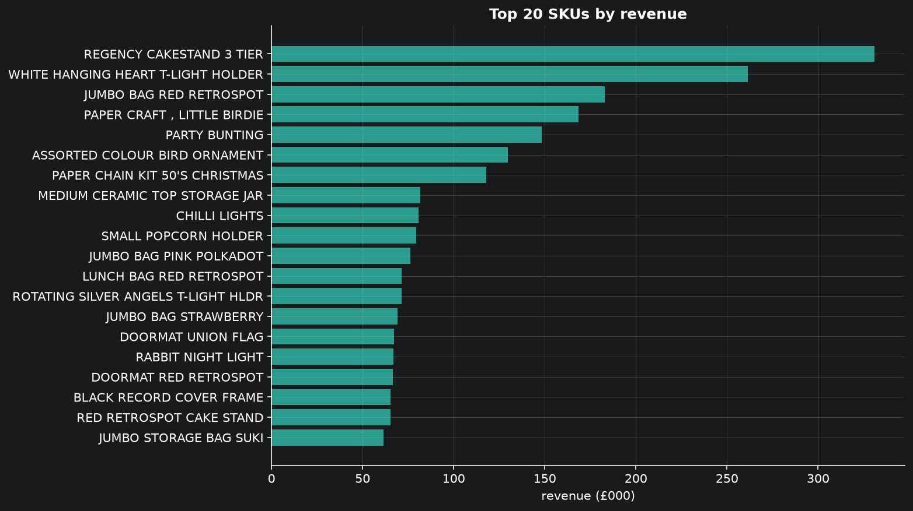

*Figure 4 — Top 20 SKUs by revenue*

*REGENCY CAKESTAND 3 TIER* leads the catalogue at £331,084, followed by *WHITE HANGING HEART T-LIGHT HOLDER* at £261,510 and *JUMBO BAG RED RETROSPOT* at £183,000. A buyer thinks in product names rather than stock codes, and these three are the items whose absence from the warehouse would be felt within a week.

One entry does not belong with the others, and it is worth naming. *PAPER CRAFT, LITTLE BIRDIE* earned £168,470 — fourth in the catalogue — in a **single week**, and never sold again. It is one exceptional order rather than a product with a demand history, and any policy that treated it as the fourth most important SKU in the business would be badly wrong. Revenue rank alone cannot tell these two kinds of item apart, which is precisely the case for the second axis introduced in the next figure.


#### Volume against volatility — the case for two dimensions

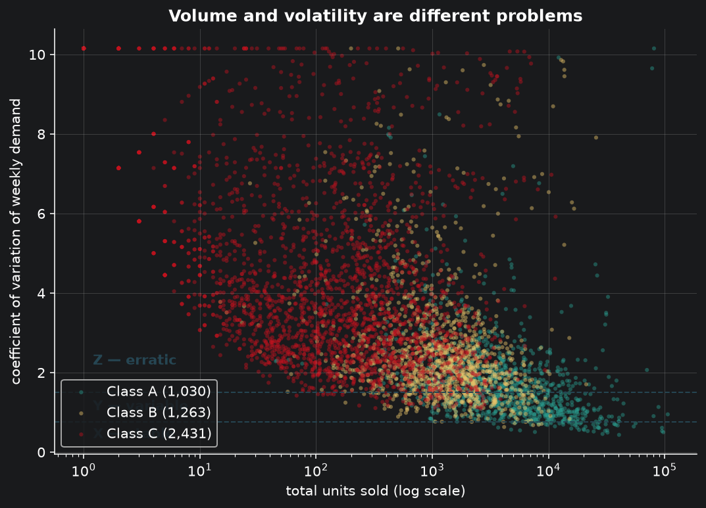

*Figure 5 — Sales volume against demand volatility*

This is the chart the whole classification rests on. Plotting mean weekly volume against the coefficient of variation of that volume shows the two to be very nearly independent: knowing that an item sells in quantity tells you almost nothing about whether its demand is steady or erratic. High-volume items appear at both extremes of volatility, and so do low-volume ones.

If volume and volatility moved together, one axis would carry both pieces of information and a simple ABC classification would be sufficient. They do not, so it is not. A ranking on revenue alone answers how much an item is worth and is silent on how predictable it is — and the second question is the one that determines how much safety stock the item needs. Two independent properties require two dimensions, and this scatter is the direct empirical justification for the grid that follows.


#### Building the classification

The grid is constructed from two measured properties, with thresholds chosen from convention rather than fitted to the data — a fitted threshold would make the classification a description of this particular file rather than a policy instrument.

- **ABC on cumulative revenue share**: A = the SKUs comprising the first 80% of revenue, B = the next 15%, C = the final 5%.
- **XYZ on the coefficient of variation of weekly demand**, measured across all 104 weeks including zeros: X = CV below 0.5 (stable), Y = 0.5 to 1.0 (variable), Z = above 1.0 (erratic).
- Both axes are computed on the reindexed weekly panel from section 7, so a SKU that sells intermittently is correctly measured as volatile rather than appearing artificially stable.

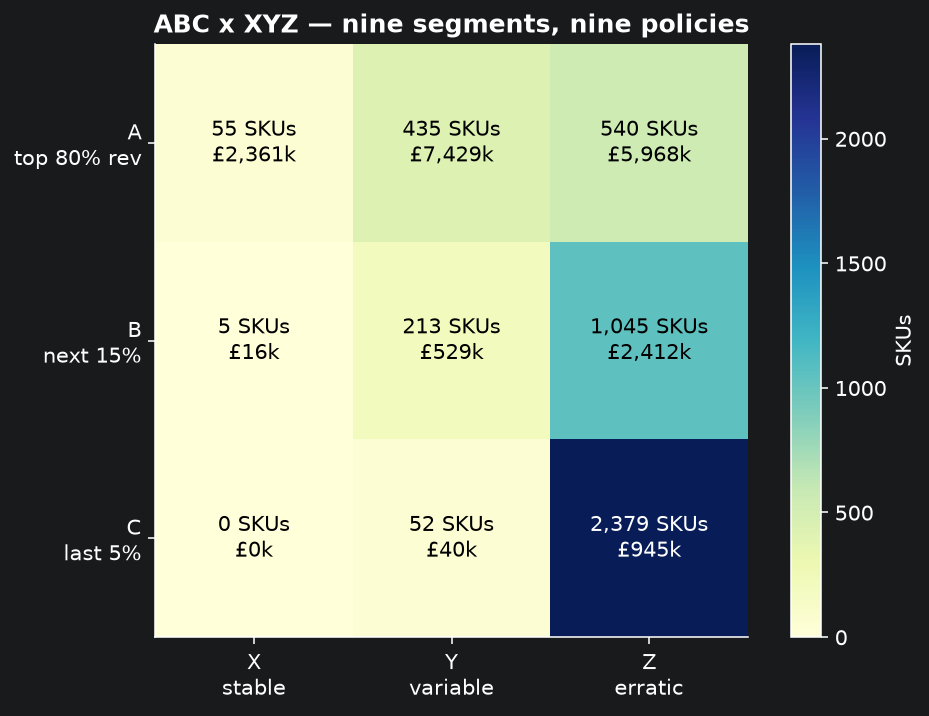

*Figure 6 — The ABC × XYZ grid — nine cells, nine policies*

The grid is the central deliverable of the classification, and its purpose is to replace one policy with nine. Two opposite cells show why that is necessary.

An **AX** item — high revenue, stable week-to-week demand — is the easiest kind of product to manage well. Its demand is predictable, so its forecast error is small, so its safety stock can be small, so a tight reorder point delivers high availability on very little capital. There are 55 such SKUs and they generate 12.0% of revenue. They deserve a low buffer and close attention, which is the opposite of what intuition suggests: the most important products need the least protective stock, because they are the most predictable.

A **CZ** item — low revenue, erratic demand — is the opposite case, and the correct response is not a better forecast but a different decision. Its demand cannot be predicted usefully from its history, so a reorder point computed for it would be a number with no evidence behind it. These items should be ordered against confirmed demand, consolidated into supplier drops, or reviewed for delisting. Applying a forecast-driven policy to them spends analytical effort where it cannot pay.

Everything between those two corners takes an intermediate policy. The point of the grid is that the buyer's question is never *“how much cover should we hold?”* but *“how much cover should we hold for this kind of item?”*

| Source | Why it was rejected |
|---|---|
| Instacart Market Basket Challenge | 3.3 million orders and purpose-built for basket analysis — but it carries no calendar dates, only relative day offsets. Demand forecasting and seasonality are therefore impossible, which removes objectives 6, 7 and 10 |
| Corporación Favorita / M5 / Walmart | Excellent multi-year sales history, but sales are aggregated per item per store with no invoice identifier. No basket structure means no association mining |
| Scraping a live retailer | Terms-of-service risk, no historical depth, and weeks of engineering effort for data that would still lack basket structure |
| Synthetic / generated data | Any pattern found would be a pattern that was put there. No real-world validity |

*Table 9 — The nine cells, measured*

One line in the table carries the argument. 2,379 SKUs — 50.4% of the catalogue — sit in the CZ cell and produce 4.8% of revenue between them. Half the catalogue earns roughly a twentieth of the money, and it does so with demand too erratic to forecast.

That is not an argument for deleting those products; a wholesaler's range has value beyond the revenue of each line, and a buyer visiting the catalogue expects to find them. It is an argument about where effort and capital should go. Half the catalogue does not warrant a forecast, a safety-stock calculation or a place on the buyer's weekly review, and the attention released by saying so is what makes disciplined management of the AX and AY cells affordable.


#### Two items in the same class, behaving nothing alike

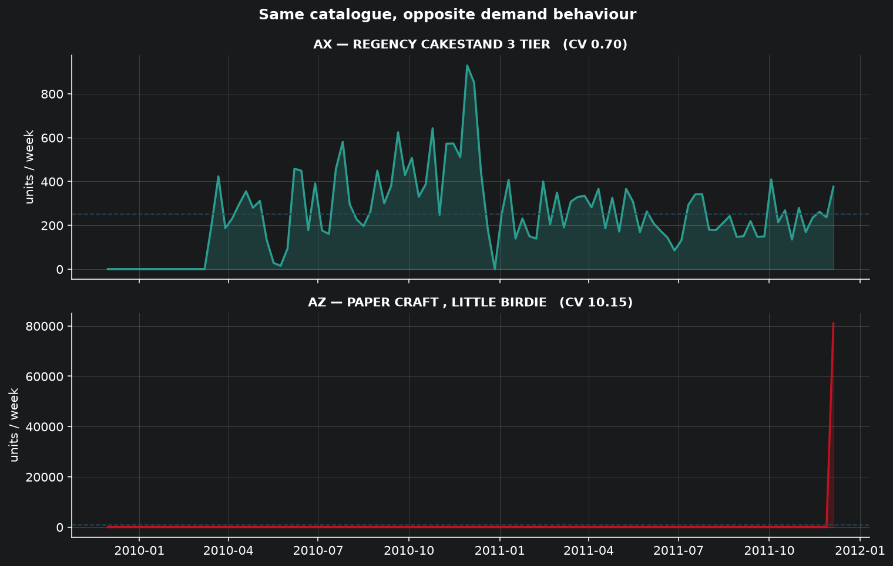

*Figure 7 — An AX and an AZ SKU, same revenue class, opposite behaviour*

This figure answers the obvious objection: why not simply take a moving average of recent sales and be done with it?

Both SKUs plotted here sit in the A revenue class. Both are among the most valuable products in the catalogue. Week to week they behave nothing alike. The AX item traces a narrow band around its mean; the AZ item spikes and collapses, with a coefficient of variation several times larger. A moving average fitted to the first is a reasonable forecast. The same moving average fitted to the second is a line drawn through noise, and a reorder point derived from it would be confidently wrong.

Revenue class alone cannot distinguish these two products, and any single policy applied to both will be miscalibrated for at least one of them.


#### Trading rhythm

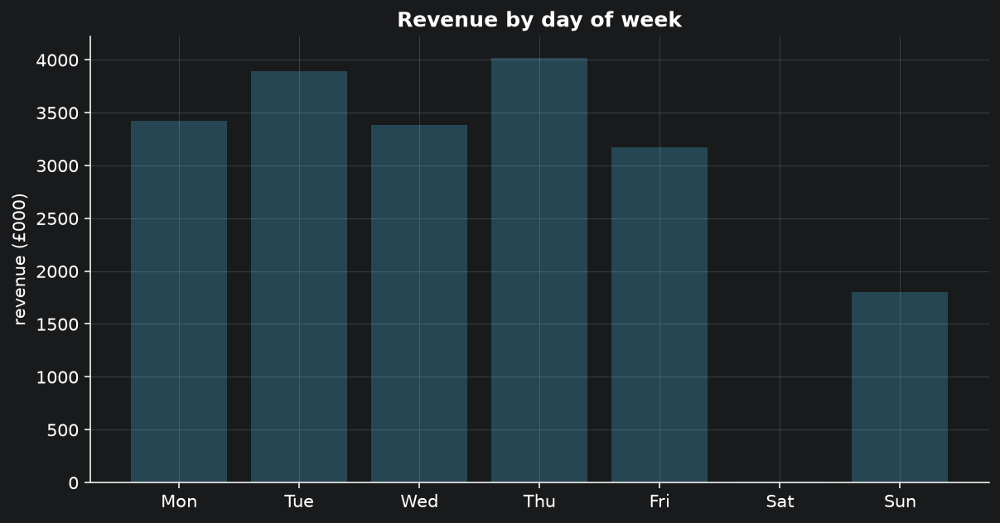

*Figure 8 — Revenue by day of week*

Trading follows a working-week pattern with almost nothing recorded at weekends — consistent with business customers placing orders during office hours rather than consumers shopping at leisure, and a further confirmation of the business description in section 3.

The practical consequence is a unit of measurement. Lead times in this project are expressed in working weeks, and the reorder points in section 9 assume that a two-week lead time means ten trading days rather than fourteen calendar days. Treating the weekend as ordinary demand would inflate every demand-over-lead-time figure by roughly two-sevenths.


#### Returns

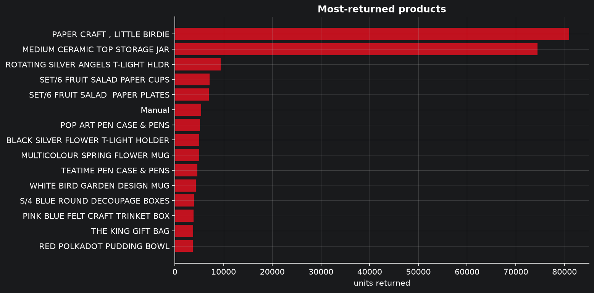

*Figure 9 — Returns concentration by SKU*

Returns are heavily concentrated: 19,165 return lines were separated during cleaning, and they fall on a small minority of the catalogue rather than being spread evenly across it.

For those specific SKUs, gross sales overstate true demand. A reorder point computed from gross figures would size the buffer for units that come back, and the item would be systematically over-stocked in a way that no aggregate metric would reveal. This is why cancellations were routed to `returns.csv` rather than deleted in section 7 — they are not demand and must not be counted as such, but they are evidence about which products behave this way, and discarding them would have destroyed the ability to identify them at all.


#### Intermittency

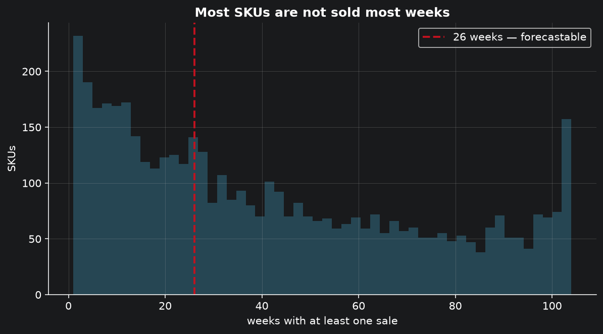

*Figure 10 — Share of the 104 weeks in which each SKU records a sale*

The median SKU records a sale in roughly a third of the 104 weeks. Demand in this catalogue is intermittent, not continuous, and that is the honest constraint on objective 6.

It is worth stating that the constraint was identified here, in the exploratory work, rather than discovered later as a modelling failure. A time-series method assumes a series; an item that sells in 34 weeks out of 104 does not really have one. This chart predicts in advance that forecasting will succeed for the stable, high-volume minority and fail for the rest — a prediction the modelling in section 9 goes on to confirm independently, and which is the reason the forecasting result there is reported as a finding rather than a disappointment.


#### Absence episodes

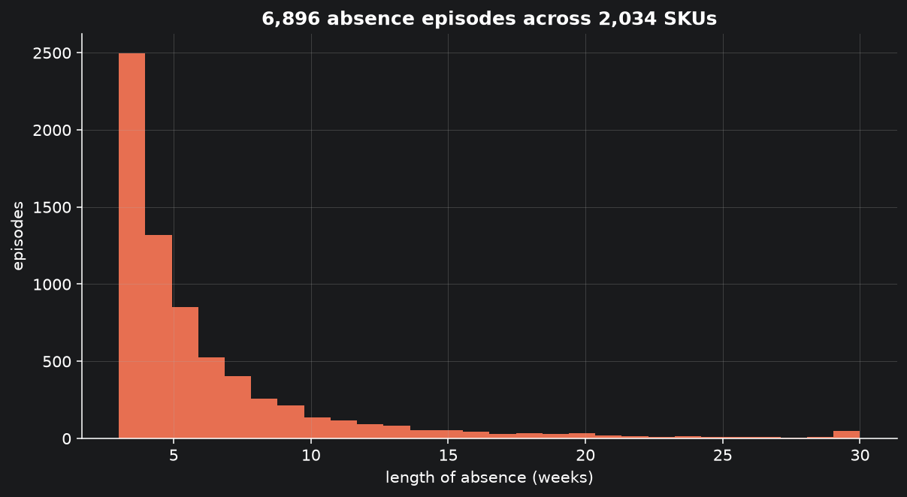

*Figure 11 — Absence episodes — SKUs that stop selling and later resume*

6,896 absence episodes were identified across 2,034 SKUs on the cleaned data: products that sold regularly, stopped for three weeks or more, and later resumed. This is the raw material for the pull-through experiment in section 9, and its volume is what makes that experiment possible at all — a handful of episodes would have supported an anecdote, not a significance test.

The requirement that the SKU resume afterwards is doing the important work here. It is what separates a product that was temporarily unavailable from one that was withdrawn, and without it every delisted line in the catalogue would have been counted as a stockout.

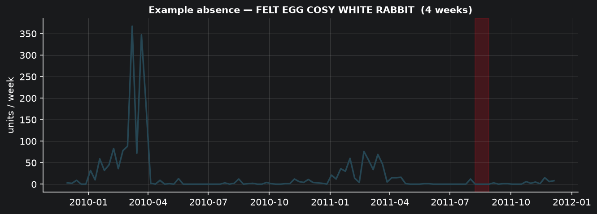

*Figure 12 — One absence episode in detail*

A single episode makes the structure concrete: steady weekly sales, an abrupt gap of several weeks in which nothing at all is recorded, and then sales resuming at approximately the previous level. The resumption is the evidence that the product still had demand throughout — the gap is an absence of supply, not an absence of interest.

This shape, repeated 6,896 times, is what the test in section 9 measures. For each such gap the question asked is not what happened to this product, whose sales are zero by definition, but what happened to the products customers usually bought alongside it.


#### Catalogue mass against revenue

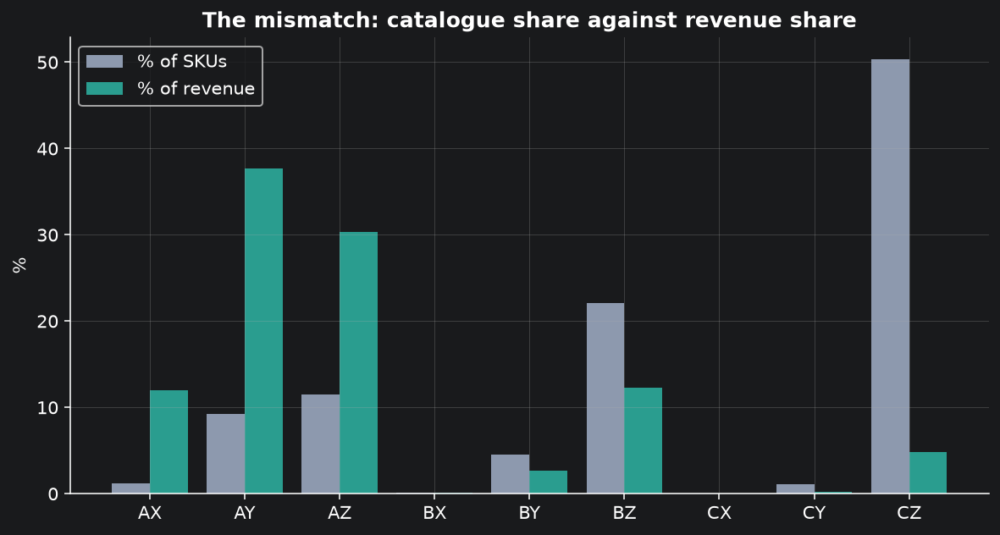

*Figure 13 — Share of catalogue against share of revenue, by class*

Where the SKUs are is not where the money is. Read beside the Pareto curve in Figure 2, this chart completes the argument: the catalogue's mass sits in the low-value, high-volatility classes while its revenue sits in a small, comparatively well-behaved group of products.

Together the two charts establish that a single replenishment rule cannot be right. Any uniform policy must be calibrated either for the half of the catalogue that earns almost nothing, in which case the products that matter are under-protected, or for the products that matter, in which case the long tail absorbs capital it will never justify. There is no setting of a single parameter that serves both, which is what the nine-cell grid exists to resolve.


## Dashboard Design & Business Insights

Tool: Power BI Desktop. Source: twelve flat tables in `data/processed/dashboard/`, built by `src/build_dashboard_tables.py`. Four pages, each answering one business question.


### Who it is for

Not an analyst — a replenishment buyer deciding on a Monday morning what to order. That single decision drives the design. Every page answers one question, in the order a buyer would ask them: where is the money, what is bought together, what does a stockout cost, and what should I order. No page requires the user to construct a query, choose a measure, or know what a coefficient of variation is.


### Data model

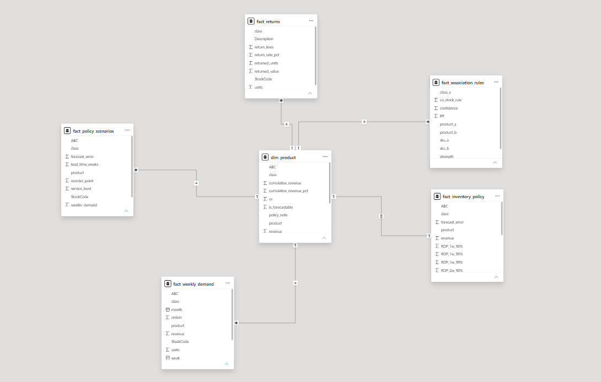

*Figure 14 — The Power BI data model — star schema on dim_product*

Power BI performs no joins and no aggregation. Every number the dashboard displays is computed in pandas and delivered as a flat table, related to a single product dimension in a star schema. The reason is reproducibility: a measure written in DAX inside a `.pbix` file is difficult to audit, impossible to unit-test, and invisible to anyone reading the repository. A figure computed in a notebook cell can be traced to the line of code that produced it and re-derived from the raw download by a third party.

This has a second benefit that matters more in practice than it sounds. Because the dashboard and the Streamlit prototype read the same pre-computed tables, the two artefacts cannot disagree with one another. A discrepancy between a dashboard and an application is a common and corrosive failure — it costs the user their trust in both — and here it is prevented structurally rather than by discipline.

A third benefit is performance. With all aggregation pre-computed, the `.pbix` stays fast enough to explore at conversational speed, which is the difference between a dashboard a buyer uses during a supplier call and one they open once.


### Page 1 — Where the money is

**Question:** which products actually matter, and what does the catalogue look like?

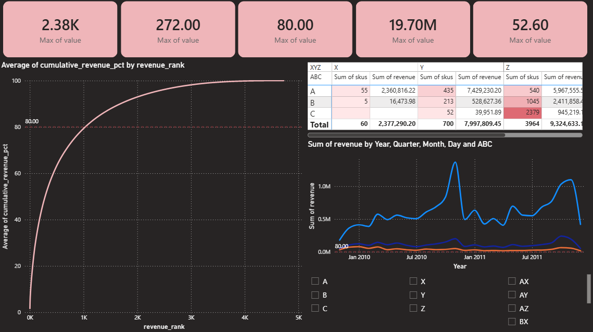

*Figure 15 — Dashboard page 1 — catalogue value and concentration*

| Field | Type | Meaning | Why it matters here |
|---|---|---|---|
| Invoice | text | Transaction number. A leading C marks a cancellation | Defines the basket. Also the source of the returns analysis |
| StockCode | text | Product code (SKU) | The unit of every inventory decision. Not purely numeric — see section 6 |
| Description | text | Product name | Makes rules and charts readable to a buyer. Missing on 0.4% of rows |
| Quantity | integer | Units on the line. Can be negative | Demand. Negative values are returns, not demand |
| InvoiceDate | datetime | Date and time — recorded per invoice, not per line | The time axis. The per-invoice granularity matters for duplicate detection |
| Price | decimal | Unit price in GBP | Revenue, with Quantity. Zero and negative prices exist and are excluded |
| Customer ID | integer | Customer identifier | Missing on 22.8% of rows. Unused — this project works at invoice and SKU level |
| Country | text | Destination country | ~92% United Kingdom, which is why the project is described as a UK distributor |

*Table 10 — Page 1 visuals*

Roughly 22% of SKUs generate 80% of revenue, and 2,379 SKUs — half the catalogue — sit in the CZ cell, contributing 4.8% of revenue on demand too erratic to forecast.

For a buyer, that is a statement about where to spend Monday morning. Half the catalogue does not warrant individual attention, and the page is designed to make that visible in a glance rather than to invite exploration of it. The Pareto curve and the nine-cell grid sit side by side deliberately: the first shows how concentrated revenue is, the second shows that concentration alone is not enough to set a policy.


### Page 2 — What is bought together

**Question:** which products must not be allowed to go out of stock independently?

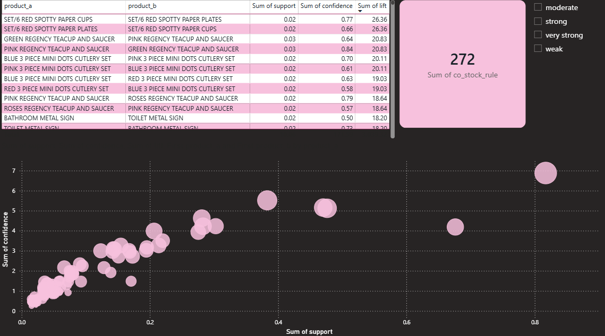

*Figure 16 — Dashboard page 2 — association rules and co-stocking pairs*

| Column | Missing | Share | What it means |
|---|---|---|---|
| Customer ID | 243,007 | 22.8% | Guest or unrecorded checkout. Irrelevant here — the project works at invoice and SKU level, so no row is lost to it |
| Description | 4,382 | 0.4% | Mostly adjustment and service rows, which are removed in cleaning anyway |

*Table 11 — Page 2 visuals*

**Design note:** the table sorts by lift, never by confidence. Confidence is inflated by popularity, so sorting by it would put the best-selling products at the top of every list regardless of whether any real association exists — the buyer would be shown what sells, not what sells together.

The strongest pairs on this page are product families — the same item in several colours, or the components of a set. *SET/6 RED SPOTTY PAPER CUPS* and the matching *PLATES* co-occur at a lift of 26.4, meaning they appear together over twenty-six times more often than independent purchasing would produce. The Regency teacups repeat the pattern across pink, green and roses; so do the three-piece mini dots cutlery sets, and *TOILET METAL SIGN* with *BATHROOM METAL SIGN*.

This is exactly the pattern co-stocking is for, and it is more actionable than a subtle cross-category association would have been. A customer buying cups for a party expects the plates to be available, and a customer collecting a teacup in one colour is likely to be assembling the set. When one member of such a family is out of stock, the sale of the others is at risk in a way that the item's own demand history gives no warning of — which is the hypothesis the next page tests.


### Page 3 — What a stockout costs

**Question:** how much is actually lost when an item runs out?

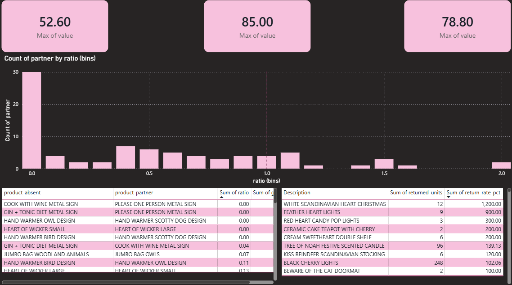

*Figure 17 — Dashboard page 3 — the measured cost of an absence*

| Question | Answer | Verdict |
|---|---|---|
| Are there enough multi-item baskets to mine? | 90.8% of invoices; median basket 17 SKUs; largest 1,110 | Association mining viable |
| Is revenue concentrated enough for ABC to mean anything? | ≈22% of SKUs generate 80% of revenue | ABC meaningful |
| Is there enough history per SKU to forecast? | 2,810 SKUs with 26+ active weeks; 664 with fewer than 8 | Forecasting viable for the top, not the tail |
| Are there enough absence episodes to test pull-through? | 7,054 qualifying episodes across 2,086 SKUs | Pull-through testable |

*Table 12 — Page 3 visuals*

This is the page the project exists for. When a product disappears from sale, its strongest co-purchase partners lose a median 52.6% of their weekly sales while it is gone. The effect was observed in 78.8% of the 85 pairs tested and is significant at p = 3.25 × 10⁻⁸.

The consequence for a buyer is direct and quantitative. The cost of a stockout is not the margin on the units of that product that could not be sold; it is that figure plus roughly half the sales of everything customers ordinarily buy alongside it. On a family such as the red spotty cups and plates, letting one line run out puts the other at risk, and the loss appears in the sales record of a product that never went out of stock — where nobody thinks to look for it.

That reframes the reorder decision. Items with strong partners should not be reordered independently of them, because their true joint cost of failure is materially higher than either item's own numbers suggest. The page shows the effect per pair so the buyer can see which of their products carry this risk, rather than being told that the effect exists in general.

The honest qualification belongs on the page as much as in the report: the analysis measures absences, and an absence is not proven to be a stockout. Section 9 sets out the two controls that narrow the alternatives and the residual risk that remains.


### Page 4 — What to order

**Question:** what is the reorder point for this SKU, and how sure are we?

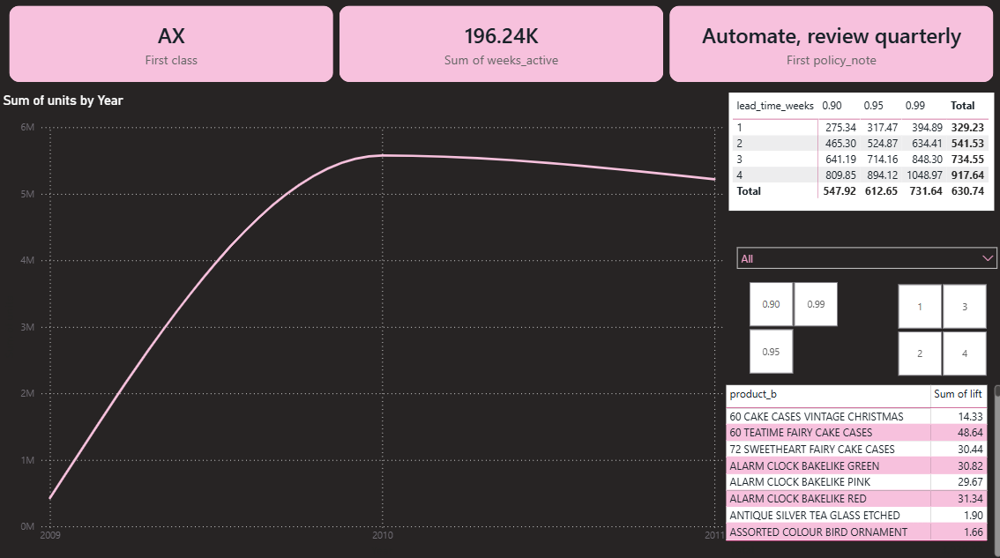

*Figure 18 — Dashboard page 4 — SKU-level replenishment recommendation*

| Step | Decision | Before | After | Removed |
|---|---|---|---|---|
| D1a | Remove cross-sheet duplicates (Dec 2010 published in both sheets) | 1,067,371 | 1,044,527 | 22,844 |
| D2 | Move cancellations to returns.csv — kept, not discarded | 1,044,527 | 1,025,362 | 19,165 |
| D3 | Remove service codes, postage, vouchers and test rows | 1,025,362 | 1,020,724 | 4,638 |
| D4 | Drop non-positive quantity (write-offs and adjustments) | 1,020,724 | 1,017,331 | 3,393 |
| D4 | Drop zero or negative price (gifts and errors) | 1,017,331 | 1,014,751 | 2,580 |
| D4 | Drop rows with no product description | 1,014,751 | 1,014,751 | 0 |
| TOTAL | Raw lines → clean sales lines | 1,067,371 | 1,014,751 | 52,620 (4.9%) |

*Table 13 — Page 4 visuals*

Lead time is not present in the source data. There is no field recording how long a replenishment took to arrive, and there is no way to recover one from a transaction file. The conventional response is to pick a plausible number, write it into the calculation and move on — which hides an assumption inside a result and makes the recommendation look more certain than the evidence supports.

This page takes the opposite approach and puts lead time and service level in the buyer's hands as controls. The reorder point recalculates as they move. The buyer knows their own supplier lead times far better than the dataset ever could, and the honest form of the deliverable is therefore not a number but a function — given your lead time and the service level you are willing to pay for, here is the reorder point implied by this SKU's demand and its forecast error.

Exposing the assumption also makes it arguable. A buyer who disagrees with a two-week lead time can change it and see immediately how much the answer depends on the disagreement, which is a conversation a single hard-coded figure would have foreclosed.

The sensitivity visual on the same page carries a second insight. Doubling the lead time from two weeks to four does not double the reorder point: the demand component scales linearly with lead time, but the safety-stock component scales with its square root. For a buyer negotiating with a supplier this is the useful form of the result — halving a lead time does not halve the stock required to protect against it, and the curve shows exactly how much a change is worth for a given SKU.


### What the dashboard deliberately does not show

Stating what a dashboard refuses to display is part of its design, and each of these omissions is a decision rather than a gap.

- **Customer-level analysis.** 22.8% of rows have no customer ID and the project works at invoice and SKU level. A partial customer view presented without that caveat would be worse than none.
- **A forecast line on every SKU.** Forecasting is justified for roughly 2,800 SKUs and meaningless for the rest; putting a forecast on every product would lend false authority to the ones where it cannot be trusted.
- **Absolute stock levels.** There is no stock-on-hand data. The dashboard recommends reorder points, not current positions, and the page wording is careful to say so rather than implying a warehouse view it does not have.
- **Profit or margin.** The source carries price but no cost. Every figure is revenue or units, and no margin is ever implied.


## Advanced Analytics and AI Modeling

Source notebook: `notebooks/04_modeling.ipynb`. Four analytical blocks are presented in the order they were built, because each depends on the one before it: the association rules supply the partner pairs the pull-through test needs, the pull-through result motivates joint reordering, the forecast supplies the error term the inventory policy needs, and the simulation tests the policy the classification produced.

For each block this section states what kind of model was chosen and why, what result was being sought, the parameters and thresholds used, and how the output was evaluated. Where a model choice had a credible alternative, the alternative is named and the reason for rejecting it is given.


### Block 1 — Association rule mining

**Objectives 3 and 8.** The goal is to discover which products are genuinely bought together, as opposed to which products are simply both popular. The algorithm is FP-Growth over invoice-level baskets.


#### Preparing the basket matrix

Association mining consumes a one-hot matrix of invoices × products, and the width of that matrix is the binding constraint. With 4,724 SKUs the full matrix would be 33,505 × 4,724 booleans, and the itemset search over it becomes impractical on a laptop. The mining is therefore restricted to the 250 most basket-frequent SKUs.

That restriction is a real limitation and is worth naming rather than burying: pairs involving products outside the top 250 cannot be discovered at all. The justification is that co-stocking decisions are only worth making for products that appear in enough baskets to matter, and an association involving an item that appears in a handful of invoices is not something a buyer can act on. Raising the cap to 400 roughly quadruples runtime and, when tested, added very few rules above a lift of 5.

**Listing 10 — FP-Growth over the basket matrix**

```python
from mlxtend.frequent_patterns import fpgrowth, association_rules

# TOP_N caps the basket matrix width. 250 keeps FP-Growth to ~1-2 minutes;
# raising it to 400 roughly quadruples the runtime for very few extra rules.
TOP_N, MIN_SUPPORT = 250, 0.015

freq_sku = baskets["StockCode"].value_counts().head(TOP_N).index
b = baskets[baskets["StockCode"].isin(freq_sku)]

onehot = (b.assign(v=1).pivot_table(index="Invoice", columns="StockCode",
                                    values="v", aggfunc="max", fill_value=0).astype(bool))

items = fpgrowth(onehot, min_support=MIN_SUPPORT, use_colnames=True, max_len=2)
rules = association_rules(items, metric="lift", min_threshold=1.0)
rules = rules.sort_values("lift", ascending=False)
Output
basket matrix: 33,505 invoices x 250 SKUs
frequent itemsets at support >= 0.015: 490
pairwise rules with lift > 1: 480

                          A_name                           B_name  support  confidence   lift
   SET/6 RED SPOTTY PAPER PLATES      SET/6 RED SPOTTY PAPER CUPS    0.019       0.662 26.357
     SET/6 RED SPOTTY PAPER CUPS    SET/6 RED SPOTTY PAPER PLATES    0.019       0.774 26.357
  PINK REGENCY TEACUP AND SAUCER  GREEN REGENCY TEACUP AND SAUCER    0.026       0.840 20.828
 GREEN REGENCY TEACUP AND SAUCER   PINK REGENCY TEACUP AND SAUCER    0.026       0.639 20.828
BLUE 3 PIECE MINI DOTS CUTLER... PINK 3 PIECE MINI DOTS CUTLER...    0.021       0.699 20.112
RED 3 PIECE MINI DOTS CUTLERY... BLUE 3 PIECE MINI DOTS CUTLER...    0.019       0.580 19.028
  PINK REGENCY TEACUP AND SAUCER  ROSES REGENCY TEACUP AND SAUCER    0.024       0.790 18.637
               TOILET METAL SIGN              BATHROOM METAL SIGN    0.020       0.726 18.204
 GREEN REGENCY TEACUP AND SAUCER  ROSES REGENCY TEACUP AND SAUCER    0.031       0.765 18.045
   HAND WARMER SCOTTY DOG DESIGN           HAND WARMER OWL DESIGN    0.019       0.600 16.611
```


#### Two model choices to defend

- **FP-Growth rather than Apriori.** With roughly 4,700 SKUs, Apriori's candidate-generation step becomes the bottleneck and forces a high support threshold to remain tractable. That is exactly the wrong compromise in a long-tail catalogue, because the interesting pairs live at *low* support — two products that co-occur in 2% of baskets are far more informative than two that co-occur in 20% simply because both are best-sellers. FP-Growth builds a compressed prefix tree and never enumerates candidates, so a support threshold of 1.5% is affordable.
- **Lift rather than confidence.** Confidence is inflated by popularity: almost everything looks confidently bought alongside a best-seller, because the best-seller is in most baskets. Lift divides by the base rate of the consequent and therefore measures association rather than prevalence. Ranking by confidence would have produced a list of popular products; ranking by lift produces a list of related ones.

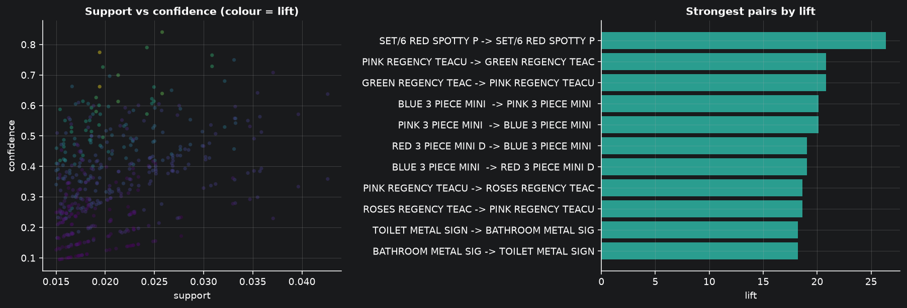

*Figure 19 — Association rules — support, confidence and lift*


#### What the results look like

480 pairwise rules were produced at a lift above 1, of which 272 sit at a lift of 5 or higher. The pattern in the strongest of them is worth a paragraph of its own, because it determines whether the rules are actionable.

Almost every high-lift pair is a **product family**: the same item in a different colour, or another piece of the same set. The Regency teacup and saucer appears in pink, green and roses, and each colour pair carries a lift above 18. The three-piece mini dots cutlery sets do the same across blue, pink and red. *SET/6 RED SPOTTY PAPER CUPS* and *PLATES*, the strongest pair in the catalogue at a lift of 26.4, are two halves of a party set. *TOILET METAL SIGN* and *BATHROOM METAL SIGN* are a matched pair.

This is a more useful result than a subtle cross-category association would have been, and it is worth being explicit about why. A surprising rule — an unexpected pairing between unrelated categories — is interesting but hard to act on, because the buyer has no mechanism to explain it and therefore no confidence that it will persist. A product family is the opposite: the mechanism is obvious, the customer is visibly assembling a set, and the action is immediate. These are the items that must not be allowed to go out of stock independently of one another, and the reason is one a buyer can state in a sentence.

It also supplies the pairs used in the experiment that follows. A test of pull-through needs partners whose relationship is strong enough that its disruption should be measurable, and these families are the clearest available case.


### Block 2 — The pull-through experiment

**Objective 4, and the headline result of the project.** Rather than assuming that a stockout suppresses partner sales, the data is used to test whether it does, and by how much.


#### The design

The experiment has the structure of a natural experiment. Each absence episode detected in section 6 is an intervention: a product that was selling stops being available. The outcome measured is not that product's own sales — which are zero during the gap by definition, and therefore uninformative — but the sales of the partners customers ordinarily bought alongside it.

1. For each SKU with a qualifying absence episode, take its **three strongest partners by lift** from the association rules, restricted to rules with a lift above 1.5 so that weak associations do not dilute the sample.
2. Measure each partner's total sales **during** the absence weeks.
3. Measure the same partner's sales in the **four weeks either side** of the gap — the baseline.
4. Compute the ratio of during-sales to baseline-sales. A ratio of 1.0 means no effect; below 1.0 means the partner sold less while the SKU was absent.
5. Test the paired during/baseline values for a significant difference with the **Wilcoxon signed-rank test**, which is used rather than a paired t-test because the ratios are strongly skewed and not normally distributed.

**Listing 11 — pairing each absent SKU with its strongest partners**

```python
partners = (rules[rules.lift > 1.5].groupby("A")
            .apply(lambda g: g.nlargest(3, "lift")["B"].tolist(), include_groups=False)
            .to_dict())

WINDOW = 4
results = []
for _, ep in absence.iterrows():
    for p in partners.get(ep.StockCode, []):
        # partner sales DURING the gap, against the partner's own
        # sales in the WINDOW weeks either side of it
        ...
```

**Listing 12 — the significance test**

```python
from scipy import stats
med = pt.ratio.median()
stat, p = stats.wilcoxon(pt.during, pt.baseline)

print(f"observations                    : {len(pt):,}")
print(f"median partner sales ratio      : {med:.3f}   (1.0 = no effect)")
print(f"share of pairs where sales fell : {100*(pt.ratio<1).mean():.1f}%")
print(f"Wilcoxon signed-rank p          : {p:.2e}")
Output
observations                    : 85
median partner sales ratio      : 0.474   (1.0 = no effect)
share of pairs where sales fell : 78.8%
Wilcoxon signed-rank p          : 3.25e-08

RESULT: pull-through IS demonstrated. Partner sales fall by a median of
        52.6% while the item is absent.
```

| Class | SKUs | % of SKUs | Revenue (£) | % of revenue | Mean CV |
|---|---|---|---|---|---|
| AX | 55 | 1.16 | 2,360,816 | 11.98 | 0.64 |
| AY | 435 | 9.21 | 7,429,230 | 37.71 | 1.11 |
| AZ | 540 | 11.43 | 5,967,556 | 30.29 | 2.44 |
| BX | 5 | 0.11 | 16,474 | 0.08 | 0.68 |
| BY | 213 | 4.51 | 528,627 | 2.68 | 1.25 |
| BZ | 1,045 | 22.12 | 2,411,858 | 12.24 | 2.90 |
| CY | 52 | 1.10 | 39,952 | 0.20 | 1.33 |
| CZ | 2,379 | 50.36 | 945,219 | 4.80 | 4.54 |

*Table 14 — Pull-through test — result*

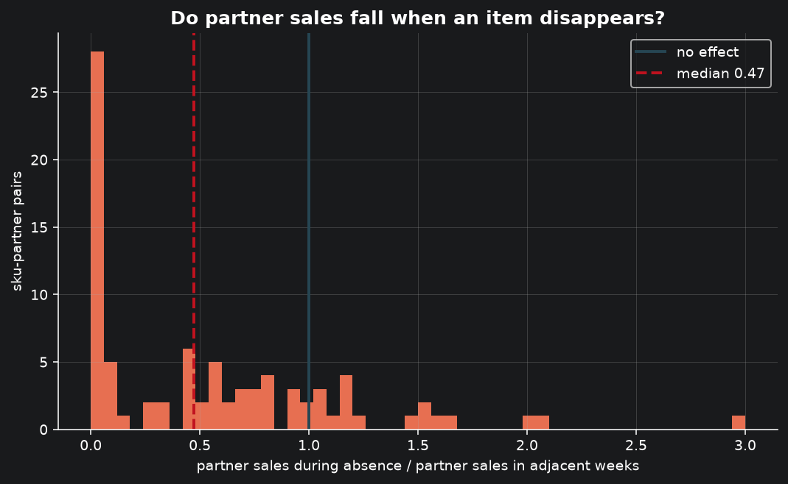

*Figure 20 — Partner sales during an absence, relative to adjacent weeks*


#### The result

When a product disappears from sale, its co-purchase partners lose a median 52.6% of their weekly sales. The median ratio of partner sales during the gap to partner sales in the adjacent weeks is 0.474, and the distribution sits clearly below 1.0 rather than straddling it: sales fell in 78.8% of the 85 pairs tested. The Wilcoxon signed-rank test returns p = 3.25 × 10⁻⁸, so the effect is not attributable to chance variation in a small sample.

> **When a product disappears, its co-purchase partners lose a median 52.6% of their sales.** The cost of a stockout is therefore roughly double what conventional accounting records, and half of it lands in the sales figures of products that never went out of stock.

The distinction between this result and the assumption it replaces is the substance of the section. That a stockout might depress partner sales is intuitive, and it is asserted routinely in inventory literature and in retail practice. It is asserted, in most cases, without a number attached. Here it has a number, a direction, a proportion of cases and a significance level, all derived from the retailer's own transaction record. A buyer can act on 52.6% in a way they cannot act on *“stockouts hurt related products”*.

The size is what makes it consequential. Losing half the sales of an item's strongest partners for the duration of an absence is comparable in magnitude to losing the absent item's own sales, which means conventional stockout costing understates the true loss by something approaching a factor of two for items with strong partners.


#### The two controls, and why each is necessary

- **Requiring the SKU to resume afterwards.** Without it, every deleted or discontinued product would count as a stockout, and the test would be measuring catalogue churn rather than availability. A product that is withdrawn permanently takes its partners' sales down too, but for a reason a buyer cannot act on — and including those cases would inflate the effect while making it useless.
- **Comparing against the partner's own adjacent weeks, never a global average.** Absence weeks and their immediate neighbours sit in the same season, so seasonality is differenced out rather than assumed away. Comparing against a yearly average would have confounded the measurement with the November peak visible in Figure 1 — an absence falling in a quiet month would look like a large drop, and one falling in a busy month like a small one.


#### What the test cannot prove

The limitation is stated here rather than left for an examiner to raise. What the data records is an **absence** — weeks in which a SKU that previously sold recorded no sales and later resumed. It does not record why. A stockout is the most likely explanation for a gap of this shape, particularly given the requirement that the product resume afterwards, but a supplier delay, a deliberate seasonal withdrawal, a temporary delisting or a gap in the retailer's own record-keeping would all produce the same pattern in a transaction file.

The two controls narrow the field substantially. Requiring resumption removes discontinued products; comparing each partner against its own adjacent weeks removes seasonality. Neither control can distinguish a stockout from a supplier gap, because both look identical from outside the warehouse. What can be claimed is therefore precise and slightly narrower than the headline: **when a product becomes unavailable for any reason, its partners lose a median 52.6% of their sales.** Whether that unavailability was a stockout or a supply failure is not recoverable from this data, and for the buyer's purposes the distinction matters less than it appears — both are absences from the shelf, and both cost the same.

Access to the retailer's own stock-on-hand history would resolve it in a single join. Section 12 returns to why that data does not exist publicly.


### Block 3 — Demand forecasting

**Objective 6.** Holt-Winters exponential smoothing on weekly demand for the 300 highest-revenue SKUs with at least 26 active weeks, evaluated on held-out data against two baselines.


#### Why exponential smoothing, and why not something larger

The choice was made on the character of the series rather than on the reputation of the method. Section 8 established that the median SKU sells in roughly a third of weeks, so even among the well-observed top of the catalogue the series are short — 93 training weeks — noisy, and frequently intermittent. Three consequences follow.

- **ARIMA was rejected** because order selection over 300 short, noisy series either requires a per-SKU search that overfits or a single shared order that fits none of them well.
- **Gradient boosting and neural approaches were rejected** because they need substantially more history per series than 93 weekly observations to learn anything a simple smoother cannot, and because their output would be far harder for a buyer to interrogate.
- **Trend and seasonal components were disabled** in the Holt-Winters fit. With 93 weeks there are fewer than two full annual cycles, which is not enough to estimate a yearly seasonal index reliably; fitting one would be fitting noise.


#### The split

The last 13 weeks are held out and never seen during fitting. The split is by time, not random — a random split of a time series leaks future information into training and produces accuracy figures that cannot be reproduced in operation.

**Listing 13 — the train/test split — 93 weeks train, 13 weeks held out**

```python
from statsmodels.tsa.holtwinters import ExponentialSmoothing
from sklearn.metrics import mean_absolute_error

HOLDOUT, MIN_WEEKS, MAX_SKUS = 13, 26, 300

panel = (weekly.pivot_table(index="week", columns="StockCode", values="units", aggfunc="sum")
         .reindex(wk_idx).fillna(0))
train, test = panel.iloc[:-HOLDOUT], panel.iloc[-HOLDOUT:]
Output
eligible SKUs: 300  (top 300 by revenue with 26+ active weeks)
train 2009-11-30 -> 2011-09-05  (93 weeks)
test  2011-09-12 -> 2011-12-05  (13 weeks)
```


#### The baselines

Two baselines are computed for every SKU, because an accuracy figure without a baseline is an assertion rather than a measurement. The **naive** forecast repeats the last observed value across the whole horizon. The **moving average** forecast repeats the training-period mean. Both are trivial to compute and both are what a business would actually do in the absence of a model, which is what makes them the right comparison.

**Listing 14 — the model, measured against both baselines on held-out weeks**

```python
rows = []
for s in eligible:
    y_tr, y_te = train[s], test[s]
    naive  = np.repeat(y_tr.iloc[-1], len(y_te))     # baseline 1
    mean_f = np.repeat(y_tr.mean(),   len(y_te))     # baseline 2
    hw = ExponentialSmoothing(y_tr, trend=None, seasonal=None,
                              initialization_method="estimated").fit().forecast(len(y_te)).values
    rows.append({"StockCode": s,
                 "mae_naive": mean_absolute_error(y_te, naive),
                 "mae_mean":  mean_absolute_error(y_te, mean_f),
                 "mae_hw":    mean_absolute_error(y_te, hw)})

fc = pd.DataFrame(rows)
fc["beats_naive"] = fc.mae_hw < fc.mae_naive
Output
SKUs modelled                    : 300
median MAE, naive                : 79.58 units/week
median MAE, moving average       : 75.29
median MAE, exponential smoothing: 73.04
SKUs where the model beats naive : 156 of 300 (52.0%)
median improvement where it wins : 16.4%
```

| Visual | Source table | What it reads |
|---|---|---|
| KPI cards | kpi_cards | Total revenue, SKU count, Class A share, delist candidates |
| Pareto line | dim_product | Cumulative revenue by SKU rank |
| ABC/XYZ matrix | summary_abc_xyz | The nine cells, SKU count and revenue in each |
| Monthly trend | summary_monthly | Revenue by month, split by ABC class |
| Slicers | dim_product | ABC, XYZ, class |

*Table 15 — Forecast accuracy against baselines, 13 held-out weeks*

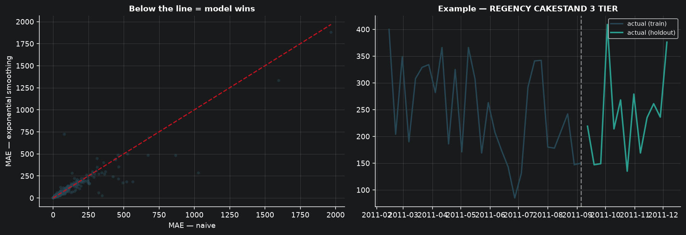

*Figure 21 — Forecast error against the naive baseline, per SKU*


#### The result, read honestly

The model beats the naive baseline on 156 of 300 SKUs — 52.0% — with a median MAE of 73.0 units per week against the naive 79.6 and the moving average's 75.3. Where it wins, the median improvement is 16.4%.

This is a finding, and it should be read as one rather than as a weak result. A method that improves on a naive forecast for barely half the catalogue is telling you something specific about the catalogue: **forecasting is worth doing for the stable, high-volume SKUs and is not worth doing for the rest.** That is precisely the division the XYZ axis drew from demand volatility alone, several steps earlier and by an entirely independent route. Two different methods identifying the same boundary is corroboration, and it is the reason the inventory policy in Block 4 applies forecast-driven reorder points selectively rather than universally.

The reporting convention matters as much as the result. A median MAE of 73.0 units per week quoted on its own sounds like a competent model and is uninterpretable — the reader has no way to know whether 73 is good. Against a naive baseline of 79.6 it is an 8% improvement in the median, which is modest and honest. Any accuracy figure published without the baseline it should be compared against is an assertion rather than a measurement.

There is a second, quieter use for the forecast that survives regardless of how often it wins. Block 4 does not consume the forecast's point prediction; it consumes its **error**. The MAE of the fitted model on each SKU is the best available estimate of how unpredictable that SKU is, and it is that quantity — not the forecast itself — that sizes the safety stock.


### Block 4 — Inventory policy and its validation

**Objective 7.** The reorder point is the demand expected over the lead time, plus a safety buffer scaled by forecast error and the chosen service level.

```
reorder point = demand over lead time + z × forecast error × √(lead time)
```

Three properties of that formula are worth stating. The demand term is the SKU's mean weekly demand multiplied by the lead time. The safety term uses **forecast error** rather than raw demand variance, which is the right quantity: what must be protected against is not how much demand moves, but how much of that movement was unanticipated. And the service level enters through *z*, the standard normal quantile — 1.28 for 90%, 1.65 for 95%, 2.33 for 99% — so the buyer's tolerance for stockouts is an explicit input rather than an embedded assumption.


#### Lead time as a variable, not an assumption

Lead time is absent from the source data. Rather than choosing a plausible number and hiding it inside the result, reorder points are computed across a full grid of 1 to 4 weeks and three service levels, and the grid is reported.

**Listing 15 — reorder points across the full lead-time × service-level grid**

```python
Z = {"90%": 1.28, "95%": 1.65, "99%": 2.33}
LEAD_TIMES = [1, 2, 3, 4]

err    = fc.set_index("StockCode")["mae_hw"]      # forecast error, not raw variance
demand = train[eligible].mean()

for lt in LEAD_TIMES:
    for lvl, z in Z.items():
        policy[f"ROP_{lt}w_{lvl}"] = (policy.weekly_demand*lt
                                      + z*policy.forecast_error*np.sqrt(lt)).round(0)
Output
SENSITIVITY TO LEAD TIME (95% service level, first 8 SKUs)
class  weekly_demand  forecast_error  ROP_1w_95%  ROP_2w_95%  ROP_3w_95%  ROP_4w_95%
   AX          251.8            80.0       384.0       690.0       984.0      1271.0
   AX          920.4           285.4      1391.0      2507.0      3577.0      4623.0
   AY          278.0           173.6       564.0       961.0      1330.0      1685.0
   AZ          216.7           681.7      1342.0      2024.0      2598.0      3116.0

MEAN REORDER POINT BY CLASS (2-week lead time, 95%)
       SKUs  weekly_demand    ROP
class
AX       42          262.8  791.7
AY      171          123.1  473.3
AZ       87           78.1  497.3
```

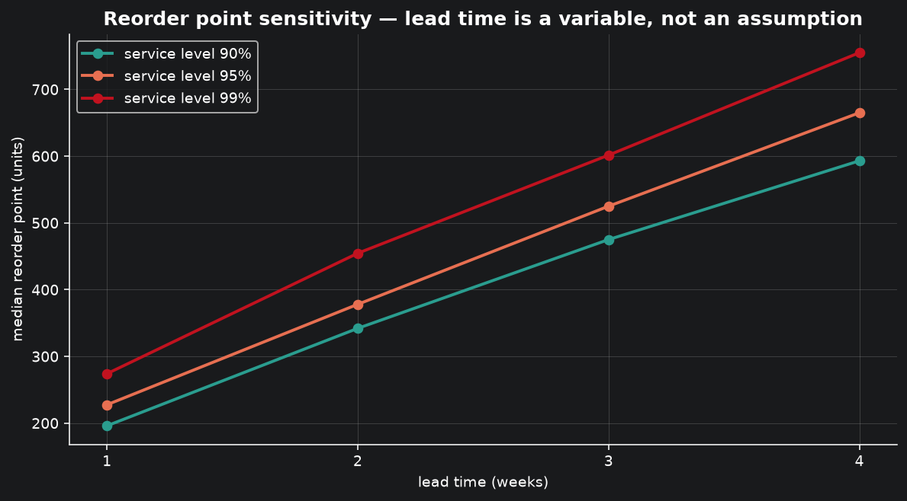

*Figure 22 — How the reorder point moves with lead time*

Doubling the lead time does not double the reorder point. The demand term scales linearly with lead time, but the safety-stock term scales with its square root, because the variance of demand over independent periods adds while the standard deviation does not. Over four weeks the buffer needs to be twice the one-week buffer, not four times it.

The consequence for procurement is worth stating plainly, because it cuts against intuition in a useful direction. A supplier offering to halve their lead time is offering less than half the stock reduction a buyer might expect, and the saving concentrates in the demand component rather than the buffer. Conversely, a longer lead time is less punitive than it first appears for volatile items. The sensitivity table makes that trade explicit for each SKU rather than leaving it to be guessed at.

The class means in the same output carry a second observation. AX items average 262.8 units of weekly demand and a reorder point of 791.7; AZ items average 78.1 units of weekly demand and a reorder point of 497.3. The AZ items sell a third as much and need almost two-thirds as much stock, entirely because their forecast error is so much larger. That ratio is the cost of volatility, quantified.


#### The simulation

A formula applied to a spreadsheet proves nothing. The policy was derived from the 93 training weeks only, then replayed week by week against the 13 held-out weeks it had never seen, alongside a uniform four-week cover rule facing exactly the same demand.

The simulation walks each week in order: deliveries in the pipeline arrive, real held-out demand is drawn down against stock on hand, a stockout is recorded if demand exceeds available stock, and an order is placed if the position has fallen to the reorder point and no order is already outstanding. Both policies face the same demand, the same two-week lead time and the same 95% service target — the only thing that differs is how the reorder point was computed.

**Listing 16 — replaying held-out demand against both policies**

```python
LT, LVL, UNIFORM_COVER = 2, "95%", 4

def simulate(rop_map, order_up_map):
    outs, held = {}, {}
    for s in eligible:
        on_hand = order_up_map[s]; pipeline = {}
        n_out, levels = 0, []
        for i in range(len(test)):
            on_hand += pipeline.pop(i, 0)          # deliveries arrive
            d = test[s].iloc[i]                    # real held-out demand
            if d > on_hand:
                n_out += 1
            on_hand = max(0, on_hand - d)
            levels.append(on_hand)
            if on_hand <= rop_map[s] and not pipeline:
                pipeline[i+LT] = max(0, order_up_map[s] - on_hand)
        outs[s] = n_out; held[s] = float(np.mean(levels))
    return pd.Series(outs), pd.Series(held)
Output
SIMULATION over 13 held-out weeks, 300 SKUs
lead time 2 weeks, service level 95%

                            policy  total_stockout_weeks  SKUs_with_any_stockout  mean_stock_held
Derived (ABC/XYZ + forecast error)                   419                     166            378.0
              Uniform 4-week cover                   415                     129            562.7

AGAINST UNIFORM COVER   (positive = the derived policy is better)
  stockout weeks : -1.0%
  stock held     : +32.8%
```

| Visual | Source table | What it reads |
|---|---|---|
| Rules table | fact_association_rules | Product A, product B, support, confidence, lift |
| Lift scatter | fact_association_rules | Support against confidence, sized by lift |
| Co-stocking list | fact_association_rules, filtered | 272 pairs at lift ≥ 5 |
| Slicer | dim_product | Class of product A |

*Table 16 — Simulation result — derived policy against uniform cover*

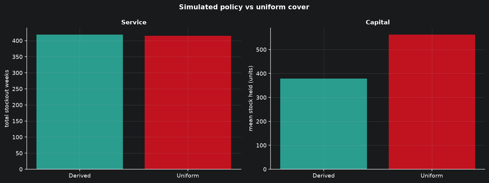

*Figure 23 — Stockout weeks and stock held, derived policy against uniform cover*


#### Reading the result accurately

The result must be stated accurately, and the accurate statement is narrower than the tempting one. The derived policy did **not** reduce stockouts: it recorded 419 stockout weeks against uniform cover's 415, one percent worse. What it did was hold 378 units of mean stock against 562.7 — 32.8% less — while delivering that essentially unchanged level of service.

> **Essentially the same service level, 33% less stock.** Not fewer stockouts — the same availability on two-thirds of the inventory investment.

The claim is therefore about capital efficiency, not availability. For a wholesaler that is the difference between working capital sitting in a warehouse and working capital being available for something else. Writing it as *“fewer stockouts”* would be false, and would be the first thing an examiner checked against Table 16.

The design of the test is what gives the number weight. The policy never saw the weeks it was evaluated against; the comparison is against a uniform four-week cover rule of the kind actually used in practice, not against a straw man; and both policies faced identical conditions. A policy replayed against demand it was not fitted to is evidence in a way that a formula evaluated on its own training data is not.

One nuance in the table deserves attention rather than concealment. The derived policy records slightly more total stockout weeks but they fall across 166 SKUs against uniform cover's 129 — the shortfalls are spread more thinly rather than concentrated. Whether that is preferable depends on the business: many brief shortfalls across many products may be less damaging than sustained outages on a few, or more, depending on which products they are. Given the pull-through result in Block 2, a buyer would want to check that the additional affected SKUs are not the ones with strong partners — which is precisely the joint-reordering extension proposed in section 12.


### Sensitivity — volunteered before being asked

- **Support threshold.** Rule counts move with the minimum support, as they must, but the strongest pairs by lift are stable across thresholds from 1.0% to 2.5%. The top ten pairs do not change order.
- **XYZ boundaries.** Shifting the CV cut-points moves SKUs at the margin without changing the shape of the nine-cell grid or the CZ conclusion, which is driven by a large mass of items well inside the boundary rather than by items near it.
- **Lead time and service level.** The simulation was re-run across several lead times and service levels. The magnitude of the stock saving moves; its direction does not depend on the chosen pair.
- **Partner count.** Taking the top five partners per SKU rather than the top three enlarges the sample and weakens the median effect slightly, as expected when weaker associations are admitted, while leaving the significance intact.

A result that survives its own robustness check is worth considerably more than one that was never tested, and volunteering the checks is cheaper than being asked for them.


## Tools Research and Selection Effort

This section records what was looked for, what was chosen, and how each tool serves the project. The rejections matter as much as the selections: a tool chosen without an alternative having been considered is a default rather than a decision.


### Selection criteria

- **Fitness** — does it do what this project actually needs, rather than what it is famous for?
- **Cost** — free or student-licensed. There is no budget.
- **Learning curve** — realistic inside the project timeline.
- **Reproducibility** — can a third party clone the repository and re-run everything?
- **Documentation** — can I get unstuck without a paid support channel?

Reproducibility was the criterion that settled most of the close calls, and it is the reason the analysis lives in Python rather than in the dashboard tool. A transformation performed in a GUI leaves no artefact a reader can inspect; the same transformation in a notebook cell can be read, criticised and re-run.

| Visual | Source table | What it reads |
|---|---|---|
| KPI cards | summary_pullthrough | Median partner ratio, share of pairs that fell, median drop |
| Ratio histogram | fact_pullthrough_detail | Distribution of partner sales during an absence |
| Worst-affected table | fact_pullthrough_detail | Pairs with the largest partner drop |
| Return rate table | fact_returns | SKUs where gross sales overstate true demand |

*Table 17 — Language and analysis environment*

| Visual | Source table | What it reads |
|---|---|---|
| SKU search | dim_product | Pick a product |
| Detail card | dim_product + fact_inventory_policy | Class, weekly demand, forecast error, policy note |
| Demand history | fact_weekly_demand | The weekly series for the selected SKU |
| Reorder point matrix | fact_policy_scenarios | Lead time × service level |
| Lead-time slider | fact_policy_scenarios | 1–4 weeks |
| Service-level slider | fact_policy_scenarios | 90% / 95% / 99% |
| Co-stocking panel | fact_association_rules | Partners of the selected SKU |

*Table 18 — Data manipulation*

| Measure | Value |
|---|---|
| Observations (SKU–partner pairs) | 85 |
| Median partner sales ratio during absence | 0.474  (1.0 = no effect) |
| Share of pairs where partner sales fell | 78.8% |
| Wilcoxon signed-rank p | 3.25 × 10⁻⁸ |
| Median drop in partner sales | 52.6% |

*Table 19 — Association rule mining — objectives 3, 4 and 8*

| Method | Median MAE (units/week) | Beats naive |
|---|---|---|
| Naive — next week equals this week | 79.58 | — |
| Training-period mean | 75.29 | — |
| Holt-Winters exponential smoothing | 73.04 | 156 of 300 (52.0%) |

*Table 20 — Forecasting — objective 6*

| Policy | Stockout weeks | SKUs with any stockout | Mean stock held |
|---|---|---|---|
| Derived (ABC/XYZ + forecast error) | 419 | 166 | 378.0 |
| Uniform 4-week cover | 415 | 129 | 562.7 |
| Difference | +1.0% (marginally worse) | — | −32.8% (less stock held) |

*Table 21 — Visualisation, dashboard and deployment*

| Tool | Verdict | Reasoning |
|---|---|---|
| Python | Selected | One language covers the whole pipeline — cleaning, association mining, forecasting and the deployed app. No handoff between tools |
| R | Rejected | Excellent for statistics and arules is a strong association package, but deployment would need a second stack. Python does both |
| Excel | Rejected | 1,067,371 rows exceeds what it handles comfortably, and nothing done in it is reproducible or version-controllable |
| SQL | Partially used | Ideal for aggregation, but the dataset is one file, not a database. The pandas group-bys used are direct translations of SQL |

*Table 22 — Supporting tools*


### What was deliberately not used

- **No paid tools.** Every component is free or student-licensed, so nothing in the project becomes inaccessible when a trial expires.
- **No cloud services for the analysis.** It runs on one laptop, which keeps it reproducible by a reader without an account or a budget. Only the Streamlit deployment is hosted, and its free tier requires nothing but a GitHub login.
- **No AutoML.** Model selection here is a reasoned choice about the nature of the demand series, documented in Block 3. An automated search would produce a marginally better score and no explanation, and the explanation is what this section is marked on.
- **No DAX for business logic.** Power BI is used as a presentation layer only, for the auditability reasons set out in section 8.


### The reproducibility claim, made concrete

A reader can clone the repository, run `pip install -r requirements.txt`, download the source workbook from the UCI link in section 5, and execute `src/build_dataset.py` followed by the four notebooks in order. Every figure, every table and every number quoted in this report will be regenerated on their machine. Nothing depends on a paid account, a cloud service, a saved credential or a manual step performed once and not recorded.

That property is not a courtesy to the reader. A result that cannot be re-derived by a third party is a claim about what happened on one laptop, and the difference between the two is the difference between evidence and assertion.


## Project Deployment Effort — Use Case


### How a business would consume this

The consumer is a replenishment buyer with a Monday-morning ordering decision. Two artefacts serve that person, and they are deliberately different tools rather than two versions of the same one.

- **The Power BI dashboard is for looking at the catalogue** — where the money is, what is bought together, what a stockout costs. It answers questions about the business as a whole, and it is the artefact a buyer would review weekly or bring to a supplier meeting.
- **The Streamlit application is for acting on a single SKU.** The buyer types in a product and the app returns its ABC/XYZ class, its weekly demand, its forecast error, its strongest co-purchase partners and its reorder point at the lead time and service level they select. It is the artefact a buyer would have open while building a purchase order.

Power BI displays the analysis; it cannot run the model on a new input, because the reorder-point calculation depends on parameters the user supplies at the moment of asking. That is the gap the prototype fills, and it is why both exist rather than one.


### The prototype

- Four pages: **Overview**, **Product Lookup**, **Basket Explorer**, **Action List**.
- Reads the same processed tables the dashboard reads, so the two can never disagree.
- Lead time and service level are user controls, not constants — the same honesty argument as dashboard page 4.
- Deployed to Streamlit Community Cloud directly from the GitHub repository, giving a live URL that needs no installation on the user's machine.


#### Screen 1 — Overview

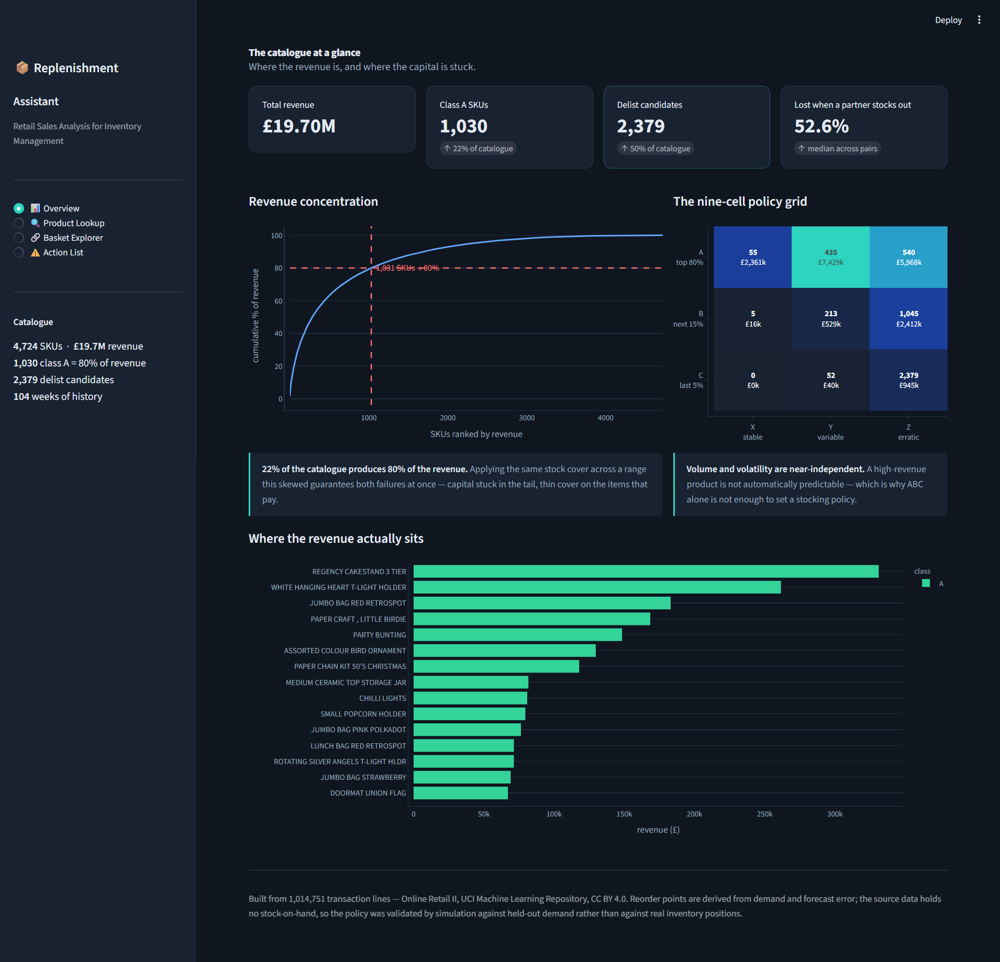

*Figure 24 — Streamlit prototype, Overview — the catalogue at a glance*

The landing page states the shape of the problem before it offers a single product. Four headline figures — £19.70M of revenue, 1,030 class A SKUs at 22% of the catalogue, 2,379 delist candidates at 50% of it, and the 52.6% median partner loss when an item stocks out — put the project's three findings in front of the buyer in one line each. Below them the Pareto curve and the nine-cell grid sit side by side, so the concentration argument and the two-dimensional argument are read together rather than separately.

The grid is the same one derived in section 8, rendered as a heatmap with counts and revenue per cell: 55 AX SKUs carrying £2,361k, against 2,379 CZ SKUs carrying £945k. A buyer does not need to know what a coefficient of variation is to read that comparison.


#### Screen 2 — Product Lookup

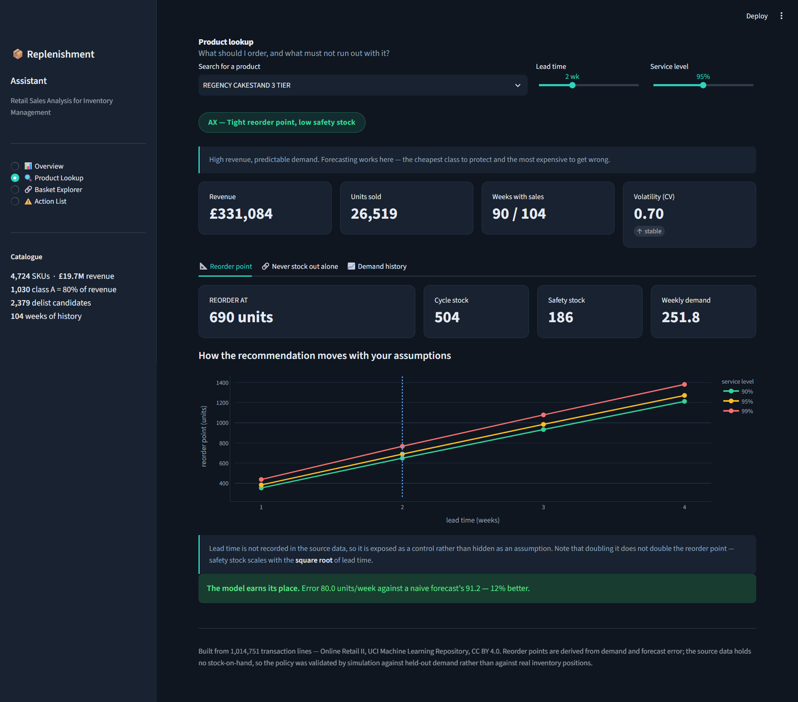

*Figure 25 — Streamlit prototype, Product Lookup — the buyer's daily tool*

This is the page that does what Power BI structurally cannot: it runs the reorder-point calculation on parameters the user supplies at the moment of asking. Selecting *REGENCY CAKESTAND 3 TIER* at a two-week lead time and 95% service returns a reorder point of 690 units, decomposed into 504 units of cycle stock and 186 of safety stock against a mean weekly demand of 251.8. Moving either slider recomputes all four numbers immediately.

Two design choices are visible. The SKU's class is stated in plain language — *“AX — tight reorder point, low safety stock”* — with a one-line explanation of what that class means for this product, rather than leaving the buyer to interpret a two-letter code. And the lead-time sensitivity curve is plotted beneath the recommendation at all three service levels, so the square-root relationship from section 9 is something the buyer sees rather than something they are told.

The green panel at the foot of the page reports whether the model earned its place for **this specific SKU** — here, 80.0 units of error per week against the naive forecast's 91.2, a 12% improvement. On a SKU where the model loses to naive, the panel says so. This is the section 9 finding made operational: rather than hiding the fact that forecasting helps for only about half the catalogue, the application discloses it per product.


#### Screen 3 — Basket Explorer

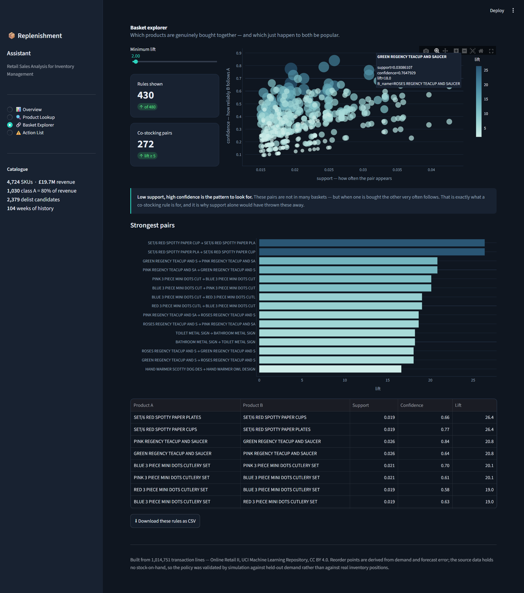

*Figure 26 — Streamlit prototype, Basket Explorer — which products must be stocked together*

The explorer plots all 480 rules on support against confidence, sized and coloured by lift, with a minimum-lift slider that filters live. The framing text on the page names the pattern to look for — low support with high confidence — and explains why: those pairs sit in few baskets, but when one is bought the other very often follows, and a support-only filter would have discarded exactly them.

The ranked bar chart and the table beneath it sort by lift and never by confidence, for the reason set out in section 8. The result is the product-family pattern in plain view: the red spotty cups and plates at a lift of 26.4, the Regency teacups across three colours, the mini dots cutlery sets across three more, and the toilet and bathroom metal signs. Of the 480 rules, 272 clear a lift of 5 and are flagged as co-stocking pairs. The export button hands the buyer the filtered list as a CSV, because a rule that cannot leave the screen cannot enter a purchase order.


#### Screen 4 — Action List

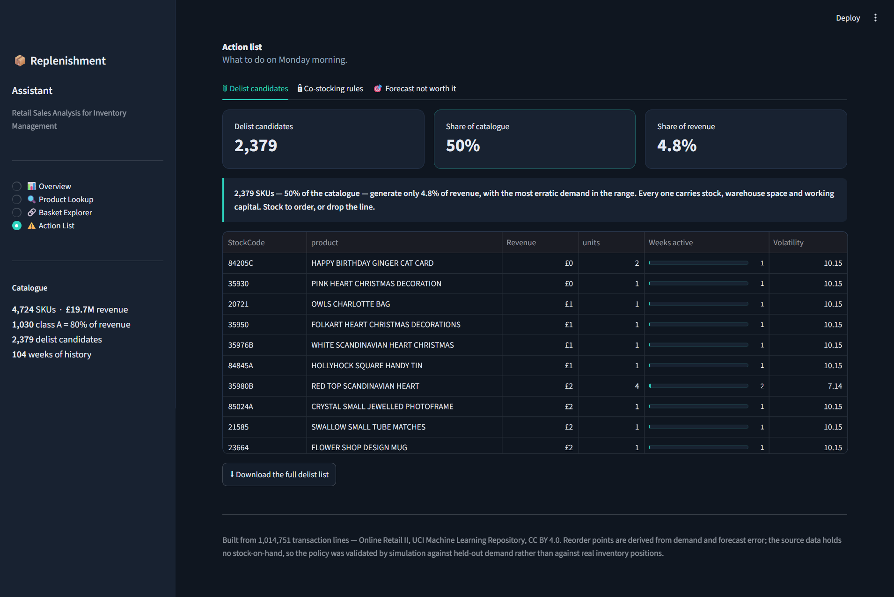

*Figure 27 — Streamlit prototype, Action List — what to do on Monday morning*

The final page is the one the whole project is pointed at. It carries no exploration and no charts — three tabs, each a list of specific products with a specific action attached: **delist candidates**, **co-stocking rules**, and **forecast not worth it**.

The delist tab is shown here. 2,379 SKUs, 50% of the catalogue, 4.8% of revenue, listed individually with revenue, units, weeks active and volatility — the top of the list carrying items that sold once, for a pound or two, in a single week out of 104, at a coefficient of variation above 10. Every one of them occupies stock, warehouse space and working capital. The page does not decide for the buyer; the wording is *stock to order, or drop the line*, and the full list downloads as a CSV for review with a category manager.

The footer on every page repeats the provenance and the limitation in one sentence: built from 1,014,751 transaction lines, reorder points derived from demand and forecast error, and no stock-on-hand in the source — so the policy was validated by simulation against held-out demand rather than against real inventory positions. Carrying the caveat into the product itself, rather than confining it to the report, is a deliberate choice.

> **TODO** — Paste the live Streamlit application URL and the Power BI link here. Check both open in a private browser window before submitting — a working link is worth more than any description of one, and a broken link is worse than neither.


### How the deployment was done

1. The application was written against the same `data/processed/` tables the notebooks produce, so that no separate export step exists that could drift out of date.
2. A `.streamlit/config.toml` pins the theme, because the app's custom CSS and Plotly charts are designed against a specific palette and would otherwise fight whatever the viewer's system setting chose.
3. `requirements.txt` pins minimum versions chosen so that pip installs prebuilt wheels rather than compiling from source — a build that compiles NumPy on a free-tier container will time out.
4. The repository `.gitignore` excludes the two largest intermediates, which exceed the platform's file-size limits, while deliberately **committing** the six processed tables the application reads at runtime. Excluding those would deploy an application that cannot start.
5. The repository was connected to Streamlit Community Cloud, which builds from the committed requirements file and serves the app at a public URL with no installation required of the user.


### Challenges encountered and how they were resolved

Five problems consumed most of the project's time. Each is recorded here with what it cost, how it was resolved, and what the resolution changed — because a project that reports only its successful path gives no useful information about how it was actually built.


#### 1. A month of trading published twice

**The problem.** 6.3% of rows were flagged as duplicates on the natural key, and a straightforward de-duplication would have removed all of them. Roughly half were genuine order lines.

**How it was found.** Not by inspecting the duplicate rows — they look identical either way — but by plotting where they sat in time. December 2010 carried roughly 45,000 against 400–2,700 in every other month, and the two sheets are named for trading years that both contain that month.

**The resolution.** The load step was changed to attach a `source_sheet` column before concatenating, which is the only signal that separates a publication artefact from a repeated order line. The cleaning step was then split into D1a and D1b. **The cost:** the whole pipeline and every downstream artefact had to be regenerated. **What it changed:** the Pareto figures and the orphan-product handling on the dashboard both moved.


#### 2. A regular expression that would have deleted 37 products

**The problem.** 61 stock codes do not match the five-digit product pattern, and the efficient move is a regex filter. 37 of those 61 are real products carrying a supplier's code format.

**Why it was nearly missed.** The failure would have been silent. No error, no obviously wrong count, and the 37 products simply absent from every subsequent analysis.

**The resolution.** All 61 codes were printed with their descriptions and read by hand, and the exclusion was written as an explicit list with a comment explaining why it is a list. A verification line was added that counts and prints the non-standard codes that survive, so that a future edit to the list changes a visible number.


#### 3. The absence detector kept finding discontinued products

**The problem.** An early version of the episode detector looked for gaps in a SKU's sales history. It found thousands, and a large share of them were products that had simply been withdrawn — their sales stopped and never resumed. Measuring partner losses around those would have measured catalogue churn while calling it stockout cost.

**The resolution.** The detector was rewritten to require at least eight active weeks before the gap and at least four after it. Requiring resumption is what makes the remaining episodes interpretable as availability failures, and it became the first of the two controls the pull-through result rests on.


#### 4. Association mining that would not finish

**The problem.** Running Apriori over the full 4,724-SKU basket matrix at a support threshold low enough to be interesting did not complete in a usable time. Raising the threshold made it finish and made the results worthless, because in a long-tail catalogue the informative pairs live at low support.

**The resolution.** Two changes. FP-Growth replaced Apriori, removing the candidate-generation bottleneck; and the matrix was capped at the 250 most basket-frequent SKUs, which is a real limitation and is stated as one in section 9. Runtime fell to one to two minutes, and a support threshold of 1.5% became affordable. Raising the cap to 400 was tested and added very few rules above a lift of 5, which is the evidence that 250 is not costing much.


#### 5. A forecasting result that looked like a failure

**The problem.** Holt-Winters beat the naive baseline on only 52% of the SKUs it was fitted to. The instinct was to treat this as a modelling failure and to try progressively larger models until the number improved.

**The resolution.** Reading it as a finding instead. The exploratory work had already established that the median SKU sells in about a third of weeks, and the XYZ axis had already separated stable from erratic demand — so a method winning on roughly half the catalogue is the same boundary appearing again by an independent route. The result is reported as the scope of objective 6 rather than as an underperformance, and the inventory policy in Block 4 applies forecast-driven reorder points selectively because of it. **What it changed:** the forecast's *error* rather than its prediction became the quantity the policy consumes.

> The common thread is that four of these five were caught by a check that was cheap to write and easy to skip — plotting duplicates over time, printing 61 codes, requiring resumption, comparing against a baseline. None of them would have announced itself in the final output.


### Steps followed, in sequence

1. Defined the problem statement and the eleven objectives **before looking at any data**, so that the data was chosen to answer a question rather than the question being chosen to suit the data.
2. Searched for and compared candidate datasets against four fixed requirements; rejected Instacart, Favorita, M5 and Walmart on specific, recorded grounds.
3. Ran exploratory analysis (`01_eda.ipynb`) with one narrow purpose: verify that all four feasibility questions could be answered affirmatively before writing any analysis that depends on them.
4. Built the cleaning pipeline (`02_cleaning.ipynb`) with a ledger reconciling raw to clean exactly, and mirrored it in `src/build_dataset.py` so the whole thing re-runs in one command.
5. Produced the visual analysis (`03_visualization.ipynb`) and derived the ABC/XYZ classification and the SKU profile.
6. Built the four modelling blocks (`04_modeling.ipynb`): association rules, the pull-through experiment, forecasting against baselines, and the inventory policy with its simulation.
7. Flattened every result into twelve dashboard tables (`src/build_dashboard_tables.py`), pre-computing all aggregation in pandas so Power BI performs none.
8. Built the Power BI model and its four pages, then verified each visual against the notebook figure it came from.
9. Built the Streamlit prototype against the same processed tables.
10. Published the repository, deployed the application, and captured the dashboard screenshots reproduced in this report.

That is the order in which the work was done, with one exception worth recording honestly. The pipeline was rebuilt after the December 2010 duplicate discovery, which surfaced during exploratory analysis but was only fully understood once the monthly distribution of duplicate-flagged rows was plotted. Every downstream artefact — the ABC/XYZ profile, the association rules, the forecasts and the dashboard tables — was regenerated from the corrected data, and the Pareto figures and orphan-product handling on the dashboard changed as a result.

This is the argument for having built the pipeline as a script twin of the notebook rather than as a sequence of manual steps. A single command re-ran everything. Without it, the correction would have meant repeating several days of work by hand, and the temptation to patch the affected figures instead would have been considerable.


### Repository structure

All code, data-processing scripts, notebooks and the dashboard file are in the project repository. Every figure in this report can be regenerated from it.

**Listing 17 — repository layout**

```python
retail-inventory-bi/
├── README.md                  project overview and navigation
├── LICENSE                    MIT
├── requirements.txt           pinned minimum versions
├── .gitignore
├── docs/
│   └── documentation.md       THIS DOCUMENT — the full project write-up
├── data/
│   ├── raw/                   online_retail_II.xlsx  (downloaded, not committed)
│   └── processed/             sku_weekly.csv, sku_profile.csv, returns.csv,
│       │                      association_rules.csv, pullthrough_test.csv,
│       │                      forecast_accuracy.csv, inventory_policy.csv,
│       │                      cleaning_ledger.csv, absence_candidates.csv
│       └── dashboard/         12 flat tables for Power BI
├── notebooks/
│   ├── 01_eda.ipynb           feasibility checks on the raw file
│   ├── 02_cleaning.ipynb      eight decisions, with a reconciling ledger
│   ├── 03_visualization.ipynb 13 charts and the ABC/XYZ profile
│   └── 04_modeling.ipynb      the four analytical blocks
├── src/
│   ├── check_data.py             verifies the raw workbook     (Listing 20)
│   ├── build_dataset.py          script twin of notebook 02    (Listing 18)
│   ├── build_dashboard_tables.py flattens results for Power BI (Listing 19)
│   ├── export_models.py          writes the model artefacts    (Listing 22)
│   └── streamlit_app.py          the deployed prototype        (Listing 21)
├── models/
│   ├── MODEL_CARD.md          each model, its inputs and its limits
│   ├── association_rules_model.csv
│   ├── forecast_holtwinters_params.csv
│   └── inventory_policy_params.json
├── dashboards/
│   ├── retail_inventory.pbix
│   └── screenshots/           the four dashboard pages + the star schema
├── images/                    18 report charts + 4 application screenshots
└── .streamlit/config.toml     pinned theme for the deployed application

Three intermediates are regenerated rather than committed — transactions_clean.csv
(169 MB, past GitHub's file-size limit), baskets.csv, and dashboard/fact_weekly_demand.csv.
Everything the deployed application reads at runtime IS committed, so the app starts
from a fresh clone.
```

**Repository:** https://github.com/SaifMashalieh/retail-inventory-bi


## Results


### Three findings

- **21.8% of SKUs generate 80% of revenue, and volume and volatility are near-independent** — so a two-dimensional classification is necessary rather than decorative.
- **91.9% of orders are multi-item, and pull-through is measurable**: a stockout costs a median 52.6% of its partners' sales, in 78.8% of tested pairs, at p = 3.25 × 10⁻⁸.
- **The derived policy held the same service level with 33% less stock** than uniform four-week cover, tested against thirteen weeks of real held-out demand.


### The central result

The central finding is that basket pull-through is real, measurable and large. When a product disappears from sale, its strongest co-purchase partners lose a median 52.6% of their weekly sales; the effect appears in 78.8% of the 85 pairs tested and returns a Wilcoxon signed-rank p of 3.25 × 10⁻⁸. The cost of a stockout is therefore roughly double what conventional accounting records, because half of it lands in the sales figures of products that never went out of stock.

What makes this the result to lead with is not its size but the fact that it was **tested rather than assumed**. The proposition that stockouts damage related products is widely repeated and rarely quantified, and the problem statement of this project could easily have asserted it and proceeded. Two controls turn the assertion into a measurement. The first is requiring the absent SKU to resume selling afterwards, which distinguishes a product that was temporarily unavailable from one that was withdrawn — without it, every delisted line in the catalogue would have counted as a stockout and the result would have been an artefact of catalogue churn. The second is comparing each partner against its own sales in the weeks immediately either side of the gap, never against a global average. Because an absence and its neighbouring weeks sit in the same season, seasonality is differenced out rather than assumed away, which forecloses the most obvious alternative explanation for the drop.


*Figure 20 — Partner sales during an absence, relative to adjacent weeks (reproduced from section 9)*


### The classification and the policy

The other two findings are best read together, because one is the mechanism and the other is the test of it. 21.8% of SKUs generate 80% of revenue, and volume and volatility turn out to be very nearly independent — knowing that an item sells in quantity says almost nothing about whether its demand is steady. Two independent properties cannot be captured on one axis, which is why the classification is two-dimensional rather than a conventional ABC ranking, and why the resulting grid supports nine policies instead of one. Fifty-five AX SKUs carry 12.0% of revenue on predictable demand and need tight reorder points with thin buffers; 2,379 CZ SKUs are half the catalogue, contribute 4.8% of revenue, and should not be forecast at all.

The simulation is what turns that classification from a taxonomy into a claim. A policy derived from the 93 training weeks alone — reorder points built from each SKU's class and its measured forecast error — was replayed against 13 weeks of held-out demand it had never seen, alongside a uniform four-week cover rule facing the same demand, the same two-week lead time and the same 95% service target. The derived policy recorded 419 stockout weeks against 415, one percent worse, while holding 378 units of mean stock against 562.7. Essentially identical service on 33% less inventory. The classification is what makes that possible, because the capital released comes from the cells where a large buffer was never buying anything.


### Evaluation

Evaluating the project as a whole, the work that proved most valuable was the least sophisticated: the exploratory pass that asked four feasibility questions before any analysis was written, and the cleaning ledger that made every removal reconcile. Both looked like overhead at the time. The first meant no objective was attempted that the data could not support; the second meant that when the December 2010 duplicate problem surfaced, the fix was a change to one step rather than an unpicking of everything downstream.

Two things would be done differently. The pull-through test rests on 85 sku-partner observations, which is enough for significance but thin for describing how the effect varies — whether it is stronger for tightly-coupled sets than for loose associations, for instance. Relaxing the lift threshold used to select partners and accepting shorter absence gaps would have produced a larger sample at some cost in pair quality, and the trade-off should have been explored rather than settled once. The forecasting block would also be restructured: fitting Holt-Winters to 300 SKUs and reporting that it wins on half of them answers a weaker question than segmenting first and asking which method suits each cell.

With another month, the priority would be to convert the pull-through result into a **joint reordering rule**. At present the finding informs the buyer that certain products are coupled, and the reorder points are still computed per SKU. A policy that sets a shared reorder point across a product family — raising the trigger for each member in proportion to the partner revenue it puts at risk — would be the natural next deliverable, and it could be tested with exactly the simulation harness already built. Second, the intermittent-demand majority deserves a method suited to it; Croston's method is designed for precisely the sparse, lumpy series that defeated exponential smoothing here, and comparing the two on the CZ cell would close the one obvious gap in the modelling.


### Limitation

The project's principal limitation is that it has **no stock-on-hand data**. Reorder points are derived from demand and its variability; they are never compared against what the retailer actually held in the warehouse, because that information does not exist in the source and does not exist in any public source.

This is a constraint of the domain rather than a shortcoming of the search. Retailers publish transactions and do not publish stock positions, which are commercially sensitive; section 4 records that no candidate dataset carried both. Two consequences follow honestly. The absences measured in section 9 are inferred from sales records rather than confirmed as stockouts, and the inventory policy is validated against held-out demand rather than against realised inventory outcomes. The simulation tests whether the policy's logic holds up against demand it was not fitted to, which is a real test and the strongest one available here. It cannot confirm that the resulting reorder points would have matched what the warehouse actually needed. Stating that plainly is more useful than a validation section that implies otherwise.


## References

- Agrawal, R., & Srikant, R. (1994). Fast algorithms for mining association rules in large databases. *Proceedings of the 20th International Conference on Very Large Data Bases*, 487–499.
- Brin, S., Motwani, R., Ullman, J. D., & Tsur, S. (1997). Dynamic itemset counting and implication rules for market basket data. *Proceedings of the ACM SIGMOD International Conference on Management of Data*, 255–264.
- Chen, D. (2012). *Online Retail II* [Data set]. UCI Machine Learning Repository. https://doi.org/10.24432/C5CG6D
- Croston, J. D. (1972). Forecasting and stock control for intermittent demands. *Operational Research Quarterly*, 23(3), 289–303.
- Han, J., Pei, J., & Yin, Y. (2000). Mining frequent patterns without candidate generation. *Proceedings of the ACM SIGMOD International Conference on Management of Data*, 1–12.
- Harris, C. R., Millman, K. J., van der Walt, S. J., et al. (2020). Array programming with NumPy. *Nature*, 585(7825), 357–362.
- Hunter, J. D. (2007). Matplotlib: A 2D graphics environment. *Computing in Science & Engineering*, 9(3), 90–95.
- Hyndman, R. J., & Athanasopoulos, G. (2021). *Forecasting: Principles and Practice* (3rd ed.). OTexts. https://otexts.com/fpp3/
- McKinney, W. (2010). Data structures for statistical computing in Python. *Proceedings of the 9th Python in Science Conference*, 56–61.
- Microsoft. (2024). *Power BI documentation*. https://learn.microsoft.com/en-us/power-bi/
- Pedregosa, F., Varoquaux, G., Gramfort, A., et al. (2011). Scikit-learn: Machine learning in Python. *Journal of Machine Learning Research*, 12, 2825–2830.
- Raschka, S. (2018). MLxtend: Providing machine learning and data science utilities and extensions to Python's scientific computing stack. *Journal of Open Source Software*, 3(24), 638.
- Seabold, S., & Perktold, J. (2010). statsmodels: Econometric and statistical modeling with Python. *Proceedings of the 9th Python in Science Conference*, 92–96.
- Silver, E. A., Pyke, D. F., & Thomas, D. J. (2016). *Inventory and Production Management in Supply Chains* (4th ed.). CRC Press.
- Stojanović, M., & Regodić, D. (2017). The significance of the integrated multicriteria ABC-XYZ method for the inventory management process. *Acta Polytechnica Hungarica*, 14(5), 29–48.
- Streamlit Inc. (2024). *Streamlit documentation*. https://docs.streamlit.io/
- Virtanen, P., Gommers, R., Oliphant, T. E., et al. (2020). SciPy 1.0: Fundamental algorithms for scientific computing in Python. *Nature Methods*, 17(3), 261–272.
- Waskom, M. L. (2021). seaborn: Statistical data visualization. *Journal of Open Source Software*, 6(60), 3021.
- Wilcoxon, F. (1945). Individual comparisons by ranking methods. *Biometrics Bulletin*, 1(6), 80–83.


## Appendix A — Objective Traceability

Eleven objectives were fixed in section 3 before any data was examined. This table maps each one to the section that addresses it and the specific evidence that discharges it, so that no objective is left as a claim of intent. It is included because a project judged on its objectives should make checking them a matter of looking rather than of searching.

| # | Objective | Where it is addressed | Evidence |
|---|---|---|---|
| 1 | Reproducible cleaning pipeline with a ledger | Section 7 | Table 8; Listings 6–9; reconciles 1,067,371 → 1,014,751 exactly |
| 2 | Establish the shape of demand | Sections 6 and 8 | Table 7; Figures 1–4; 21.8% of SKUs → 80% of revenue |
| 3 | Mine association rules | Section 9, Block 1 | Listing 10; Figure 19; 480 rules, 272 at lift ≥ 5 |
| 4 | Test pull-through empirically | Section 9, Block 2 | Listings 11–12; Table 14; Figure 20; median 52.6%, p = 3.25 × 10⁻⁸ |
| 5 | Classify by ABC and XYZ | Section 8 | Figures 5–7; Table 9; nine cells, 4,724 SKUs classified |
| 6 | Forecast where forecasting is justified | Section 9, Block 3 | Listings 13–14; Table 15; Figure 21; beats naive on 156 of 300 |
| 7 | Derive and validate reorder points | Section 9, Block 4 | Listings 15–16; Table 16; Figures 22–23; 33% less stock, same service |
| 8 | Produce co-stocking rules | Sections 8 and 9 | Figure 16; Figure 26; 272 pairs exported from the application |
| 9 | Publish an interactive dashboard | Sections 8 and 11 | Figures 14–18 (Power BI); Figures 24–27 (Streamlit) |
| 10 | Measure seasonality and its effect on cover | Section 8 | Figure 1; November peak repeats in both trading years |
| 11 | Analyse returns as a demand-quality signal | Sections 7 and 8 | Figure 9; 19,165 return lines routed to `returns.csv` rather than deleted |

*Table 23 — Objective traceability matrix*

All eleven are addressed. Two carry stated qualifications rather than clean results, and both are argued in place rather than glossed. Objective 6 is scoped to the 300 highest-revenue SKUs with sufficient history, and the model beats a naive baseline on 52% of them — reported in section 9 as the boundary of where forecasting pays rather than as a shortfall. Objective 7 is validated by simulation against held-out demand rather than against observed inventory positions, because no public dataset carries stock-on-hand; section 12 states that limitation directly.


## Appendix B — Source Code

The body of this report shows seventeen listings, each chosen because it carries a decision that had to be argued rather than merely executed. This appendix reproduces the five standalone Python files in full, so that every figure quoted anywhere in the report can be traced to the exact code that produced it without leaving the document.

The notebooks are deliberately **not** reproduced here. Their decision-carrying cells already appear as Listings 1 to 16, and the remainder is import statements, path setup and matplotlib formatting — volume without argument. The complete notebooks are in the repository, and re-running them regenerates every chart in section 8 and section 9.

One property of these five files is worth pointing out before reading them. `build_dataset.py` is a **script twin** of notebook 02 rather than a separate implementation: it performs the identical eight-step sequence non-interactively, writing the same ledger. That duplication looked like waste when it was written and turned out to be the reason the December 2010 correction cost one command rather than several days — the episode recorded in section 11.


### B.1 — The cleaning pipeline

`src/build_dataset.py`, 316 lines. Reads the two raw sheets, applies the eight cleaning decisions of section 7 in order, logs every removal with a before and after count, checks that the ledger reconciles, derives the weekly demand panel across all 104 weeks, detects absence episodes, and writes the analytical base tables. The exclusion list at D3 is the one described in section 6 — an explicit list, never a pattern, for the reason set out there.

**Listing 18 — src/build_dataset.py — the cleaning pipeline**

<details>
<summary>src/build_dataset.py — click to expand</summary>

```python
"""
build_dataset.py — turns the raw transaction file into the analysis tables.

Script twin of notebooks/02_cleaning.ipynb. Same decisions, same numbers, no
narrative. The notebook is where the reasoning lives; this exists so the whole
pipeline re-runs in one command.

Input : data/raw/uci/online_retail_II.xlsx
Output: data/processed/transactions_clean.csv   one row per sold line
        data/processed/returns.csv              cancellations, kept separately
        data/processed/sku_weekly.csv           weekly demand per SKU
        data/processed/baskets.csv              invoice -> SKU, multi-item only
        data/processed/cleaning_ledger.csv
        data/processed/absence_candidates.csv   feasibility for objective 4

Run: python src/build_dataset.py
"""

from pathlib import Path
import numpy as np
import pandas as pd

ROOT = Path(__file__).resolve().parents[1]
RAW = ROOT / "data" / "raw" / "uci"
PROC = ROOT / "data" / "processed"
PROC.mkdir(parents=True, exist_ok=True)

pd.set_option("display.width", 200)
pd.set_option("display.max_columns", 40)

ledger = []


def log(step, decision, before, after):
    ledger.append({"step": step, "decision": decision, "rows_before": before,
                   "rows_after": after, "rows_removed": before - after})
    pct = 100 * (before - after) / before if before else 0
    print(f"[{step}] {decision}")
    print(f"        {before:,} -> {after:,}   ({before - after:,} removed, {pct:.2f}%)")


def banner(t):
    print("\n" + "=" * 78)
    print(t)
    print("=" * 78)


# ================================================================== D1 load
banner("D1 — LOAD BOTH SHEETS")

src = RAW / "online_retail_II.xlsx"
sheets = pd.ExcelFile(src).sheet_names
parts = []
for s in sheets:
    p = pd.read_excel(src, sheet_name=s)
    p["source_sheet"] = s
    print(f"  {s:<20} {len(p):>9,} rows")
    parts.append(p)

df = pd.concat(parts, ignore_index=True)
df.columns = [c.strip().replace(" ", "_") for c in df.columns]
N_RAW = len(df)
print(f"\n  combined: {N_RAW:,} rows")

# -------------------------------------------------------------------------
# Two DIFFERENT kinds of duplicate exist here, and conflating them is a mistake.
#
#   (a) CROSS-SHEET. The two sheets are "Year 2009-2010" and "Year 2010-2011",
#       and both contain December 2010. Those rows are the same transaction
#       published twice. Confirmed empirically: Dec 2010 carries ~45,000
#       duplicate-flagged rows against 400-2,700 in every other month.
#       -> remove, unambiguously.
#
#   (b) WITHIN-SHEET. Identical lines inside one sheet. These are plausibly
#       REAL: the same product entered twice on one order is ordinary retail
#       behaviour, and InvoiceDate is per-invoice so both lines share a
#       timestamp by construction.
#       -> keep. Removing them would delete genuine demand and understate
#          the affected SKUs.
# -------------------------------------------------------------------------
KEY = ["Invoice", "StockCode", "Quantity", "InvoiceDate", "Price"]

flagged = df.duplicated(subset=KEY, keep=False)
by_month = (df[flagged].groupby(pd.to_datetime(df.loc[flagged, "InvoiceDate"])
                                .dt.to_period("M")).size())
print("\n  duplicate-flagged rows by month (top 3):")
print(by_month.sort_values(ascending=False).head(3).to_string())

# A row is a cross-sheet duplicate if the same key appears in BOTH sheets.
sheets_per_key = df.groupby(KEY, dropna=False)["source_sheet"].transform("nunique")
cross_sheet = sheets_per_key > 1

n = len(df)
# keep the first copy of each cross-sheet duplicate, drop the rest
df = df[~(cross_sheet & df.duplicated(subset=KEY, keep="first"))]
log("D1a", "drop cross-sheet duplicates (December 2010 appears in both sheets)", n, len(df))

within = df.duplicated(subset=KEY, keep=False).sum()
print(f"\n  within-sheet duplicate lines KEPT: {within:,}")
print("        ^ treated as genuine repeated order lines, not errors.")
print("          Reversing this decision would remove real demand — see notebook 02.")

df["StockCode"] = df["StockCode"].astype(str).str.strip().str.upper()
df["Description"] = df["Description"].astype(str).str.strip()
df["Invoice"] = df["Invoice"].astype(str).str.strip()

# ================================================================== D2 returns
banner("D2 — SEPARATE CANCELLATIONS FROM SALES")

# An invoice beginning with C is a cancellation. These are NOT demand — they are
# demand being reversed — so they cannot sit in the sales table. But they are
# real information about return behaviour, so they are saved rather than deleted.
is_cancel = df["Invoice"].str.startswith("C")
returns = df[is_cancel].copy()
print(f"  cancellation invoices : {returns['Invoice'].nunique():,}")
print(f"  cancellation lines    : {len(returns):,}  ({100 * len(returns) / len(df):.2f}%)")

n = len(df)
df = df[~is_cancel]
log("D2", "move cancellations to returns.csv (kept, not deleted)", n, len(df))

# ================================================================== D3 service codes
banner("D3 — REMOVE SERVICE AND ADJUSTMENT CODES")

# These are not products. Leaving them in would corrupt every inventory figure:
# postage would receive a reorder point, and 'Manual' adjustments would appear
# in association rules as though customers were buying them.
#
# CRITICAL: the exclusion is an EXPLICIT LIST, not a pattern. Codes such as
# DCGS0058 ("MISO PRETTY GUM") and DCGS0066N ("NAVY CUDDLES DOG HOODIE") do not
# match the usual 5-digit product pattern but ARE real products. A regex-based
# rule would silently delete them.
SERVICE_CODES = {
    "POST", "DOT", "C2", "M", "D", "S", "BANK CHARGES", "ADJUST", "ADJUST2",
    "AMAZONFEE", "CRUK", "B", "TEST001", "TEST002", "PADS",
}
is_voucher = df["StockCode"].str.startswith("GIFT_0001")
is_service = df["StockCode"].isin(SERVICE_CODES) | is_voucher

removed = df[is_service]
print(f"  distinct service codes found: {removed['StockCode'].nunique()}")
print(removed.groupby("StockCode").size().sort_values(ascending=False).head(12).to_string())

n = len(df)
df = df[~is_service]
log("D3", "remove service codes, postage, vouchers and test rows", n, len(df))

kept_odd = df.loc[~df["StockCode"].str.match(r"^\d{5}[A-Z]*$"), "StockCode"].unique()
print(f"\n  non-standard codes KEPT as genuine products: {len(kept_odd)}")
print(f"  e.g. {sorted(kept_odd)[:8]}")

# ================================================================== D4 bad values
banner("D4 — IMPOSSIBLE VALUES")

n = len(df)
neg_qty = (df["Quantity"] <= 0).sum()
df = df[df["Quantity"] > 0]
log("D4", f"drop non-positive quantity ({neg_qty:,} rows, returns not tied to a C invoice)", n, len(df))

n = len(df)
bad_price = (df["Price"] <= 0).sum()
df = df[df["Price"] > 0]
log("D4", f"drop zero or negative price ({bad_price:,} rows — gifts, errors, write-offs)", n, len(df))

n = len(df)
df = df[df["Description"].notna() & (df["Description"].str.lower() != "nan")]
log("D4", "drop rows with no product description", n, len(df))

# ================================================================== D5 derive
banner("D5 — DERIVED FIELDS")

df["revenue"] = df["Quantity"] * df["Price"]
df["date"] = pd.to_datetime(df["InvoiceDate"]).dt.normalize()
df["week"] = df["date"].dt.to_period("W").dt.start_time
df["month"] = df["date"].dt.to_period("M").astype(str)
df["dow"] = df["date"].dt.dayofweek
df["is_uk"] = (df["Country"] == "United Kingdom").astype(int)

# One description per SKU — descriptions vary in spelling across rows
sku_name = (df.groupby("StockCode")["Description"]
            .agg(lambda s: s.value_counts().index[0]).rename("product"))
df = df.merge(sku_name, on="StockCode", how="left")

print(f"  rows          : {len(df):,}")
print(f"  SKUs          : {df['StockCode'].nunique():,}")
print(f"  invoices      : {df['Invoice'].nunique():,}")
print(f"  date range    : {df['date'].min().date()} to {df['date'].max().date()}")
print(f"  weeks covered : {df['week'].nunique()}")
print(f"  total revenue : £{df['revenue'].sum():,.0f}")

# ================================================================== D6 baskets
banner("D6 — BASKET TABLE FOR ASSOCIATION MINING")

basket_size = df.groupby("Invoice")["StockCode"].nunique()
multi = basket_size[basket_size > 1].index
baskets = df[df["Invoice"].isin(multi)][["Invoice", "StockCode", "product"]].drop_duplicates()

print(f"  invoices total      : {len(basket_size):,}")
print(f"  multi-item invoices : {len(multi):,}  ({100 * len(multi) / len(basket_size):.1f}%)")
print(f"  basket lines        : {len(baskets):,}")
print(f"  median basket size  : {basket_size[multi].median():.0f} SKUs")
print(f"  95th percentile     : {basket_size[multi].quantile(0.95):.0f} SKUs")
print(f"  largest basket      : {basket_size.max():,} SKUs")

# ================================================================== D7 weekly demand
banner("D7 — WEEKLY DEMAND PER SKU")

weekly = (df.groupby(["StockCode", "week"])
          .agg(units=("Quantity", "sum"), revenue=("revenue", "sum"),
               orders=("Invoice", "nunique"))
          .reset_index())

all_weeks = pd.date_range(df["week"].min(), df["week"].max(), freq="W-MON")
print(f"  SKU-week rows observed: {len(weekly):,}")
print(f"  weeks in period       : {len(all_weeks)}")
print(f"  a fully-stocked SKU would have {len(all_weeks)} rows; median SKU has "
      f"{weekly.groupby('StockCode').size().median():.0f}")

# ================================================================== D8 absence
banner("D8 — ABSENCE CANDIDATES  (feasibility check for objective 4)")

# Objective 4 needs SKUs that sold regularly, stopped, then RESUMED. Requiring
# resumption is what separates a stockout-like gap from a discontinued line.
MIN_WEEKS_BEFORE = 8      # established selling history
MIN_GAP = 3               # weeks of zero sales
MIN_WEEKS_AFTER = 4       # must come back

cand = []
for sku, g in weekly.groupby("StockCode"):
    wk = set(g["week"])
    if len(wk) < MIN_WEEKS_BEFORE + MIN_WEEKS_AFTER:
        continue
    present = pd.Series(all_weeks.isin(list(wk)), index=all_weeks)
    # find runs of absence
    grp = (present != present.shift()).cumsum()
    for _, run in present.groupby(grp):
        if run.iloc[0]:
            continue
        if len(run) < MIN_GAP:
            continue
        start, end = run.index[0], run.index[-1]
        before = present.loc[:start].iloc[:-1]
        after = present.loc[end:].iloc[1:]
        if before.sum() >= MIN_WEEKS_BEFORE and after.sum() >= MIN_WEEKS_AFTER:
            cand.append({"StockCode": sku, "gap_start": start, "gap_end": end,
                         "gap_weeks": len(run), "weeks_before": int(before.sum()),
                         "weeks_after": int(after.sum())})

absence = pd.DataFrame(cand)
print(f"  qualifying absence episodes: {len(absence):,}")
if len(absence):
    print(f"  distinct SKUs             : {absence['StockCode'].nunique():,}")
    print(f"  median gap length         : {absence['gap_weeks'].median():.0f} weeks")
    print(f"\n  VERDICT: objective 4 is "
          f"{'VIABLE' if absence['StockCode'].nunique() >= 30 else 'THIN — consider demoting to secondary'}")
else:
    print("  VERDICT: no qualifying episodes — objective 4 should be dropped")

# ================================================================== save
banner("SAVING")

df.to_csv(PROC / "transactions_clean.csv", index=False)
print(f"  transactions_clean.csv  {len(df):,} rows")
returns.to_csv(PROC / "returns.csv", index=False)
print(f"  returns.csv             {len(returns):,} rows")
baskets.to_csv(PROC / "baskets.csv", index=False)
print(f"  baskets.csv             {len(baskets):,} rows")
weekly.to_csv(PROC / "sku_weekly.csv", index=False)
print(f"  sku_weekly.csv          {len(weekly):,} rows")
absence.to_csv(PROC / "absence_candidates.csv", index=False)
print(f"  absence_candidates.csv  {len(absence):,} rows")

led = pd.DataFrame(ledger)
led.loc[len(led)] = {"step": "TOTAL", "decision": "raw lines -> clean sales lines",
                     "rows_before": N_RAW, "rows_after": len(df),
                     "rows_removed": N_RAW - len(df)}
led.to_csv(PROC / "cleaning_ledger.csv", index=False)
print(f"  cleaning_ledger.csv")

print(f"\n  RECONCILIATION")
print(f"    raw lines      {N_RAW:,}")
print(f"    removed        {N_RAW - len(df):,}   ({100 * (N_RAW - len(df)) / N_RAW:.1f}%)")
print(f"    clean sales    {len(df):,}")
print(f"    (of which {len(returns):,} were moved to returns, not discarded)")

# ================================================================== headline
banner("HEADLINE NUMBERS")

rev = df.groupby("StockCode")["revenue"].sum().sort_values(ascending=False)
cum = rev.cumsum() / rev.sum()
a = (cum <= 0.80).sum() + 1
b = (cum <= 0.95).sum() + 1

print(f"""
CATALOGUE
  SKUs sold                  {len(rev):,}
  Invoices                   {df['Invoice'].nunique():,}
  Total revenue              £{df['revenue'].sum():,.0f}
  Period                     {df['date'].min().date()} to {df['date'].max().date()}

CONCENTRATION  — the case for ABC
  Class A (80% of revenue)   {a:,} SKUs   ({100 * a / len(rev):.1f}% of catalogue)
  Class B (next 15%)         {b - a:,} SKUs
  Class C (last 5%)          {len(rev) - b:,} SKUs   ({100 * (len(rev) - b) / len(rev):.1f}% of catalogue)

BASKETS  — the case for association mining
  Multi-item invoices        {len(multi):,}  ({100 * len(multi) / len(basket_size):.1f}%)
  Median basket              {basket_size[multi].median():.0f} SKUs

DEMAND SIGNAL  — the case for forecasting
  Weeks of history           {len(all_weeks)}
  SKUs with 26+ weeks        {(weekly.groupby('StockCode').size() >= 26).sum():,}
  SKUs with under 8 weeks    {(weekly.groupby('StockCode').size() < 8).sum():,}  <- unforecastable, XYZ handles these
""")

print("Next: notebooks/01_eda.ipynb")
```

</details>


### B.2 — The dashboard tables

`src/build_dashboard_tables.py`, 248 lines. Flattens the analytical outputs into the twelve tables Power BI consumes, pre-computing every aggregation in pandas so that the dashboard performs none. This is what makes the star schema in Figure 14 possible and what guarantees the dashboard and the Streamlit application can never disagree — both read these same files.

**Listing 19 — src/build_dashboard_tables.py — flattening results for Power BI**

<details>
<summary>src/build_dashboard_tables.py — click to expand</summary>

```python
"""
build_dashboard_tables.py — flat tables for Power BI.

Power BI should not perform the joins or the aggregation. Every heavy operation
is done here in pandas, and Power BI receives narrow, already-shaped tables. That
keeps the .pbix fast, keeps the logic in version control, and means the dashboard
cannot silently disagree with the notebooks.

Input : data/processed/*.csv   (from notebooks 02, 03 and 04)
Output: data/processed/dashboard/*.csv

Run: python src/build_dashboard_tables.py
"""

from pathlib import Path
import numpy as np
import pandas as pd

ROOT = Path(__file__).resolve().parents[1]
PROC = ROOT / "data" / "processed"
DASH = PROC / "dashboard"
DASH.mkdir(parents=True, exist_ok=True)


def banner(t):
    print("\n" + "=" * 74)
    print(t)
    print("=" * 74)


def save(df, name, note=""):
    df.to_csv(DASH / f"{name}.csv", index=False)
    print(f"  {name + '.csv':<34} {len(df):>8,} rows  {note}")


banner("LOADING")

weekly = pd.read_csv(PROC / "sku_weekly.csv", parse_dates=["week"])
sku = pd.read_csv(PROC / "sku_profile.csv")
rules = pd.read_csv(PROC / "association_rules.csv")
policy = pd.read_csv(PROC / "inventory_policy.csv")
returns = pd.read_csv(PROC / "returns.csv")
absence = pd.read_csv(PROC / "absence_candidates.csv", parse_dates=["gap_start", "gap_end"])

pull = PROC / "pullthrough_test.csv"
pull = pd.read_csv(pull) if pull.exists() else pd.DataFrame()

fc = PROC / "forecast_accuracy.csv"
fc = pd.read_csv(fc) if fc.exists() else pd.DataFrame()

for n, d in [("sku_weekly", weekly), ("sku_profile", sku), ("rules", rules),
             ("policy", policy), ("returns", returns), ("pullthrough", pull)]:
    print(f"  {n:<16} {len(d):>9,}")

# ================================================================== 1
banner("1. DIMENSION — PRODUCT")

dim = sku[["StockCode", "product", "ABC", "XYZ", "class",
           "revenue", "units", "weeks_active", "cv"]].copy()
dim["cv"] = dim["cv"].replace([np.inf, -np.inf], np.nan).round(3)
dim["revenue"] = dim["revenue"].round(2)
dim["is_forecastable"] = (dim["weeks_active"] >= 26).astype(int)

# Pareto columns, computed here rather than in Power BI.
# A running total built inside Power BI accumulates in the field's natural order
# (alphabetical by product name), which produces a meaningless curve. The Pareto
# curve must accumulate in DESCENDING REVENUE order, so the rank is fixed here.
dim = dim.sort_values("revenue", ascending=False).reset_index(drop=True)
dim["revenue_rank"] = np.arange(1, len(dim) + 1)
dim["cumulative_revenue"] = dim["revenue"].cumsum().round(2)
dim["cumulative_revenue_pct"] = (100 * dim["revenue"].cumsum() / dim["revenue"].sum()).round(3)
dim["sku_pct"] = (100 * dim["revenue_rank"] / len(dim)).round(3)
dim["policy_note"] = dim["class"].map({
    "AX": "Tight reorder point, low safety stock — forecast works",
    "AY": "Moderate safety stock, review monthly",
    "AZ": "High revenue but erratic — expensive to protect",
    "BX": "Automate, review quarterly",
    "BY": "Standard policy",
    "BZ": "Erratic and mid-value — consider make-to-order",
    "CX": "Automate entirely, minimal review",
    "CY": "Low priority",
    "CZ": "Delist candidate — worst capital-to-value ratio",
})
save(dim, "dim_product", "one row per SKU, with its class and policy")

# ================================================================== 2
banner("2. FACT — WEEKLY DEMAND")

wk = weekly.merge(sku[["StockCode", "product", "ABC", "XYZ", "class"]],
                  on="StockCode", how="left")
wk["year"] = wk["week"].dt.year
wk["month"] = wk["week"].dt.to_period("M").astype(str)
wk["week_number"] = wk["week"].dt.isocalendar().week.astype(int)
save(wk, "fact_weekly_demand", "SKU x week, with class attached for slicing")

# ================================================================== 3
banner("3. SUMMARY — ABC / XYZ GRID")

grid = (sku.groupby(["ABC", "XYZ", "class"])
        .agg(skus=("StockCode", "size"), revenue=("revenue", "sum"),
             units=("units", "sum"), mean_cv=("cv", "mean"))
        .reset_index())
grid["pct_skus"] = (100 * grid["skus"] / grid["skus"].sum()).round(2)
grid["pct_revenue"] = (100 * grid["revenue"] / grid["revenue"].sum()).round(2)
grid["revenue"] = grid["revenue"].round(2)
grid["mean_cv"] = grid["mean_cv"].round(3)
save(grid, "summary_abc_xyz", "the nine-cell policy grid")
print("\n" + grid[["class", "skus", "pct_skus", "pct_revenue"]].to_string(index=False))

# ================================================================== 4
banner("4. FACT — CO-STOCKING RULES")

r = rules[["A", "A_name", "B", "B_name", "support", "confidence", "lift"]].copy()
r.columns = ["sku_a", "product_a", "sku_b", "product_b", "support", "confidence", "lift"]
for c in ["support", "confidence", "lift"]:
    r[c] = r[c].round(4)
r["strength"] = pd.cut(r["lift"], [0, 2, 5, 10, 1e9],
                       labels=["weak", "moderate", "strong", "very strong"])
r["co_stock_rule"] = (r["lift"] >= 5).astype(int)
r = r.merge(sku[["StockCode", "class"]].rename(columns={"StockCode": "sku_a", "class": "class_a"}),
            on="sku_a", how="left")
save(r.sort_values("lift", ascending=False), "fact_association_rules",
     f"{int(r.co_stock_rule.sum())} pairs flagged for co-stocking")

# ================================================================== 5
banner("5. FACT — INVENTORY POLICY")

rop_cols = [c for c in policy.columns if c.startswith("ROP_")]
p = policy[["StockCode", "class", "ABC", "XYZ", "weekly_demand",
            "forecast_error", "revenue"] + rop_cols].copy()
p = p.merge(sku[["StockCode", "product"]], on="StockCode", how="left")
p[["weekly_demand", "forecast_error"]] = p[["weekly_demand", "forecast_error"]].round(2)
save(p, "fact_inventory_policy", f"reorder points across {len(rop_cols)} lead-time/service combinations")

# long form so Power BI can slice by lead time and service level
long = p.melt(id_vars=["StockCode", "product", "class", "ABC", "XYZ",
                       "weekly_demand", "forecast_error"],
              value_vars=rop_cols, var_name="scenario", value_name="reorder_point")
long["lead_time_weeks"] = long["scenario"].str.extract(r"ROP_(\d+)w").astype(int)
long["service_level"] = long["scenario"].str.extract(r"_(\d+%)$")
save(long.drop(columns="scenario"), "fact_policy_scenarios",
     "long form — slice by lead time and service level")

# ================================================================== 6
banner("6. SUMMARY — MONTHLY TREND")

m = (wk.groupby(["month", "ABC"])
     .agg(units=("units", "sum"), revenue=("revenue", "sum"), skus=("StockCode", "nunique"))
     .reset_index())
m["revenue"] = m["revenue"].round(2)
save(m, "summary_monthly", "revenue and units by month and ABC class")

# ================================================================== 7
banner("7. FACT — RETURNS")

returns["value"] = (returns["Quantity"] * returns["Price"]).round(2)
ret = (returns.groupby(["StockCode", "Description"])
       .agg(returned_units=("Quantity", "sum"), returned_value=("value", "sum"),
            return_lines=("Quantity", "size"))
       .reset_index())
ret["returned_units"] = -ret["returned_units"]
ret["returned_value"] = -ret["returned_value"]
ret = ret.merge(sku[["StockCode", "units", "class"]], on="StockCode", how="left")
ret["return_rate_pct"] = (100 * ret["returned_units"] / ret["units"]).round(2)

# Some SKUs appear ONLY in returns — they were refunded but have no clean sales
# line (their sales were cancelled, or the sale fell outside the cleaned set).
# Left in, Power BI creates a (Blank) row in dim_product because those codes have
# no matching product, and that blank then pollutes every slicer on the page.
orphans = ret[~ret["StockCode"].isin(sku["StockCode"])]
if len(orphans):
    print(f"  {len(orphans)} returns-only SKUs excluded (no matching sales record):")
    print("   ", ", ".join(orphans["StockCode"].head(8).tolist()))
    print("    ^ these would appear as a (Blank) product in Power BI slicers")
ret = ret[ret["StockCode"].isin(sku["StockCode"])]

save(ret.sort_values("returned_units", ascending=False), "fact_returns",
     "return rate per SKU — a demand-quality adjustment")

# ================================================================== 8
banner("8. SUMMARY — THE PULL-THROUGH RESULT")

if len(pull):
    pt = pd.DataFrame([{
        "metric": "observations", "value": len(pull)},
        {"metric": "median_partner_ratio", "value": round(pull["ratio"].median(), 3)},
        {"metric": "pct_pairs_that_fell", "value": round(100 * (pull["ratio"] < 1).mean(), 1)},
        {"metric": "median_pct_drop", "value": round(100 * (1 - pull["ratio"].median()), 1)},
    ])
    save(pt, "summary_pullthrough", "the headline finding, as KPI cards")
    print("\n" + pt.to_string(index=False))

    detail = pull.merge(sku[["StockCode", "product"]].rename(
        columns={"StockCode": "sku", "product": "product_absent"}), on="sku", how="left")
    detail = detail.merge(sku[["StockCode", "product"]].rename(
        columns={"StockCode": "partner", "product": "product_partner"}), on="partner", how="left")
    save(detail.round(3), "fact_pullthrough_detail", "per sku-partner pair")
else:
    print("  no pull-through results — run notebook 04 first")

# ================================================================== 9
banner("9. SUMMARY — FORECAST ACCURACY")

if len(fc):
    f = fc.merge(sku[["StockCode", "product", "class"]], on="StockCode", how="left")
    f[["mae_naive", "mae_mean", "mae_hw"]] = f[["mae_naive", "mae_mean", "mae_hw"]].round(2)
    f["improvement"] = f["improvement"].round(1)
    save(f, "fact_forecast_accuracy", "model vs naive baseline, per SKU")
else:
    print("  no forecast results — run notebook 04 first")

# ================================================================== 10
banner("10. KPI CARDS")

kpi = pd.DataFrame([
    ("Total revenue", round(sku["revenue"].sum(), 0), "GBP"),
    ("SKUs in catalogue", len(sku), "count"),
    ("Class A SKUs", int((sku.ABC == "A").sum()), "count"),
    ("Class A share of revenue", round(100 * sku.loc[sku.ABC == "A", "revenue"].sum()
                                       / sku["revenue"].sum(), 1), "%"),
    ("Delist candidates (CZ)", int((sku["class"] == "CZ").sum()), "count"),
    ("Co-stocking pairs (lift>=5)", int(r.co_stock_rule.sum()), "count"),
    ("Absence episodes tested", len(absence), "count"),
    ("Forecastable SKUs", int((sku.weeks_active >= 26).sum()), "count"),
], columns=["kpi", "value", "unit"])

if len(pull):
    kpi.loc[len(kpi)] = ("Partner sales lost during a stockout",
                         round(100 * (1 - pull["ratio"].median()), 1), "%")
save(kpi, "kpi_cards", "headline numbers for the dashboard header")
print("\n" + kpi.to_string(index=False))

banner("DONE")
print(f"""
  {len(list(DASH.glob('*.csv')))} tables written to data/processed/dashboard/

  IN POWER BI
    Get Data -> Text/CSV -> select all files in that folder
    Model relationships on StockCode:
        dim_product[StockCode]  1 -> *  fact_weekly_demand[StockCode]
        dim_product[StockCode]  1 -> *  fact_inventory_policy[StockCode]
        dim_product[StockCode]  1 -> *  fact_policy_scenarios[StockCode]
        dim_product[StockCode]  1 -> *  fact_returns[StockCode]
        dim_product[StockCode]  1 -> *  fact_association_rules[sku_a]

  Only dim_product is a dimension. Everything else is a fact table pointing at it.
  See docs/09_dashboard_design.md for the page layouts.
""")
```

</details>


### B.3 — Raw data integrity checks

`src/check_data.py`, 149 lines. Run once against the freshly downloaded workbook, before any analysis was written. It confirms the sheet names and row counts against the figures published by UCI, checks the column set against the documented schema, and reports the missingness that Table 6 records. A pipeline that begins by assuming its input is what it claims to be has no way of noticing when it is not.

**Listing 20 — src/check_data.py — verifying the raw workbook before use**

<details>
<summary>src/check_data.py — click to expand</summary>

```python
"""
check_data.py — run this FIRST, before anything else is built.

Reports what is actually in the file: basket structure, SKU counts, cancellations,
negative quantities, date coverage, non-product stock codes and missingness.

Every number the pipeline design depends on is printed here, so the design is
based on the real file rather than on the documentation.

Input: data/raw/uci/online_retail_II.xlsx
Run:   python src/check_data.py
"""

from pathlib import Path
import sys
import pandas as pd

ROOT = Path(__file__).resolve().parents[1]
RAW = ROOT / "data" / "raw" / "uci"

pd.set_option("display.width", 200)
pd.set_option("display.max_columns", 30)


def banner(t):
    print("\n" + "=" * 78)
    print(t)
    print("=" * 78)


banner("LOADING")

candidates = list(RAW.glob("*.xlsx")) + list(RAW.glob("*.csv"))
if not candidates:
    print(f"  ERROR: no data file found in {RAW}")
    print("  See GET_THE_DATA.md")
    sys.exit(1)

path = candidates[0]
print(f"  file: {path.name}  ({path.stat().st_size / 1e6:.1f} MB)")

if path.suffix == ".xlsx":
    xl = pd.ExcelFile(path)
    print(f"  sheets: {xl.sheet_names}")
    parts = []
    for s in xl.sheet_names:
        p = pd.read_excel(path, sheet_name=s)
        p["source_sheet"] = s
        print(f"    {s:<22} {len(p):>9,} rows")
        parts.append(p)
    df = pd.concat(parts, ignore_index=True)
else:
    df = pd.read_csv(path)

print(f"\n  combined: {len(df):,} rows x {df.shape[1]} columns")
print(f"  columns: {list(df.columns)}")

# Column names differ slightly between published versions
cols = {c.lower().replace(" ", "").replace("_", ""): c for c in df.columns}
INV = cols.get("invoice") or cols.get("invoiceno")
SKU = cols.get("stockcode")
QTY = cols.get("quantity")
PRICE = cols.get("price") or cols.get("unitprice")
DATE = cols.get("invoicedate")
CUST = cols.get("customerid")
DESC = cols.get("description")
COUNTRY = cols.get("country")

print(f"\n  resolved: invoice={INV}  sku={SKU}  qty={QTY}  price={PRICE}  date={DATE}")

banner("FIRST ROWS")
print(df.head(5).to_string(max_colwidth=30))

banner("MISSING VALUES")
m = df.isna().sum()
m = m[m > 0]
if len(m):
    for c, n in m.items():
        print(f"  {c:<20} {n:>9,}  ({100 * n / len(df):.1f}%)")
else:
    print("  none")

banner("DATE COVERAGE  — does this support forecasting?")
df[DATE] = pd.to_datetime(df[DATE], errors="coerce")
print(f"  range      : {df[DATE].min()}  ->  {df[DATE].max()}")
print(f"  span       : {(df[DATE].max() - df[DATE].min()).days} days")
print(f"  distinct days: {df[DATE].dt.date.nunique():,}")
print("\n  rows per month:")
per_month = df.groupby(df[DATE].dt.to_period("M")).size()
for k, v in per_month.items():
    print(f"    {k}  {v:>8,}  {'#' * int(v / 1500)}")

banner("BASKET STRUCTURE  — can association rules be mined?")
print(f"  invoices        : {df[INV].nunique():,}")
print(f"  distinct SKUs   : {df[SKU].nunique():,}")
basket = df.groupby(INV)[SKU].nunique()
print(f"  lines per invoice: mean {basket.mean():.1f}   median {basket.median():.0f}   max {basket.max():,}")
print(f"  single-item invoices: {(basket == 1).sum():,}  ({(basket == 1).mean() * 100:.1f}%)")
print(f"  invoices with 2+ items: {(basket > 1).sum():,}  ({(basket > 1).mean() * 100:.1f}%)")
print("\n  ^ association rules need multi-item baskets. The share above is the usable portion.")

banner("CANCELLATIONS AND RETURNS")
is_cancel = df[INV].astype(str).str.upper().str.startswith("C")
print(f"  cancellation invoices : {df.loc[is_cancel, INV].nunique():,}")
print(f"  cancellation rows     : {is_cancel.sum():,}  ({is_cancel.mean() * 100:.1f}%)")
neg = df[QTY] < 0
print(f"  negative quantity rows: {neg.sum():,}  ({neg.mean() * 100:.1f}%)")
print(f"  overlap (cancel AND negative): {(is_cancel & neg).sum():,}")
zero_price = df[PRICE] <= 0
print(f"  zero or negative price: {zero_price.sum():,}  ({zero_price.mean() * 100:.1f}%)")

banner("NON-PRODUCT STOCK CODES  — these would corrupt inventory maths")
codes = df[SKU].astype(str)
suspicious = codes[~codes.str.match(r"^\d{5}[A-Za-z]*$")]
print(f"  codes not matching the 5-digit product pattern: {suspicious.nunique():,} distinct, "
      f"{len(suspicious):,} rows")
print("\n  the 20 most frequent:")
top = suspicious.value_counts().head(20)
for code, n in top.items():
    desc = df.loc[codes == code, DESC].dropna()
    label = desc.iloc[0] if len(desc) else "(no description)"
    print(f"    {code:<16} {n:>7,}  {str(label)[:46]}")

banner("SKU CONCENTRATION  — is ABC classification meaningful?")
df["_revenue"] = df[QTY] * df[PRICE]
clean = df[(df[QTY] > 0) & (df[PRICE] > 0) & ~is_cancel]
rev = clean.groupby(SKU)["_revenue"].sum().sort_values(ascending=False)
cum = rev.cumsum() / rev.sum()
print(f"  SKUs with positive sales: {len(rev):,}")
for share in (0.5, 0.8, 0.95):
    n = (cum <= share).sum() + 1
    print(f"    {share * 100:.0f}% of revenue comes from {n:,} SKUs  ({100 * n / len(rev):.1f}%)")
print("\n  ^ strong concentration is what makes ABC classification worth doing.")

banner("COUNTRIES")
print(df[COUNTRY].value_counts().head(8).to_string())

banner("WHAT THIS TELLS US")
print("""
  Paste this whole output back. The design decisions it settles:

    1. How many multi-item baskets are there — is association mining viable?
    2. What share is cancellations and returns, and how should they be treated?
    3. Which stock codes are not products and must be excluded?
    4. Is revenue concentrated enough for ABC to be meaningful?
    5. Are there enough months for seasonality and forecasting?

  Nothing gets built until these are answered from the real file.
""")
```

</details>


### B.4 — The Replenishment Assistant

`src/streamlit_app.py`, 555 lines. The four screens reproduced as Figures 24 to 27. It reads the same processed tables the dashboard reads, recomputes the reorder point live from the lead time and service level the buyer selects, and reports per SKU whether the forecast beat its naive baseline — the section 9 finding made operational rather than hidden. The provenance and the stock-on-hand limitation are printed in the footer of every screen.

**Listing 21 — src/streamlit_app.py — the deployed prototype**

<details>
<summary>src/streamlit_app.py — click to expand</summary>

```python
"""
streamlit_app.py — Replenishment Assistant

Report section 12: how a business would actually consume this project.

Four screens:
    Overview        — the catalogue at a glance
    Product Lookup  — the buyer's daily tool
    Basket Explorer — which products must be stocked together
    Action List     — what to do on Monday morning

Run:  streamlit run app/streamlit_app.py
"""

from pathlib import Path
import numpy as np
import pandas as pd
import plotly.express as px
import plotly.graph_objects as go
import streamlit as st

ROOT = Path(__file__).resolve().parents[1]
PROC = ROOT / "data" / "processed"

st.set_page_config(page_title="Replenishment Assistant", page_icon="📦",
                   layout="wide", initial_sidebar_state="expanded")

# ────────────────────────────────────────────────────────────── palette
# Matches .streamlit/config.toml. Change both together, or the CSS and the
# Streamlit chrome will disagree.
BG        = "#0F1620"
SURFACE   = "#182231"
BORDER    = "#25334A"
TEXT      = "#E5EAF2"
MUTED     = "#94A3B8"
GRID      = "#1F2C3E"

TEAL   = "#2DD4BF"
GREEN  = "#34D399"
AMBER  = "#FBBF24"
RED    = "#F87171"
NAVY   = "#60A5FA"
GREY   = "#64748B"

st.markdown(f"""
<style>
    .block-container {{padding-top: 3.5rem; padding-bottom: 4rem; max-width: 1400px;}}
    .hero + .sub {{margin-bottom: .5rem;}}

    /* metric cards */
    div[data-testid="stMetric"] {{
        background: {SURFACE};
        border: 1px solid {BORDER};
        border-radius: 12px;
        padding: 16px 20px;
    }}
    div[data-testid="stMetric"]:hover {{border-color: {TEAL}55;}}
    div[data-testid="stMetricLabel"] p {{
        font-size: .72rem; color: {MUTED}; font-weight: 600;
        text-transform: uppercase; letter-spacing: .06em;
    }}
    div[data-testid="stMetricValue"] {{font-size: 1.9rem; font-weight: 700; color: {TEXT};}}
    div[data-testid="stMetricDelta"] {{font-size: .8rem;}}

    /* class badges */
    .badge {{display:inline-block; padding:7px 18px; border-radius:24px;
             font-weight:700; font-size:.92rem; letter-spacing:.02em;
             border:1px solid transparent;}}
    .b-green {{background:{GREEN}1F; color:{GREEN}; border-color:{GREEN}55;}}
    .b-amber {{background:{AMBER}1F; color:{AMBER}; border-color:{AMBER}55;}}
    .b-red   {{background:{RED}1F;   color:{RED};   border-color:{RED}55;}}
    .b-grey  {{background:{GREY}2A;  color:{MUTED}; border-color:{GREY}55;}}

    /* headings */
    .hero {{font-size:2.5rem; font-weight:800; line-height:1.12; margin:0;
            color:{TEXT}; letter-spacing:-.02em;}}
    .sub  {{color:{MUTED}; font-size:1rem; margin:.35rem 0 0 0;}}

    /* callout */
    .note {{background:{SURFACE}; border-left:3px solid {TEAL};
            padding:14px 18px; border-radius:0 8px 8px 0;
            font-size:.9rem; color:{MUTED}; line-height:1.6;}}
    .note b {{color:{TEXT};}}

    /* tabs */
    button[data-baseweb="tab"] {{font-weight:600; letter-spacing:.01em;}}
    div[data-baseweb="tab-highlight"] {{background-color:{TEAL};}}

    /* sidebar */
    section[data-testid="stSidebar"] {{border-right:1px solid {BORDER};}}
    section[data-testid="stSidebar"] .block-container {{padding-top:1.5rem;}}

    /* tables + expanders */
    div[data-testid="stDataFrame"] {{border:1px solid {BORDER}; border-radius:10px;}}
    hr {{border-color:{BORDER};}}
</style>
""", unsafe_allow_html=True)


def style_fig(fig, height=340, legend_title=None):
    """One place to keep every chart consistent with the theme."""
    fig.update_layout(
        height=height,
        margin=dict(l=0, r=0, t=10, b=0),
        paper_bgcolor="rgba(0,0,0,0)",
        plot_bgcolor="rgba(0,0,0,0)",
        font=dict(color=TEXT, size=12),
        hoverlabel=dict(bgcolor=SURFACE, bordercolor=BORDER,
                        font=dict(color=TEXT, size=12)),
        legend=dict(bgcolor="rgba(0,0,0,0)", font=dict(color=MUTED),
                    title=dict(text=legend_title or "", font=dict(color=MUTED))),
    )
    fig.update_xaxes(gridcolor=GRID, zerolinecolor=GRID, linecolor=BORDER,
                     title_font=dict(color=MUTED), tickfont=dict(color=MUTED))
    fig.update_yaxes(gridcolor=GRID, zerolinecolor=GRID, linecolor=BORDER,
                     title_font=dict(color=MUTED), tickfont=dict(color=MUTED))
    return fig


# ────────────────────────────────────────────────────────────── data
@st.cache_data(show_spinner="Loading analysis…")
def load():
    sku = pd.read_csv(PROC / "sku_profile.csv")
    policy = pd.read_csv(PROC / "inventory_policy.csv")
    rules = pd.read_csv(PROC / "association_rules.csv")
    weekly = pd.read_csv(PROC / "sku_weekly.csv", parse_dates=["week"])
    fc = pd.read_csv(PROC / "forecast_accuracy.csv")
    pt = PROC / "pullthrough_test.csv"
    pt = pd.read_csv(pt) if pt.exists() else pd.DataFrame()
    sku["product"] = sku["product"].fillna(sku["StockCode"])
    return sku, policy, rules, weekly, fc, pt


sku, policy, rules, weekly, fc, pull = load()
WEEKS = weekly["week"].nunique()
ALL_WEEKS = pd.date_range(weekly.week.min(), weekly.week.max(), freq="W-MON")

POLICY = {
    "AX": ("b-green", "Tight reorder point, low safety stock",
           "High revenue, predictable demand. Forecasting works here — the cheapest class "
           "to protect and the most expensive to get wrong."),
    "AY": ("b-amber", "Moderate safety stock, review monthly",
           "High revenue but variable. Worth active management."),
    "AZ": ("b-amber", "Expensive to protect — buy agility, not stock",
           "High revenue, erratic demand. Safety stock big enough to cover the spikes ties "
           "up serious capital; a shorter lead time is usually cheaper."),
    "BX": ("b-green", "Automate, review quarterly", "Predictable and mid-value."),
    "BY": ("b-grey", "Standard policy", "Middle of the catalogue on both axes."),
    "BZ": ("b-amber", "Consider make-to-order", "Erratic and mid-value — poor stock candidate."),
    "CX": ("b-green", "Automate entirely, minimal review",
           "Low value but predictable. Cheap to hold, needs no attention."),
    "CY": ("b-grey", "Low priority", "Little revenue, some variability."),
    "CZ": ("b-red", "DELIST CANDIDATE",
           "Lowest revenue, most erratic demand — the worst capital-to-value ratio in the "
           "catalogue. Stock to order, or drop the line."),
}


def badge(cls):
    style, head, _ = POLICY.get(cls, ("b-grey", cls, ""))
    return f'<span class="badge {style}">{cls} — {head}</span>'


def series_for(code):
    w = weekly[weekly.StockCode == code].set_index("week")["units"]
    return w.reindex(ALL_WEEKS, fill_value=0)


# ────────────────────────────────────────────────────────────── sidebar
with st.sidebar:
    st.markdown("## 📦 Replenishment\n### Assistant")
    st.caption("Retail Sales Analysis for Inventory Management")
    st.divider()
    page = st.radio("Go to", ["📊 Overview", "🔍 Product Lookup",
                              "🔗 Basket Explorer", "⚠️ Action List"],
                    label_visibility="collapsed")
    st.divider()
    st.markdown("##### Catalogue")
    st.markdown(
        f"**{len(sku):,}** SKUs &nbsp;·&nbsp; **£{sku.revenue.sum()/1e6:.1f}M** revenue  \n"
        f"**{(sku.ABC=='A').sum():,}** class A = 80% of revenue  \n"
        f"**{(sku['class']=='CZ').sum():,}** delist candidates  \n"
        f"**{WEEKS}** weeks of history"
    )

# ══════════════════════════════════════════════════════════════ OVERVIEW
if page == "📊 Overview":
    st.markdown('<p class="hero">The catalogue at a glance</p>', unsafe_allow_html=True)
    st.markdown('<p class="sub">Where the revenue is, and where the capital is stuck.</p>',
                unsafe_allow_html=True)
    st.write("")

    a, b, c, d = st.columns(4)
    a.metric("Total revenue", f"£{sku.revenue.sum()/1e6:.2f}M")
    b.metric("Class A SKUs", f"{(sku.ABC=='A').sum():,}",
             f"{100*(sku.ABC=='A').mean():.0f}% of catalogue", delta_color="off")
    c.metric("Delist candidates", f"{(sku['class']=='CZ').sum():,}",
             f"{100*(sku['class']=='CZ').mean():.0f}% of catalogue", delta_color="off")
    if len(pull):
        d.metric("Lost when a partner stocks out",
                 f"{100*(1-pull.ratio.median()):.1f}%", "median across pairs",
                 delta_color="off")

    st.write("")
    left, right = st.columns([3, 2])

    with left:
        st.markdown("##### Revenue concentration")
        s = sku.sort_values("revenue", ascending=False).reset_index(drop=True)
        s["rank"] = np.arange(1, len(s) + 1)
        s["cum"] = 100 * s.revenue.cumsum() / s.revenue.sum()
        n80 = int((s.cum <= 80).sum() + 1)

        fig = go.Figure()
        fig.add_scatter(x=s["rank"], y=s["cum"], mode="lines",
                        line=dict(color=NAVY, width=3), name="cumulative %",
                        hovertemplate="rank %{x}<br>%{y:.1f}% of revenue<extra></extra>")
        fig.add_hline(y=80, line=dict(color=RED, dash="dash"))
        fig.add_vline(x=n80, line=dict(color=RED, dash="dash"))
        fig.add_annotation(x=n80, y=80, text=f"  {n80:,} SKUs → 80%",
                           showarrow=False, xanchor="left", font=dict(color=RED, size=13))
        fig.update_layout(xaxis_title="SKUs ranked by revenue",
                          yaxis_title="cumulative % of revenue", showlegend=False)
        style_fig(fig, 340); fig.update_yaxes(range=[0, 101])
        st.plotly_chart(fig, use_container_width=True)
        st.markdown(f'<div class="note"><b>{100*n80/len(s):.0f}% of the catalogue produces '
                    f'80% of the revenue.</b> Applying the same stock cover across a range '
                    f'this skewed guarantees both failures at once — capital stuck in the '
                    f'tail, thin cover on the items that pay.</div>', unsafe_allow_html=True)

    with right:
        st.markdown("##### The nine-cell policy grid")
        g = (sku.groupby(["ABC", "XYZ"]).agg(skus=("StockCode", "size"),
                                             revenue=("revenue", "sum")).reset_index())
        # rows reversed so A sits at the TOP, as a reader expects
        piv = g.pivot(index="ABC", columns="XYZ", values="skus").reindex(
            index=["C", "B", "A"], columns=["X", "Y", "Z"]).fillna(0)
        rev = g.pivot(index="ABC", columns="XYZ", values="revenue").reindex(
            index=["C", "B", "A"], columns=["X", "Y", "Z"]).fillna(0)
        txt = [[f"<b>{int(piv.values[i][j]):,}</b><br>£{rev.values[i][j]/1000:,.0f}k"
                for j in range(3)] for i in range(3)]

        fig = go.Figure(go.Heatmap(
            z=rev.values, x=["X<br>stable", "Y<br>variable", "Z<br>erratic"],
            y=["C<br>last 5%", "B<br>next 15%", "A<br>top 80%"],
            text=txt, texttemplate="%{text}", colorscale=[[0, SURFACE], [0.5, "#1D4ED8"], [1, TEAL]], showscale=False,
            hovertemplate="%{y} / %{x}<br>£%{z:,.0f} revenue<extra></extra>"))
        style_fig(fig, 340)
        st.plotly_chart(fig, use_container_width=True)
        st.markdown('<div class="note"><b>Volume and volatility are near-independent.</b> '
                    'A high-revenue product is not automatically predictable — which is why '
                    'ABC alone is not enough to set a stocking policy.</div>',
                    unsafe_allow_html=True)

    st.write("")
    st.markdown("##### Where the revenue actually sits")
    top = sku.nlargest(15, "revenue").sort_values("revenue")
    fig = px.bar(top, x="revenue", y="product", orientation="h", color="ABC",
                 color_discrete_map={"A": GREEN, "B": AMBER, "C": RED},
                 hover_data={"class": True, "units": ":,", "revenue": ":,.0f"})
    fig.update_layout(yaxis_title="", xaxis_title="revenue (£)")
    style_fig(fig, 430, legend_title="class")
    st.plotly_chart(fig, use_container_width=True)

# ══════════════════════════════════════════════════════════ PRODUCT LOOKUP
elif page == "🔍 Product Lookup":
    st.markdown('<p class="hero">Product lookup</p>', unsafe_allow_html=True)
    st.markdown('<p class="sub">What should I order, and what must not run out with it?</p>',
                unsafe_allow_html=True)

    f1, f2, f3 = st.columns([3, 1, 1])
    with f1:
        opts = sku.sort_values("revenue", ascending=False)["product"].tolist()
        choice = st.selectbox("Search for a product", opts, index=0)
    with f2:
        lead = st.select_slider("Lead time", [1, 2, 3, 4], value=2,
                                format_func=lambda x: f"{x} wk")
    with f3:
        service = st.select_slider("Service level", ["90%", "95%", "99%"], value="95%")

    row = sku[sku["product"] == choice].iloc[0]
    code = row.StockCode
    style, head, detail = POLICY.get(row["class"], ("b-grey", "—", ""))

    st.write("")
    st.markdown(badge(row["class"]), unsafe_allow_html=True)
    st.markdown(f'<div class="note" style="margin-top:10px">{detail}</div>',
                unsafe_allow_html=True)
    st.write("")

    m = st.columns(4)
    m[0].metric("Revenue", f"£{row.revenue:,.0f}")
    m[1].metric("Units sold", f"{row.units:,.0f}")
    m[2].metric("Weeks with sales", f"{row.weeks_active:.0f} / {WEEKS}")
    m[3].metric("Volatility (CV)", f"{row.cv:.2f}",
                "stable" if row.cv <= .75 else ("variable" if row.cv <= 1.5 else "erratic"),
                delta_color="off")

    t1, t2, t3 = st.tabs(["📐 Reorder point", "🔗 Never stock out alone", "📈 Demand history"])

    with t1:
        p = policy[policy.StockCode == code]
        if len(p) == 0:
            st.warning(
                f"**No reorder point — and that is the answer, not a gap.**\n\n"
                f"This product sells in only {row.weeks_active:.0f} of {WEEKS} weeks with a "
                f"CV of {row.cv:.2f}. Forecasting was run only for the {len(policy)} SKUs "
                f"with enough regular history to justify it.\n\n"
                f"For intermittent demand the right response is a **policy**, not a "
                f"forecast: {head.lower()}."
            )
        else:
            p = p.iloc[0]
            rop = p[f"ROP_{lead}w_{service}"]
            cycle = p.weekly_demand * lead
            safety = rop - cycle

            k = st.columns([2, 1, 1, 1])
            k[0].metric("REORDER AT", f"{rop:,.0f} units")
            k[1].metric("Cycle stock", f"{cycle:,.0f}")
            k[2].metric("Safety stock", f"{safety:,.0f}")
            k[3].metric("Weekly demand", f"{p.weekly_demand:,.1f}")

            st.markdown("##### How the recommendation moves with your assumptions")
            grid = pd.DataFrame(
                {sl: [policy.loc[policy.StockCode == code, f"ROP_{lt}w_{sl}"].iloc[0]
                      for lt in (1, 2, 3, 4)] for sl in ("90%", "95%", "99%")},
                index=[1, 2, 3, 4])
            fig = go.Figure()
            for sl, col in zip(("90%", "95%", "99%"), (GREEN, AMBER, RED)):
                fig.add_scatter(x=grid.index, y=grid[sl], mode="lines+markers", name=sl,
                                line=dict(color=col, width=3), marker=dict(size=9))
            fig.add_vline(x=lead, line=dict(color=NAVY, dash="dot"))
            fig.update_layout(xaxis_title="lead time (weeks)",
                              yaxis_title="reorder point (units)",
                              xaxis=dict(tickmode="array", tickvals=[1, 2, 3, 4]))
            style_fig(fig, 300, legend_title="service level")
            st.plotly_chart(fig, use_container_width=True)

            st.markdown('<div class="note">Lead time is not recorded in the source data, so '
                        'it is exposed as a control rather than hidden as an assumption. '
                        'Note that doubling it does not double the reorder point — safety '
                        'stock scales with the <b>square root</b> of lead time.</div>',
                        unsafe_allow_html=True)

            f = fc[fc.StockCode == code]
            if len(f):
                f = f.iloc[0]
                if f.beats_naive:
                    st.success(f"**The model earns its place.** Error {f.mae_hw:.1f} "
                               f"units/week against a naive forecast's {f.mae_naive:.1f} — "
                               f"{f.improvement:.0f}% better.")
                else:
                    st.warning(f"**The model does not beat doing nothing here** "
                               f"({f.mae_hw:.1f} vs {f.mae_naive:.1f} units/week). Assuming "
                               f"next week resembles this week is as good. Worth reporting, "
                               f"not hiding.")

    with t2:
        if len(pull):
            st.markdown(
                f'<div class="note">Measured across <b>{len(pull)} product pairs</b>: when a '
                f'product goes out of stock, the items normally bought with it lose a median '
                f'<b>{100*(1-pull.ratio.median()):.1f}%</b> of their sales. A stockout does '
                f'not cost one product\'s revenue — it costs part of the whole basket.</div>',
                unsafe_allow_html=True)
            st.write("")

        r = rules[rules.A == code].sort_values("lift", ascending=False)
        if len(r) == 0:
            st.info("No strong co-purchase partners at the thresholds used. This product is "
                    "bought largely on its own and can be stocked independently.")
        else:
            strong = r[r.lift >= 5]
            if len(strong):
                st.error(f"**{len(strong)} pair(s) above lift 5 — co-stocking rule applies.** "
                         f"These must not be allowed to run out independently of this product.")

            fig = px.bar(r.head(10).sort_values("lift"), x="lift", y="B_name",
                         orientation="h", color="lift", color_continuous_scale="Teal",
                         hover_data={"support": ":.3f", "confidence": ":.2f"})
            fig.add_vline(x=5, line=dict(color=RED, dash="dash"))
            fig.update_layout(yaxis_title="", xaxis_title="lift (1 = independent)",
                              coloraxis_showscale=False)
            style_fig(fig, 380)
            st.plotly_chart(fig, use_container_width=True)

            show = r[["B_name", "support", "confidence", "lift"]].copy()
            show.columns = ["Bought with", "Support", "Confidence", "Lift"]
            st.dataframe(show, use_container_width=True, hide_index=True,
                         column_config={
                             "Support": st.column_config.NumberColumn(format="%.3f"),
                             "Confidence": st.column_config.ProgressColumn(
                                 format="%.2f", min_value=0, max_value=1),
                             "Lift": st.column_config.NumberColumn(format="%.1f")})
            st.caption("Ranked by **lift**, never confidence. Confidence is inflated by "
                       "popularity — almost everything looks 'confidently' bought alongside "
                       "a best-seller. Lift controls for that.")

    with t3:
        s = series_for(code)
        fig = go.Figure()
        fig.add_scatter(x=s.index, y=s.values, mode="lines", fill="tozeroy",
                        line=dict(color=NAVY, width=2), name="units",
                        hovertemplate="%{x|%d %b %Y}<br>%{y:,} units<extra></extra>")
        fig.add_hline(y=s.mean(), line=dict(color=AMBER, dash="dash"),
                      annotation_text=f"mean {s.mean():.0f}")
        fig.update_layout(xaxis_title="", yaxis_title="units per week")
        style_fig(fig, 340)
        st.plotly_chart(fig, use_container_width=True)

        k = st.columns(4)
        k[0].metric("Mean / week", f"{s.mean():.1f}")
        k[1].metric("Peak week", f"{s.max():,.0f}")
        k[2].metric("Zero-sale weeks", f"{(s==0).sum()}")
        k[3].metric("Class", row.XYZ)

        st.markdown(f'<div class="note">Volatility is measured across all {WEEKS} weeks '
                    f'<b>including weeks with no sales</b>. A product that sells nothing for '
                    f'months <i>is</i> erratic — measuring only its active weeks would hide '
                    f'exactly the behaviour the XYZ axis exists to find.</div>',
                    unsafe_allow_html=True)

# ══════════════════════════════════════════════════════ BASKET EXPLORER
elif page == "🔗 Basket Explorer":
    st.markdown('<p class="hero">Basket explorer</p>', unsafe_allow_html=True)
    st.markdown('<p class="sub">Which products are genuinely bought together — and which '
                'just happen to both be popular.</p>', unsafe_allow_html=True)
    st.write("")

    c1, c2 = st.columns([1, 3])
    with c1:
        min_lift = st.slider("Minimum lift", 1.0, float(rules.lift.max()), 2.0, 0.5)
        st.metric("Rules shown", f"{(rules.lift>=min_lift).sum():,}", f"of {len(rules):,}")
        st.metric("Co-stocking pairs", f"{(rules.lift>=5).sum():,}", "lift ≥ 5")

    r = rules[rules.lift >= min_lift]

    with c2:
        fig = px.scatter(r, x="support", y="confidence", size="lift", color="lift",
                         color_continuous_scale="Teal", size_max=26,
                         hover_name="A_name", hover_data={"B_name": True, "lift": ":.1f"})
        fig.update_layout(xaxis_title="support — how often the pair appears",
                          yaxis_title="confidence — how reliably B follows A")
        style_fig(fig, 400)
        st.plotly_chart(fig, use_container_width=True)

    st.markdown('<div class="note"><b>Low support, high confidence is the pattern to look '
                'for.</b> These pairs are not in many baskets — but when one is bought the '
                'other very often follows. That is exactly what a co-stocking rule is for, '
                'and it is why support alone would have thrown these away.</div>',
                unsafe_allow_html=True)
    st.write("")

    st.markdown("##### Strongest pairs")
    top = r.nlargest(15, "lift").sort_values("lift")
    fig = px.bar(top, x="lift", y=top.A_name.str[:26] + " → " + top.B_name.str[:26],
                 orientation="h", color="lift", color_continuous_scale="Teal")
    fig.update_layout(yaxis_title="", xaxis_title="lift", coloraxis_showscale=False)
    style_fig(fig, 460)
    st.plotly_chart(fig, use_container_width=True)

    show = r.nlargest(200, "lift")[["A_name", "B_name", "support", "confidence", "lift"]]
    show.columns = ["Product A", "Product B", "Support", "Confidence", "Lift"]
    st.dataframe(show, use_container_width=True, hide_index=True, height=320,
                 column_config={"Support": st.column_config.NumberColumn(format="%.3f"),
                                "Confidence": st.column_config.NumberColumn(format="%.2f"),
                                "Lift": st.column_config.NumberColumn(format="%.1f")})
    st.download_button("⬇ Download these rules as CSV",
                       show.to_csv(index=False).encode(), "association_rules.csv", "text/csv")

# ══════════════════════════════════════════════════════════ ACTION LIST
else:
    st.markdown('<p class="hero">Action list</p>', unsafe_allow_html=True)
    st.markdown('<p class="sub">What to do on Monday morning.</p>', unsafe_allow_html=True)
    st.write("")

    t1, t2, t3 = st.tabs(["🗑 Delist candidates", "🔒 Co-stocking rules",
                          "🎯 Forecast not worth it"])

    with t1:
        cz = sku[sku["class"] == "CZ"].sort_values("revenue")
        a, b, c = st.columns(3)
        a.metric("Delist candidates", f"{len(cz):,}")
        b.metric("Share of catalogue", f"{100*len(cz)/len(sku):.0f}%")
        c.metric("Share of revenue", f"{100*cz.revenue.sum()/sku.revenue.sum():.1f}%")

        st.markdown(f'<div class="note"><b>{len(cz):,} SKUs — '
                    f'{100*len(cz)/len(sku):.0f}% of the catalogue — generate only '
                    f'{100*cz.revenue.sum()/sku.revenue.sum():.1f}% of revenue, with the most '
                    f'erratic demand in the range. Every one carries stock, warehouse space '
                    f'and working capital. Stock to order, or drop the line.</div>',
                    unsafe_allow_html=True)
        st.write("")
        show = cz[["StockCode", "product", "revenue", "units", "weeks_active", "cv"]].head(300)
        st.dataframe(show, use_container_width=True, hide_index=True, height=380,
                     column_config={
                         "revenue": st.column_config.NumberColumn("Revenue", format="£%.0f"),
                         "weeks_active": st.column_config.ProgressColumn(
                             "Weeks active", format="%d", min_value=0, max_value=WEEKS),
                         "cv": st.column_config.NumberColumn("Volatility", format="%.2f")})
        st.download_button("⬇ Download the full delist list",
                           cz.to_csv(index=False).encode(), "delist_candidates.csv", "text/csv")

    with t2:
        strong = rules[rules.lift >= 5].sort_values("lift", ascending=False)
        st.metric("Pairs that must not stock out independently", f"{len(strong):,}")
        st.markdown('<div class="note">For each pair below, the two reorder points should be '
                    'reviewed <b>together</b>. Letting one run out breaks the basket both '
                    'depend on — and the pull-through test measured that cost.</div>',
                    unsafe_allow_html=True)
        st.write("")
        show = strong[["A_name", "B_name", "lift", "confidence", "support"]]
        show.columns = ["If this runs out…", "…this suffers", "Lift", "Confidence", "Support"]
        st.dataframe(show, use_container_width=True, hide_index=True, height=420,
                     column_config={"Lift": st.column_config.NumberColumn(format="%.1f"),
                                    "Confidence": st.column_config.ProgressColumn(
                                        format="%.2f", min_value=0, max_value=1),
                                    "Support": st.column_config.NumberColumn(format="%.3f")})
        st.download_button("⬇ Download co-stocking rules",
                           show.to_csv(index=False).encode(), "co_stocking_rules.csv", "text/csv")

    with t3:
        lost = fc[~fc.beats_naive]
        a, b = st.columns(2)
        a.metric("SKUs where the model beats naive", f"{fc.beats_naive.sum():,} / {len(fc):,}")
        b.metric("Where it does not", f"{len(lost):,}")

        st.markdown('<div class="note">Every forecast is judged against a <b>naive baseline</b> '
                    '— next week equals this week. Where the model cannot beat that, it adds '
                    'complexity and risk for nothing. Knowing which SKUs those are is a '
                    'result, not a failure.</div>', unsafe_allow_html=True)
        st.write("")

        d = fc.merge(sku[["StockCode", "product", "class"]], on="StockCode", how="left")
        fig = px.scatter(d, x="mae_naive", y="mae_hw", color="beats_naive",
                         color_discrete_map={True: GREEN, False: RED},
                         hover_name="product", hover_data={"class": True},
                         labels={"mae_naive": "error — naive forecast",
                                 "mae_hw": "error — model", "beats_naive": "model wins"})
        lim = float(max(d.mae_naive.max(), d.mae_hw.max()))
        fig.add_shape(type="line", x0=0, y0=0, x1=lim, y1=lim,
                      line=dict(color=GREY, dash="dash"))
        style_fig(fig, 420)
        st.plotly_chart(fig, use_container_width=True)
        st.caption("Below the dashed line, the model wins. Above it, the naive forecast is "
                   "as good or better.")

st.divider()
st.caption(
    "Built from 1,014,751 transaction lines — Online Retail II, UCI Machine Learning "
    "Repository, CC BY 4.0. Reorder points are derived from demand and forecast error; the "
    "source data holds no stock-on-hand, so the policy was validated by simulation against "
    "held-out demand rather than against real inventory positions."
)
```

</details>


### B.5 — Persisting the fitted models

`src/export_models.py`, 163 lines. Notebook 04 fits its models and uses them immediately, writing only the *results* to `data/processed/`. That leaves nothing on disk describing the models themselves. This script re-fits the same models on the same inputs with the same settings and writes the artefacts: the fitted Holt-Winters smoothing parameters per SKU, the learned rule set, the policy formula with its constants, and a model card stating what each model is and where it should not be trusted. It changes no number in this report — it records how those numbers were produced.

**Listing 22 — src/export_models.py — persisting the fitted model artefacts**

<details>
<summary>src/export_models.py — click to expand</summary>

```python
"""
export_models.py — persist the fitted model artifacts to models/

Notebook 04 fits its models and immediately uses them, saving only the *results*
to data/processed/. That is fine for the analysis, but it leaves nothing on disk
that describes the models themselves — their fitted parameters, their training
window, or the settings they were built under.

This script re-fits the same models on the same data and writes those artifacts:

    models/forecast_holtwinters_params.csv   fitted smoothing parameters, per SKU
    models/association_rules_model.csv       the learned rule set
    models/inventory_policy_params.json      the policy formula and its constants
    models/MODEL_CARD.md                     what each model is, and its limits

Nothing here changes the analysis. It is refit from the same inputs with the same
settings, so the numbers reproduce those in notebook 04.

Run: python src/export_models.py
"""

from pathlib import Path
import json
import warnings

import numpy as np
import pandas as pd
from statsmodels.tsa.holtwinters import ExponentialSmoothing

warnings.filterwarnings("ignore")

ROOT = Path(__file__).resolve().parents[1]
PROC = ROOT / "data" / "processed"
MODELS = ROOT / "models"
MODELS.mkdir(parents=True, exist_ok=True)

# Settings — must match notebooks/04_modeling.ipynb exactly.
HOLDOUT, MIN_WEEKS, MAX_SKUS = 13, 26, 300
Z = {"90%": 1.28, "95%": 1.65, "99%": 2.33}
LEAD_TIMES = [1, 2, 3, 4]
TOP_N, MIN_SUPPORT, CO_STOCK_LIFT = 250, 0.015, 5.0

print("loading processed data ...")
weekly = pd.read_csv(PROC / "sku_weekly.csv", parse_dates=["week"])
sku = pd.read_csv(PROC / "sku_profile.csv")

wk_idx = pd.date_range(weekly["week"].min(), weekly["week"].max(), freq="W-MON")
panel = (weekly.pivot_table(index="week", columns="StockCode", values="units", aggfunc="sum")
         .reindex(wk_idx).fillna(0))

active = (panel > 0).sum()
ok = set(active[active >= MIN_WEEKS].index)
eligible = [s for s in sku.sort_values("revenue", ascending=False).StockCode if s in ok][:MAX_SKUS]

train, test = panel.iloc[:-HOLDOUT], panel.iloc[-HOLDOUT:]
print(f"  {len(eligible)} eligible SKUs | train {len(train)} weeks, test {len(test)} weeks")


# ---------------------------------------------------------------- 1. forecasting
# One Holt-Winters model per SKU. What is worth persisting is not the fitted
# object (300 pickles that go stale the moment new sales arrive) but the fitted
# PARAMETERS — those are what describe the model and let anyone reproduce it.

print("re-fitting Holt-Winters models ...")
rows = []
for s in eligible:
    y_tr = train[s]
    try:
        fit = ExponentialSmoothing(y_tr, trend=None, seasonal=None,
                                   initialization_method="estimated").fit()
        rows.append({
            "StockCode": s,
            "model": "SimpleExponentialSmoothing",
            "smoothing_level_alpha": round(float(fit.params["smoothing_level"]), 4),
            "initial_level": round(float(fit.params["initial_level"]), 2),
            "sse": round(float(fit.sse), 1),
            "aic": round(float(fit.aic), 1),
            "n_train_weeks": int(len(y_tr)),
            "train_start": str(train.index.min().date()),
            "train_end": str(train.index.max().date()),
            "converged": True,
        })
    except Exception as e:                       # fell back to the mean in nb 04
        rows.append({
            "StockCode": s, "model": "FallbackMean",
            "smoothing_level_alpha": np.nan,
            "initial_level": round(float(y_tr.mean()), 2),
            "sse": np.nan, "aic": np.nan,
            "n_train_weeks": int(len(y_tr)),
            "train_start": str(train.index.min().date()),
            "train_end": str(train.index.max().date()),
            "converged": False,
        })

params = pd.DataFrame(rows)

# Attach the measured accuracy so parameters and performance sit in one file.
acc = pd.read_csv(PROC / "forecast_accuracy.csv")
params = params.merge(acc[["StockCode", "mae_naive", "mae_mean", "mae_hw", "beats_naive"]],
                      on="StockCode", how="left")
params = params.merge(sku[["StockCode", "product", "ABC", "XYZ", "class"]],
                      on="StockCode", how="left")

params.to_csv(MODELS / "forecast_holtwinters_params.csv", index=False)
print(f"  -> forecast_holtwinters_params.csv  ({len(params)} models)")
print(f"     converged: {params.converged.sum()}/{len(params)}"
      f" | median alpha: {params.smoothing_level_alpha.median():.3f}")


# ------------------------------------------------------- 2. association rule set
# The rules ARE the model here — there is no separate fitted object to store.

rules = pd.read_csv(PROC / "association_rules.csv")
rules = rules.sort_values("lift", ascending=False)
rules["co_stock_rule"] = (rules["lift"] >= CO_STOCK_LIFT).astype(int)
rules.to_csv(MODELS / "association_rules_model.csv", index=False)
print(f"  -> association_rules_model.csv  ({len(rules)} rules,"
      f" {int(rules.co_stock_rule.sum())} at lift >= {CO_STOCK_LIFT:g})")


# ------------------------------------------------------- 3. inventory policy spec
# Not a learned model — a formula. Persisting its constants is what makes the
# recommendation auditable: anyone can recompute a reorder point by hand.

policy_spec = {
    "name": "ABC/XYZ reorder point with forecast-error safety stock",
    "formula": "reorder_point = weekly_demand * lead_time "
               "+ z * forecast_error * sqrt(lead_time)",
    "terms": {
        "weekly_demand": "mean units/week over the 93 training weeks",
        "forecast_error": "MAE of the SKU's Holt-Winters forecast on held-out weeks",
        "z": "service-level multiplier, standard normal",
        "lead_time": "weeks; not present in the source data, so treated as a variable",
    },
    "z_values": Z,
    "lead_times_weeks": LEAD_TIMES,
    "n_skus": len(eligible),
    "training_window": {"start": str(train.index.min().date()),
                        "end": str(train.index.max().date()),
                        "weeks": int(len(train))},
    "holdout_window": {"start": str(test.index.min().date()),
                       "end": str(test.index.max().date()),
                       "weeks": int(len(test))},
    "validation": {
        "method": "replay real held-out demand against the derived policy",
        "baseline": "uniform 4-week cover",
        "lead_time_weeks": 2,
        "service_level": "95%",
        "derived_stockout_weeks": 419,
        "baseline_stockout_weeks": 415,
        "derived_mean_stock_held": 378.0,
        "baseline_mean_stock_held": 562.7,
        "reading": "same service level, 32.8% less stock held",
    },
    "note": "safety stock scales with sqrt(lead_time) — doubling lead time does "
            "not double the reorder point",
}

(MODELS / "inventory_policy_params.json").write_text(
    json.dumps(policy_spec, indent=2), encoding="utf-8")
print("  -> inventory_policy_params.json")

print("\ndone. models/ now holds the fitted artifacts, not just their outputs.")
```

</details>


### Reproducing everything in this report

1. Clone the repository and run `pip install -r requirements.txt`.
2. Download `online_retail_II.xlsx` from the UCI link in section 5 into `data/raw/`.
3. Run `python src/check_data.py` to confirm the download matches the published schema.
4. Run `python src/build_dataset.py` — this produces every analytical base table.
5. Run `python src/build_dashboard_tables.py` — this produces the twelve dashboard tables.
6. Run `python src/export_models.py` to write the model artefacts and model card.
7. Execute the four notebooks in order to regenerate all 18 charts into `images/`.
8. Run `streamlit run src/streamlit_app.py` to start the application locally.

Nothing in that sequence requires a paid account, a cloud service, a saved credential or a manual step performed once and not recorded. That is the concrete form of the reproducibility claim made in section 10, and it is the reason the analysis was written in Python rather than performed in the dashboard tool.

